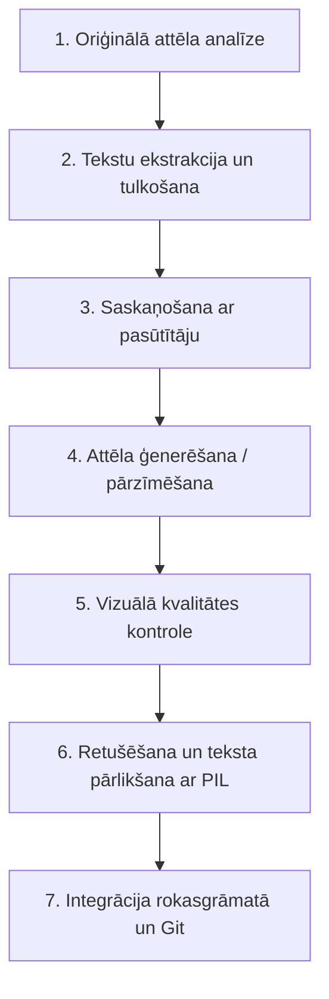

# Attēlu digitalizācijas un tulkošanas vadlīnijas (Developer Guidelines)

Šis dokuments apkopo labāko praksi un atziņas par to, kā veicama vēsturisko vai zemas kvalitātes tehnisko zīmējumu digitalizācija un tulkošana šajā projektā.

---

## Darba gaitas shēma (soli pa solim)

---

## Detalizēts soļu apraksts

### 1. Oriģinālā attēla analīze
*   **Ģeometrija:** Izpētīt konstrukcijas shēmu, elementu izvietojumu, asis un izmērus.
*   **Konteksts:** Noskaidrot, kurā nodaļā attēls atrodas un kādu teorētisko principu tas ilustrē.
*   **Vizuālais stils:** Identificēt zīmējuma veidu (grafiks, karte, mezgls, shēma).

### 2. Tekstu ekstrakcija un tulkošana
*   Ekstrahēt visus angļu valodas parakstus un izmēru vienības.
*   Sagatavot **precīzu inženiertehnisko tulkojumu** latviešu valodā.
*   *Pamatterminu glosārijs:*
    *   `shear wall` $\rightarrow$ **bīdes siena** (nevis *bīdes siena*, *slodzes siena* vai *izturības siena*)
    *   `core` $\rightarrow$ **kodols** (kāpņu vai liftu šahta)
    *   `torsional rigidity` $\rightarrow$ **vērpes stingums**
    *   `eccentricity` $\rightarrow$ **ekscentritāte**
    *   `restraint` $\rightarrow$ **deformāciju ierobežojums / sasaiste**
    *   `good` $\rightarrow$ **labs risinājums** (inženiertehniski korektāk nekā vienkārši *labs*)

### 3. Saskaņošana ar lietotāju
*   Pirms attēla pārzīmēšanas vienmēr parādīt tulkojumu salīdzinošo tabulu lietotājam.
*   Saskaņot un precizēt terminus, pirms tie tiek iestrādāti attēlā.

### 4. Attēla ģenerēšana / pārzīmēšana
*   Izmantot `generate_image` rīku, nodrošinot vienotu rokasgrāmatas vizuālo kodu:
    *   Gaišs/balts fons.
    *   Konstrukcijas iekrāsotas maigās, profesionālās krāsās (piem., gaiši pelēks betonam, tirkīza/zaļgans stinguma elementiem).
    *   Tīra, moderna vektorgrafikas estētika bez liekiem gradientiem vai trīsdimensionāliem efektiem (ja vien tas nav 3D mezgls).

### 5. Vizuālā kvalitātes kontrole (QC)
*   Pārbaudīt ģenerēto attēlu uz:
    *   **Teksta kropļojumiem (hallucinācijām):** AI ģeneratori bieži pieļauj kļūdas latviešu diakriskajās zīmēs (ā, ē, ī, ū, š, ķ, ļ, ž u.c.).
    *   **Dubultu tekstu:** AI var atstāt veco tekstu fonā un uzrakstīt jauno pa virsu.
    *   **Ģeometriskām kļūdām:** Savienojuma līnijām jābūt pilnīgi taisnām un loģiskām.

### 6. Retušēšana un teksta pārlikšana ar PIL
*   Ja attēlā ir teksta kļūdas vai neprecizitātes, tās labo programmātiski ar Python `Pillow` bibliotēku:
    1.  Nolasīt pareizos fona krāsu RGB kodus.
    2.  Aizpildīt kļūdainos apgabalus ar fona krāsas taisnstūriem.
    3.  Uzrakstīt pareizo tekstu, izmantojot tīru sistēmas fontu (piemēram, Arial vai Segoe UI) atbilstošā izmērā un koordinātās.
*   Šādi tiek garantēts pilnīgs teksta asums un pareizrakstība.

### 7. Integrācija rokasgrāmatā un Git
*   Saglabāt attēlu kā JPG ar augstu kvalitāti (95+) mērķa mapē `src/images/...`.
*   Atjaunināt attēla saiti attiecīgajā markdown failā.
*   Palaist formulu pārbaudes skriptu `python tools/verify_math.py`.
*   Iekomitēt un nosūtīt izmaiņas uz GitHub repozitoriju.
