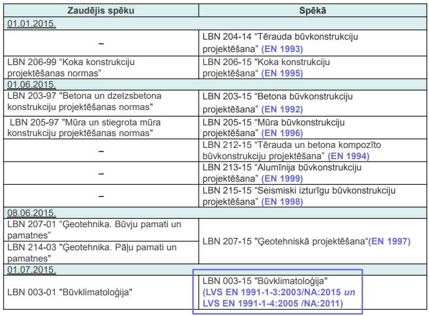

# IZMANTOJAMIE BŪVNORMATĪVI UN STANDARTI

Ja pasūtītāja uzdevumā nav noteikts savādāk, tad projektēšana saskaņā ar Latvijas būvnormatīviem no 01.07.2015. veicama pēc Eirokodeksiem un ar tiem saistītajiem standartiem (galvenokārt EN, bet arī ISO). Saistītie standarti ir atrunāti katrā Eirokodeksu sadaļā. Eirokodeksi ir Eiropas Standartizācijas komitejas CEN standartu saime, kas nosaka būvkonstrukciju projektēšanas kārtību.

- Veicot esošu būvju pārbūvi vai atjaunošanu konstruktīvo elementu lokālajās pārbaudēs par atbilstošām konstrukcijām Latvijas Republikā uzskata arī tādas konstrukcijas, kas atbilst konstrukciju projektēšanas būvnormatīviem, kas bija spēkā no 1988. gada līdz Eirokodeksu spēkā stāšanās dienai 01.07.2015, ja vienlaikus īstenojas šādi nosacījumi:
- pēc pārbūves vai atjaunošanas netiek palielināta slodze uz konstruktīvo elementu;
- netiek mainīta konstruktīvā elementa aprēķina shēma;
- tehniskās apsekošanas laikā nav konstatētas virsnormas izlieces vai citas konstrukciju nedrošuma pazīmes.
Projektos izmantojamiem materiāliem un izstrādājumiem ir jāatbilst ar Eirokodeksiem saistītajiem standartiem.

Izmantojamie standarti

