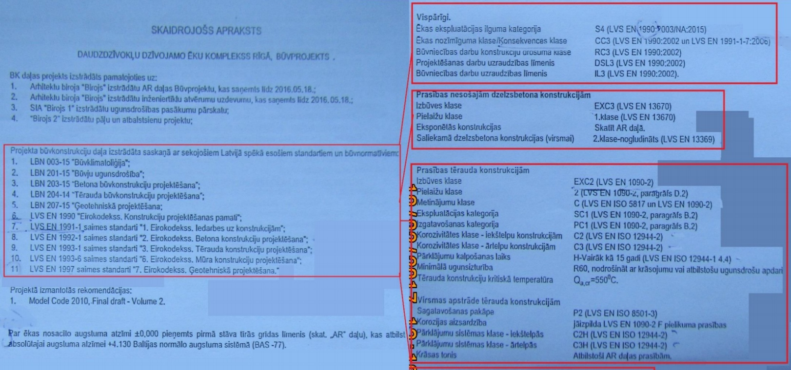

# Vispārīgie projektēšanas nosacījumi

Projekta detalizācijas pakāpi nosaka savstarpējā pasūtītāja un projektētāja uzdevumā. Saskaņā ar standarta pieņēmumu konstruktīvo shēmu izvēli un projektēšanu veic atbilstoši kvalificēti speciālisti (attiecīgi arī izbūvi un uzraudzību veic speciālisti ar atbilstošām prasmēm un pieredzi). Konstrukcijas ir jāprojektē un jābūvē tā, lai projektētajā kalpošanas laikā tiktu nodrošināts atbilstošs drošības līmenis un tās būtu ekonomiskas. Konstrukcijas ir jāprojektē ar atbilstošu nestspēju, lietojamības kritēriju izpildi un ilgmūžību. Lai nodrošinātu adekvātu konstrukciju ilgmūžību jāņem vērā:

- Paredzētais ēkas izmantojums;
- Vides apstākļi (vides agresivitāte);
- Izmantoto materiālu un produktu ilgmūžība;
- Izvēlēto elementu šķērsgriezums un mezglu risinājums;
- Paredzētie ēkas uzturēšanas pasākumi projektētajā kalpošanas laikā;
- Pamatnes īpašības un ēkas konstruktīvā shēma;
- Darbaspēka kvalifikācija un darbu izpildes kontroles līmenis.

Ugunsgrēka situācijā konstrukcijām ir jānodrošina nestspēja nepieciešamajam laika periodam. Konstrukcijām nedrīkst rasties neatbilstoši lieli bojājumi no ārkārtas iedarbēm.

## Vispārīgie projekta dati

Pārskatāma un precīza vispārīgo datu lapa ļoti būtiska ir ne tikai būvdarbu izpildītājam, bet arī izstrādātājam, lai darba procesā pie neskaidrībām var tajā atkārtoti ielūkoties un pieņēmumi būtu vienādi visa projekta ietvaros.

Piemērs no BVKB rīkotā semināra materiāliem

Minimāli pieļaujamās prasības, kas ir nodrošināmas 2. un 3. grupas būvēm (iekrāsotās ailes)

| Lietojot Eirokodeksus un to saimes standartus | Lietojot Eirokodeksus un to saimes standartus | Lietojot Eirokodeksus un to saimes standartus | Lietojot Eirokodeksus un to saimes standartus |
| --- | --- | --- | --- |
| Konsekvences klases CC | 1 | 2 | 3 |
| Izpildes klases EXC | 1 | 2 | 3 |
| Pielaižu klases | 1 | 2 | 3 |
| Inspekcijas līmenis | 1 | 2 | 3 |

## Seku klases

| Seku klase | Apraksts | Ēku un inženierbūvju piemēri |
| --- | --- | --- |
| CC3 | Smagas sekas attiecībā uz cilvēku dzīvību zaudēšanu, ar ļoti liekām ekonomiskām, sociālām un apkārtējās vides sekām. | Publiskās ēkas kuru sabrukšanas sekas ir smagas. Pieskaitāmas arī ēkas, kas uzskaitītas CC2a un CC2b, bet tām ir lielāka stāvu platība vai stāvu skaits. Visas publiskās ēkas, kurās nav cilvēku skaita ierobežojuma. Stadioni, kuros ir vairāk par 5 000 skatītāju vietu. Ēkas, kurās ir bīstamas vielas vai procesi. |
| CC2 | Vidējas sekas attiecībā uz cilvēku dzīvību zaudēšanu, ar ievērojamām ekonomiskām, sociālām un apkārtējās vides sekām. Pēc LVS EN 1991-1-7 izdala divas apakšklases: CC2a CC2b | Dzīvojamās un biroju ēkas, publiskās ēkas, kuru sabrukšanas sekas ir vidējas. Privātmājas ar 5 stāviem. Viesnīcas ar ne vairāk kā 4 stāviem. Dzīvojamās ēkas ar ne vairāk kā 4 stāviem. Biroja ēkas ar ne vairāk kā 4 stāviem. Industriālās ēkas ar ne vairāk kā 3 stāviem. Mazumtirdzniecības ēkas ar ne vairāk kā 3 stāviem un katra stāva platību ne lielāku par 1 000 m2. Vienstāva izglītības iestādes. Publiskas ēkas ar ne vairāk kā 2 stāviem un katra stāva platību ne lielāku par 2 000 m2. Viesnīcas un dzīvojamās mājas ar stāvu skaitu lielāku par 4 un nepārsniedz 15 stāvus. Izglītības iestādes ar stāvu skaitu lielāku par 1 un nepārsniedz 15 stāvus. Mazumtirdzniecības ēkas ar stāvu skaitu lielāku par 3 un nepārsniedz 15 stāvus. Slimnīcas ar stāvu skaitu ne vairāk kā 3. Biroja ēkas ar stāvu skaitu lielāku par 4 un nepārsniedz 15 stāvus. Publiskas ēkas, kurās stāva platība ir robežās no 2 000 m2 līdz 5 000 m2. Auto stāvvietas ar ne vairāk kā 6 stāviem. |
| CC1 | Vieglas sekas ar mazu vērā neņemamu risku cilvēka dzīvībai, ar vieglām ekonomiskām, sociālām un apkārtējās vies sekām. | Lauksaimniecības ēkas, kur parasti cilvēki neiet, piemēram, noliktavas un siltumnīcas, ja tās neatrodas tuvāk par 1.5 ēkas augstumiem līdz blakus ēkām vai zonām, kur uzturas cilvēki. Pēc LVS EN 1991-1-7 pie šīs klases var pieskaitīt arī privātmājas ar ne vairāk kā 4 stāviem. |

## Drošības klases

Ēku drošības klases (RC) atbilst ēku seku klasēm. RC1 atbilst CC1, RC2 atbilst CC2 un RC3 atbilst CC3. Ēku drošības klases tiek aprakstītas ar drošības indeksu β. Drošuma jeb uzticamības indekss tiek izmantots konstrukcijas sabrukuma iestāšanās varbūtības aprēķināšanai un ir aprakstāms ar funkciju: Pf=Ф(-β). Praksē izmanto vienkāršotu paņēmienu drošības līmeņa koriģēšanai lietojot korekcijas koeficientu KFI. Ar koeficientu koriģē slodžu drošības koeficientu γF un materiālu drošības koeficientu γM.

| Koeficients KFI | Drošības klase | Drošības klase | Drošības klase |
| --- | --- | --- | --- |
| Koeficients KFI | RC1 | RC2 | RC3 |
| KFI | 0.9 | 1.0 | 1.1 |

## Projektēšanas kontroles līmenis

Parasti projektēšanas kontroles līmenis ir piesaistīts ēkas drošības klasei. Latvijā noteikts, ka obligāta trešās puses ekspertīze ir III grupas būvēm, atbilstoši šīm ēkām projektēšanas kontroles līmenis ir DSL3. Pārējiem līmeņiem Latvijas normatīvie akti nenosaka prasības prasības projektēšanas kontrolei.

| Projektēšanas kontroles klase | Kontroles raksturs | Minimālās rekomendētās prasības aprēķinu, rasējumu un tehnisko specifikāciju kontrolei |
| --- | --- | --- |
| DSL3 | Izvērsta kontrole | Kontrole, ko veic trešā puse – ekspertīze |
| DSL2 | Parasta kontrole | Kontrole, kas tiek veikta projektēšanas organizācijas iekšienē. Veic speciālists, kurš nav piedalījies konkrētā projekta izstrādē. |
| DSL1 | Parasta kontrole | Paškontrole. Veic speciālists, kas izstrādājis konkrēto projektu |

## Būvdarbu uzraudzības līmeņi

Tabula pēc LVS EN 1990 B pielikuma

| Inspekcijas līmeņi | Skaidrojums | Minimālās rekomendētās prasības aprēķinu, rasējumu un tehnisko specifikāciju kontrolei |
| --- | --- | --- |
| IL 3 (augsts) | Paplašināta inspekcija | Trīskārša inspekcija (piesaistot akreditētas laboratorijas un / vai speciālistus) |
| IL 2 (vidējs) | Normāla inspekcija | Inspekcija, saskaņā ar būvorganizācijas kvalitātes procedūrām |
| IL 1 (zems) | Normāla inspekcija | Pašinspekcija |

## Ekspluatācijas ilguma kategorijas

| Projektētā kategorija | Paredzamais ekspluatācijas ilgums (gados) | Piemēri |
| --- | --- | --- |
| 1 | 10 | Pagaidu konstrukcijas |
| 2 | no 10 līdz 25 | Aizvietojamas būvkonstrukciju daļas, piemēram, celtņa sijas, balsti |
| 3 | no 15 līdz 30 | Lauksaimniecības un citas līdzīgas būvkonstrukcijas |
| 4 | 50 | Ēku un citas parastas būvkonstrukcijas |
| 5 | 100 | Monumentālu ēku konstrukcijas, tilti u.c. inženierbūvju konstrukcijas |

Ja nav norādīts atsevišķi vienmēr lietot kategoriju S4 (paredzamais ekspluatācijas ilgums 50 gadi).
