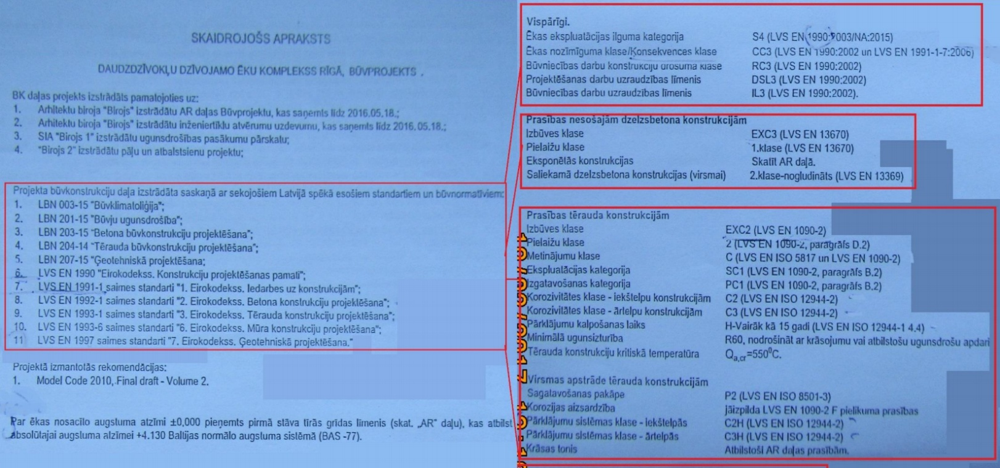

# Vispārīgie projektēšanas nosacījumi

Projekta detalizācijas pakāpi nosaka pasūtītāja un projektētāja savstarpēji saskaņotajā projektēšanas uzdevumā. Saskaņā ar Eirokodeksa pamatpieņēmumiem, konstruktīvo shēmu izvēli un projektēšanu veic atbilstoši kvalificēti un sertificēti speciālisti (attiecīgi arī būvdarbus un uzraudzību veic speciālisti ar atbilstošām prasmēm un pieredzi). 

Būvkonstrukcijas jāprojektē un jābūvē tā, lai projektētajā ekspluatācijas laikā tiktu nodrošināts atbilstošs drošības, drošuma un ilgmūžības līmenis, vienlaikus saglabājot ekonomisko pamatojumu. Konstrukcijām jāpiemīt pietiekamai nestspējai, jānodrošina lietojamības kritēriju izpilde (izlieces, vibrācijas, plaisas) un ilgmūžība. 

Lai nodrošinātu adekvātu konstrukciju ilgmūžību, jāņem vērā:
- paredzētais būves izmantojums un ekspluatācijas apstākļi;
- vides apstākļi (vides iedarbības klases un agresivitāte);
- izmantoto materiālu un izstrādājumu ilgmūžība;
- izvēlēto elementu šķērsgriezumi un mezglu konstruktīvie risinājumi;
- paredzētie ēkas uzturēšanas un apsaimniekošanas pasākumi projektētajā kalpošanas laikā;
- pamatnes (grunts) īpašības un ēkas vispārējā konstruktīvā shēma;
- darbaspēka kvalifikācija un būvdarbu izpildes kontroles līmenis.

Ugunsgrēka situācijā konstrukcijām ir jānodrošina nestspēja nepieciešamajam laika periodam (atbilstoši noteiktajai REI ugunsizturības klasei). Būvēm nedrīkst rasties nesamērīgi lieli bojājumi no ārkārtas iedarbībām (sprādzieniem, triecieniem vai lokāliem sabrukumiem).

---

## Vispārīgie projekta dati

Pārskatāma un precīza vispārīgo datu lapa ir ļoti būtiska ne tikai būvdarbu izpildītājam un ekspertam, bet arī pašam projektētājam, lai darba procesā pie neskaidrībām varētu tajā ielūkoties un nodrošinātu pieņēmumu vienotību visa projekta ietvaros.

**Piemērs no BVKB rīkotā semināra materiāliem:**

**Kopsavilkuma tabula starp klasēm un līmeņiem saskaņā ar LVS EN 1990:**

| Parametrs / Līmenis | 1. līmenis (Zems) | 2. līmenis (Vidējs / Standarta) | 3. līmenis (Augsts / Izvērsts) |
| :--- | :---: | :---: | :---: |
| Seku (konsekvences) klase | CC1 | CC2 | CC3 |
| Drošības (uzticamības) klase | RC1 | RC2 | RC3 |
| Projektēšanas kontroles klase | DSL1 | DSL2 | DSL3 |
| Būvdarbu uzraudzības līmenis | IL1 | IL2 | IL3 |
| Pielaižu (toleranču) klase | 1. klase | 2. klase | 3. klase |
| Tērauda izpildes klase (EXC) | EXC1 | EXC2 | EXC3 |

---

## Seku klases

Seku klases (Consequence Classes, CC) nosaka, ņemot vērā iespējamās sekas konstrukcijas sabrukuma vai nepareizas darbības gadījumā.

| Seku klase | Apraksts | Ēku un inženierbūvju piemēri |
| :--- | :--- | :--- |
| **CC3** | Smagas sekas attiecībā uz cilvēku dzīvību zaudēšanu, ar ļoti lielām ekonomiskām, sociālām un apkārtējās vides sekām. | Publiskās ēkas, kuru sabrukšanas sekas ir smagas. Pieskaitāmas arī ēkas, kas uzskaitītas CC2a un CC2b, bet tām ir lielāka stāvu platība vai stāvu skaits. Visas publiskās ēkas, kurās nav cilvēku skaita ierobežojuma. Stadioni, kuros ir vairāk par 5 000 skatītāju vietu. Ēkas, kurās ir bīstamas vielas vai procesi. |
| **CC2** | Vidējas sekas attiecībā uz cilvēku dzīvību zaudēšanu, ar ievērojamām ekonomiskām, sociālām un apkārtējās vides sekām. Pēc LVS EN 1991-1-7 izdala divas apakšklases: **CC2a** un **CC2b**. | Dzīvojamās un biroju ēkas, publiskās ēkas, kuru sabrukšanas sekas ir vidējas. Privātmājas ar 5 stāviem. Viesnīcas ar ne vairāk kā 4 stāviem. Dzīvojamās ēkas ar ne vairāk kā 4 stāviem. Biroja ēkas ar ne vairāk kā 4 stāviem. Industriālās ēkas ar ne vairāk kā 3 stāviem. Mazumtirdzniecības ēkas ar ne vairāk kā 3 stāviem un katra stāva platību ne lielāku par 1 000 m2. Vienstāva izglītības iestādes. Publiskas ēkas ar ne vairāk kā 2 stāviem un katra stāva platību ne lielāku par 2 000 m2. Viesnīcas un dzīvojamās mājas ar stāvu skaitu lielāku par 4 un nepārsniedz 15 stāvus. Izglītības iestādes ar stāvu skaitu lielāku par 1 un nepārsniedz 15 stāvus. Mazumtirdzniecības ēkas ar stāvu skaitu lielāku par 3 un nepārsniedz 15 stāvus. Slimnīcas ar stāvu skaitu ne vairāk kā 3. Biroja ēkas ar stāvu skaitu lielāku par 4 un nepārsniedz 15 stāvus. Publiskas ēkas, kurās stāva platība ir robežās no 2 000 m2 līdz 5 000 m2. Auto stāvvietas ar ne vairāk kā 6 stāviem. |
| **CC1** | Vieglas sekas ar mazu, vērā neņemamu risku cilvēka dzīvībai, ar vieglām ekonomiskām, sociālām un apkārtējās vides sekām. | Lauksaimniecības ēkas, kur parasti cilvēki neuzturas, piemēram, noliktavas un siltumnīcas, ja tās neatrodas tuvāk par $1,5$ ēkas augstumiem līdz blakus ēkām vai zonām, kur uzturas cilvēki. Pēc LVS EN 1991-1-7 pie šīs klases var pieskaitīt arī privātmājas ar ne vairāk kā 4 stāviem. |

---

## Drošības klases un uzticamības indeksi

Ēku drošības klases (Reliability Classes, RC) tiešā veidā atbilst ēku seku klasēm: RC1 atbilst CC1, RC2 atbilst CC2 un RC3 atbilst CC3. 

Drošuma jeb uzticamības līmenis tiek izteikts ar uzticamības indeksu $\beta$. Indekss $\beta$ ir saistīts ar konstrukcijas sabrukuma iestāšanās varbūtību $P_f$ ar formulu:
$$P_f = \Phi(-\beta)$$
kur $\Phi$ ir standarta normālā sadalījuma funkcija.

Praksē izmanto vienkāršotu paņēmienu drošības līmeņa koriģēšanai, izmantojot reizinātāju (korekcijas koeficientu) $K_{\text{FI}}$, ar kuru reizina pastāvīgo un mainīgo slodžu parciālos drošības koeficientus $\gamma_F$:

| Drošības klase | RC1 | RC2 | RC3 |
| :--- | :---: | :---: | :---: |
| Uzticamības indeksa $\beta$ mērķvērtība (1 gada references periodam) | 3.7 | 4.2 | 4.7 |
| Uzticamības indeksa $\beta$ mērķvērtība (50 gadu references periodam) | 3.3 | 3.8 | 4.3 |
| Slodžu korekcijas koeficients $K_{\text{FI}}$ | 0.9 | 1.0 | 1.1 |

*Piezīme: Saskaņā ar LBN 200-21 un LVS EN 1990 nacionālo pielikumu, koeficientu $K_{\text{FI}}$ parasti piemēro tikai mainīgajām (lietderīgajām, vēja, sniega) slodzēm.*

---

## Projektēšanas kontroles līmenis

Projektēšanas kontroles līmeņi (Design Supervision Levels, DSL) ir piesaistīti būves drošības klasei (RC/CC līmenim) un nosaka projekta aprēķinu, rasējumu un specifikāciju pārbaudes kārtību.

| Kontroles klase | Kontroles raksturs | Minimālās rekomendētās prasības aprēķinu, rasējumu un tehnisko specifikāciju kontrolei |
| :--- | :--- | :--- |
| **DSL3** | Izvērsta kontrole | Projekta pārbaude, ko veic neatkarīga trešā puse (neatkarīga būvprojekta ekspertīze). Latvijā obligāta III grupas būvēm. |
| **DSL2** | Parasta kontrole | Kontrole, kas tiek veikta projektēšanas organizācijas iekšienē. Veic kvalificēts speciālists, kurš pats nav piedalījies konkrētā projekta izstrādē (iekšējā neatkarīgā pārbaude). |
| **DSL1** | Paškontrole | Paškontrole, ko veic pats projekta izstrādātājs (autoruzraudzība / paškontrole). |

---

## Būvdarbu uzraudzības līmeņi

Būvdarbu uzraudzības (inspekcijas) līmeņi (Inspection Levels, IL) nosaka prasības būvdarbu kvalitātes kontrolei un atbilstībai projektam.

| Inspekcijas līmenis | Kontroles raksturs | Minimālās rekomendētās prasības būvdarbu uzraudzībai un atbilstības kontrolei |
| :--- | :--- | :--- |
| **IL3** (augsts) | Paplašināta inspekcija | Izvērsta trešās puses kontrole (piesaistot neatkarīgus būvuzraugus, testēšanas laboratorijas un autoruzraugus). |
| **IL2** (vidējs) | Parasta inspekcija | Sistemātiska kontrole saskaņā ar būvorganizācijas kvalitātes vadības sistēmas procedūrām. |
| **IL1** (zems) | Vienkāršota kontrole | Pašinspekcija (veic būvdarbu veicējs pats būvdarbu vadītāja uzraudzībā). |

---

## Ekspluatācijas ilguma kategorijas

Projektētā ekspluatācijas ilguma kategorija (Design Working Life Category) definē laika periodu, kurā konstrukcijai jāsaglabā sava nestspēja un lietojamība bez nepieciešamības veikt neparedzētus rekonstrukcijas darbus, veicot tikai plānoto uzturēšanu.

| Kategorija | Paredzamais ekspluatācijas ilgums (gadi) | Būvkonstrukciju piemēri |
| :---: | :---: | :--- |
| **1** | 10 | Pagaidu konstrukcijas (izņemot konstrukcijas, ko pēc demontāžas plānots izmantot atkārtoti). |
| **2** | no 10 līdz 25 | Aizvietojamas būvkonstrukciju daļas, piemēram, celtņa ceļu sijas, balsti, stiprinājumi. |
| **3** | no 15 līdz 30 | Lauksaimniecības un tamlīdzīgas būves, siltumnīcas. |
| **4** | 50 | Ēkas un citas parastas būvkonstrukcijas (dzīvojamās, publiskās un industriālās ēkas). |
| **5** | 100 | Monumentālu ēku konstrukcijas, tilti, tuneļi un citas valsts nozīmes inženierbūves. |

Ja projektēšanas uzdevumā nav norādīts citādi, parastām ēkām vienmēr piemēro **4. kategoriju (50 gadi)**, kas betonam atbilst standarta strukturālajai klasei **S4** (lieto aizsargslāņa noteikšanai).
