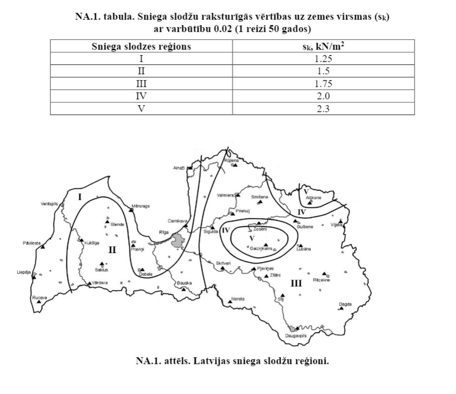
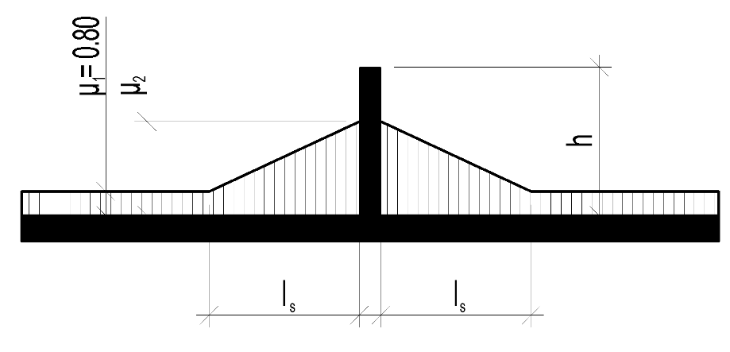
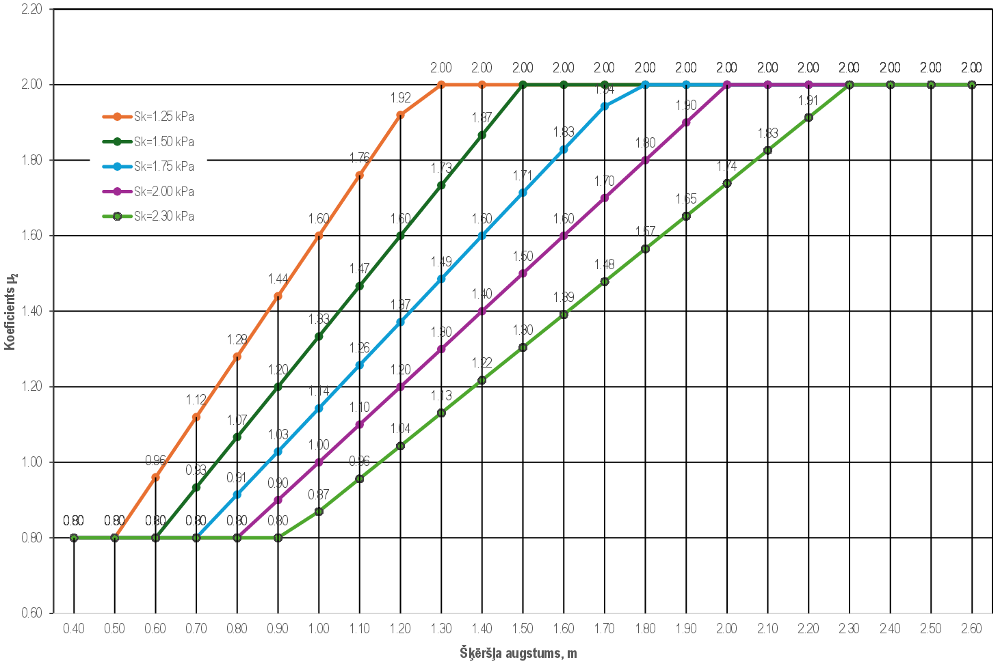
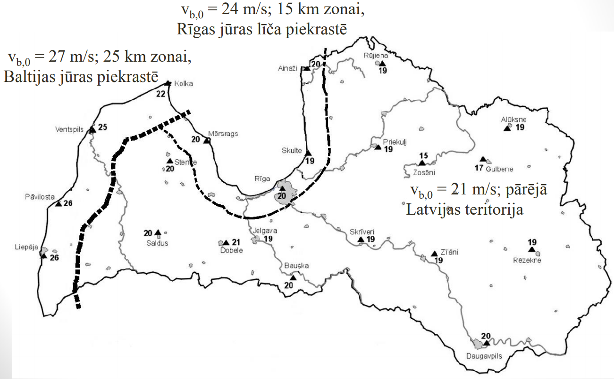

# Klimatiskās slodzes

## Sniega slodze

Sniega slodze ir mainīga klimatiskā iedarbība, kas jāņem vērā, projektējot jumta un citu sniegam pakļautu virsmu konstrukcijas.

Saskaņā ar LVS EN 1991-1-3/NA:2019 punktu 2.7, visā Latvijas teritorijā ir jāpiemēro **B1 slogojuma gadījums** (notiek īpaša snigšana, nav paredzēti īpaši sanesumi uz zemes). 

- Standarta projektēšanas situācijās (ilgstoša/īslaicīga situācija) aprēķina sniega slodzi uz jumta:
  $$s = \mu_i \cdot C_e \cdot C_t \cdot s_k$$
- Ārkārtas situācijās (kur sniegs tiek vērtēts kā ārkārtēja iedarbība) aprēķina sniega slodzi uz jumta:
  $$s = \mu_i \cdot C_e \cdot C_t \cdot C_{esl} \cdot s_k$$
  Latvijā ārkārtējās sniega slodzes koeficients ir **$C_{esl} = 2,0$**.

LVS EN 1991-1-3 6.2. punktā aprakstītie sniega sanesumi pie jumta izvirzījumiem ir jāizvērtē kā projekta ilgstoša vai īslaicīga situācija.

**Sniega slodzes slogojuma situācijas (pēc LVS EN 1991-1-3 A.1. tabulas):**

| Situācija / Slogojums | A gadījums (Normāli apstākļi) | B1 gadījums (Īpaši apstākļi)* | B2 gadījums (Īpaši apstākļi) | B3 gadījums (Īpaši apstākļi) |
| :--- | :--- | :--- | :--- | :--- |
| **Raksturojums** | Nenotiek īpaša snigšana, nav īpašu sanesumu. | Notiek īpaša snigšana, nav īpašu sanesumu. | Nenotiek īpaša snigšana, ir īpaši sanesumi. | Notiek īpaša snigšana, ir īpaši sanesumi. |
| **Ilgstoša/īslaicīga situācija** | — Nesanests sniegs: $s = \mu_i C_e C_t s_k$ — Sanests sniegs: $s = \mu_i C_e C_t s_k$ | — Nesanests sniegs: $s = \mu_i C_e C_t s_k$ — Sanests sniegs: $s = \mu_i C_e C_t s_k$ | — Nesanests sniegs: $s = \mu_i C_e C_t s_k$ — Sanests sniegs: $s = \mu_i C_e C_t s_k$ *(izņemot B pielikumu)* | — Nesanests sniegs: $s = \mu_i C_e C_t s_k$ — Sanests sniegs: $s = \mu_i C_e C_t s_k$ *(izņemot B pielikumu)* |
| **Ārkārtējā situācija (sniegs kā ārkārtēja slodze)** | Nav jāvērtē. | — Nesanests sniegs: $s = \mu_i C_e C_t C_{esl} s_k$ — Sanests sniegs: $s = \mu_i C_e C_t C_{esl} s_k$ | — Sanests sniegs: $s = \mu_i s_k$ *(jumtu formām B pielikumā)* | — Nesanests sniegs: $s = \mu_i C_e C_t C_{esl} s_k$ — Sanests sniegs: $s = \mu_i s_k$ |

---

### Sniega slodze uz zemes virsmas $s_k$ Latvijā

Sniega slodžu raksturīgās vērtības uz zemes virsmas ($s_k$) ir noteiktas LVS EN 1991-1-3/NA (references periods 50 gadi, ikgadējā pārsniegšanas varbūtība 0,02).

| Sniega slodzes reģions | $s_k$ (kN/m² jeb kPa) |
| :---: | :---: |
| **I** | 1,25 |
| **II** | 1,50 |
| **III** | 1,75 |
| **IV** | 2,00 |
| **V** | 2,30 |

*Svarīgi: Interpolāciju starp zonām neveic. Projektēšanā izmanto tā reģiona vērtību, kurā atrodas būvlaukums.*

---

### Sniega sanesumi pie izvirzījumiem un šķēršļiem

Vēja ietekmē sniega sanesumi var veidoties uz jebkura jumta, kuram ir izbūvēti šķēršļi (parapeti, sienu nobīdes, virsgaismas, mašīntelpas u.c.). 

Uz gandrīz horizontāliem jumtiem sniega formas koeficientus pie šķēršļiem aprēķina šādi:
- $\mu_1 = 0,8$ (nesanesta sniega slodze)
- $\mu_2 = \frac{\gamma \cdot h}{s_k}$ (ar ierobežojumu: $0,8 \le \mu_2 \le 2,0$)

Kur:
- $h$ ir šķēršļa augstums (m);
- $s_k$ ir sniega slodze uz zemes (kPa);
- $\gamma$ ir sniega tilpummasa (tilpumsvars), ko pieņem vienādu ar **$2,0\text{ kN/m}^3$**.

Sanesuma garums:
- $l_s = 2h$ (ar ierobežojumu: $5,0\text{ m} \le l_s \le 15,0\text{ m}$).

*Piezīme: Pie biežāk sastopamajiem jumta šķēršļiem (kuru augstums $h \le 2,5\text{ m}$) sanesuma garums $l_s$ parasti būs tieši minimālais robežlielums — $5,0\text{ m}$. Lielāks sanesuma garums var veidoties tikai tad, ja šķēršļa augstums pārsniedz 2,5 m.*

**Sanesumu principiālā shēma pie šķēršļiem:**

**Koeficientu $\mu_2$ vērtības Latvijas sniega reģionos atkarībā no šķēršļa augstuma $h$:**

---

## Vēja slodze

Vēja slodze ir mainīga iedarbība, ko aprēķina saskaņā ar LVS EN 1991-1-4 un tā nacionālo pielikumu LVS EN 1991-1-4/NA:2011.

### Fundamentālais vēja pamatātrums $v_{b,0}$ Latvijā

Visā Latvijas teritorijā, izņemot piekrastes zonas, vēja fundamentālais pamatātrums ir **$v_{b,0} = 21\text{ m/s}$** (atbilst vēja spiedienam $q_{b,0} \approx 0,27\text{ kN/m}^2$).

- **Rīgas jūras līča piekrastes zonā** (15 km josla): **$v_{b,0} = 24\text{ m/s}$** ($q_{b,0} \approx 0,36\text{ kN/m}^2$)
- **Baltijas jūras atklātās piekrastes zonā** (25 km josla): **$v_{b,0} = 27\text{ m/s}$** ($q_{b,0} \approx 0,46\text{ kN/m}^2$)

*Piezīme: Piekrastes zonas joslas platumu mēra no krasta līnijas, ja netiek ņemta vērā apvidus specifiskā orogrāfija. Jūrā un tiešā kāpu zonā ieteicams piemērot paaugstinātu vēja fundamentālo ātrumu pēc projektētāja novērtējuma.*

---

### Apvidus kategorijas izvēle

Apvidus kategorija (Terrain Category) raksturo virsmas raupjumu un ietekmē vēja ātruma profilu un dinamisko spiedienu augstumā.

| Apvidus kategorija | Apraksts |
| :---: | :--- |
| **0** | Jūra un atklātas jūras iedarbībai pakļauta piekrastes teritorija. |
| **I** | Ezeri vai atklātas teritorijas ar nenozīmīgu veģetāciju un bez šķēršļiem. |
| **II** | Teritorija ar zemu veģetāciju (piemēram, zāli) un atsevišķiem šķēršļiem (kokiem, ēkām), kas atrodas vismaz 20 šķēršļu augstumu attālumā viens no otra. |
| **III** | Teritorija ar regulāru veģetāciju, ēkām vai mežaudzēm, kur šķēršļi atrodas ne tālāk par 20 šķēršļu augstumiem viens no otra (piemēram, ciemati, priekšpilsētas, pastāvīgs mežs). |
| **IV** | Teritorija, kurā vismaz 15% no virsmas ir apbūvēti ar ēkām, kuru vidējais augstums pārsniedz 15 m (blīva pilsētas apbūve). |
