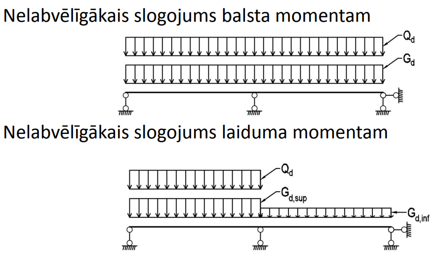

## Nelabvēlīgākās slodzes noteikšana

Vairāklaidumu sistēmā slodžu nelabvēlīgākā izvietojuma noteikšanai tradicionāli izmanto šādas shēmas:

- **Balsta momentam** — pilna projektēšanas slodze (Gd + Qd) uz visiem laidumiem
- **Laiduma momentam** — pilna slodze (Qd + Gd,sup) uz aprēķinājamā laiduma, minimālā pastāvīgā slodze (Gd,inf) uz blakus laidumiem

