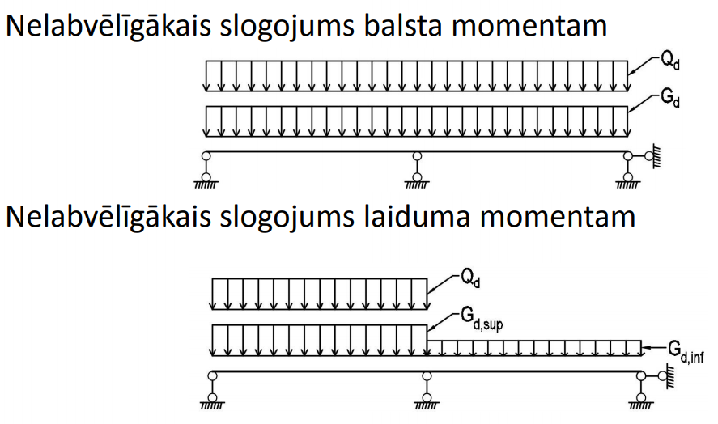

# Nelabvēlīgākās slodzes noteikšana

Vairāklaidumu konstrukcijās (piemēram, nepārtrauktās sijās vai plātnēs) maksimālo piepūļu (momentu, šķērsspēku) noteikšanai ir jāveic slodžu izvietošana nelabvēlīgākajās kombinācijās, izmantojot t.s. "šaha slogojuma" shēmu.

## Slogojuma shēmas nepārtrauktām sijām

Lai iegūtu ekstremālās piepūļu vērtības, mainīgā slodze \\(Q_d\\) tiek izvietota šādos veidos:

- **Maksimālajam laiduma momentam** (\\(M_{max,\text{laidumā}}\\)):
  Pilna aprēķina slodze (\\(G_d + Q_d\\)) tiek uzlikta pārbaudāmajam laidumam un pamīšus katram otrajam laidumam. Blakus esošajos laidumos tiek uzlikta tikai minimālā pastāvīgā slodze (\\(G_{d,inf}\\) jeb \\(\gamma_{G,inf} \cdot G_k\\), kur \\(\gamma_{G,inf} = 1,0\\)).
  
- **Maksimālajam balsta momentam** (\\(M_{max,\text{balstā}}\\)) vai reakcijai:
  Pilna aprēķina slodze (\\(G_d + Q_d\\)) tiek uzlikta abos laidumos abpus pārbaudāmajam balstam, un pēc tam pamīšus katram otrajam laidumam.

---

## Slodžu kombināciju vienādojumi (ULS pēc LVS EN 1990)

Projektējot konstrukcijas pēc nestspējas robežstāvokļa (ULS - Ultimate Limit State), pastāvīgo un mainīgo slodžu kombinācijas aprēķina pēc LVS EN 1990. Latvijā ir atļauts izmantot divas alternatīvas metodes:

### 1. Metode: Izmantojot vienādojumu (6.10)
Tā ir vienkāršotā metode, kurā visas slodzes tiek reizinātas ar pilniem parciālajiem koeficientiem:

\[E_d = \gamma_{G} \cdot G_k + \gamma_{Q} \cdot Q_k\]

Kur Latvijas nacionālajā pielikumā noteikts:
- \\(\gamma_{G} = 1,35\\) (nelabvēlīgā pastāvīgā slodze);
- \\(\gamma_{Q} = 1,50\\) (nelabvēlīgā mainīgā slodze);
- \\(\gamma_{G,inf} = 1,00\\) (labvēlīgā pastāvīgā slodze).

### 2. Metode: Izmantojot vienādojumus (6.10a) un (6.10b)
Šī metode parasti sniedz ekonomiskāku rezultātu, ja pastāvīgā slodze ir dominējoša. Konstrukcija jāpārbauda uz nelabvēlīgāko no abiem vienādojumiem:

- **Vienādojums (6.10a)** (dominē pastāvīgās slodzes):
  \[E_d = \gamma_{G} \cdot G_k + \gamma_{Q} \cdot \psi_0 \cdot Q_k\]
  *(Latvijā: \\(1,35 \cdot G_k + 1,5 \cdot \psi_0 \cdot Q_k\\))*

- **Vienādojums (6.10b)** (dominē mainīgās slodzes):
  \[E_d = \xi \cdot \gamma_{G} \cdot G_k + \gamma_{Q} \cdot Q_k\]
  *(Latvijā: \\(\xi = 0,85\\), kas dod \\(1,15 \cdot G_k + 1,5 \cdot Q_k\\))*

*Piezīme: Ja ir vairākas mainīgās slodzes (piem., lietderīgā + vējš + sniegs), tad viena no tām tiek pieņemta kā galvenā mainīgā slodze (\\(Q_{k,1}\\)), bet pārējās tiek reizinātas ar attiecīgajiem kombināciju koeficientiem \\(\psi_{0,i}\\).*
