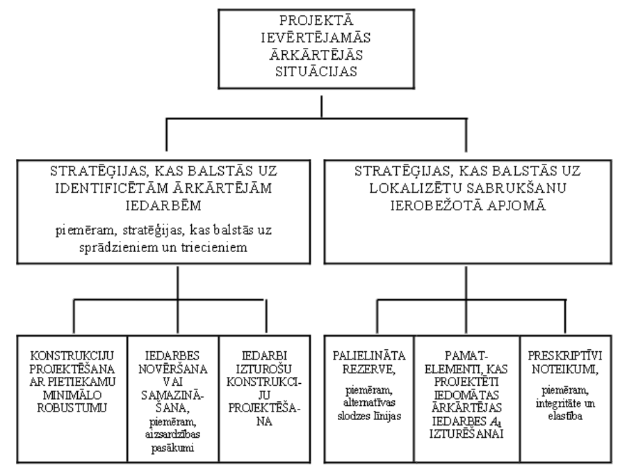
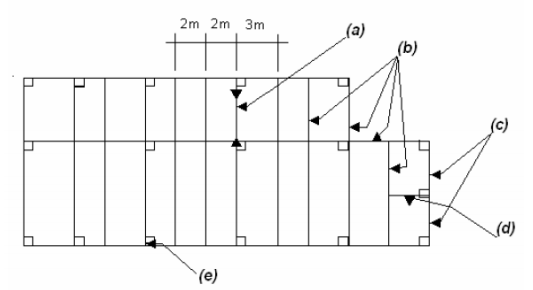
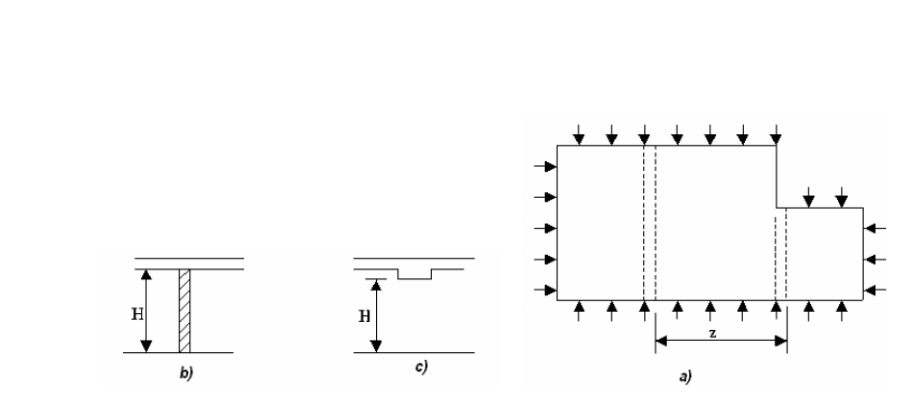

## ĒKU ROBUSTUMA NODROŠINĀJUMS

Prasības ēku robustuma nodrošināšanai ir dotas katras konstrukciju grupas standartā, bet izvērsti tās ir aprakstītas standartā LVS EN 1991-1-7 1. Eirokodekss. Iedarbes uz konstrukcijām. 1-7. daļa: Vispārīgās iedarbes. Ārkārtas iedarbes. Seku klases ar piemēriem skatīt iepriekš materiālā (punkts 2.2).

**Shēmā uzrādītas stratēģijas attiecībā uz projektā apskatāmajām ārkārtējām situācijām**

Robustuma nodrošinājums ēkām ar Seku klasēm CC1 un CC2a.

Ēkām ar seku klasi CC1 ir jābūt projektētām saskaņā ar atbilstošo Eirokodeksu prasībām stabilitātes nodrošināšanai normālas ekspluatācijas situācijai, papildus prasības ārkārtas iedarbēm netiek izvirzītas;

Ēkām ar seku klasi CC2a ir jābūt projektētām saskaņā ar atbilstošo Eirokodeksu prasībām stabilitātes nodrošināšanai normālas ekspluatācijas situācijai. Papildus, ir jānodrošina pārsegumiem horizontāla saišu sistēma saskaņā ar LVS EN 1991-1-7 A.5. punkta prasībām.

Robustuma nodrošinājums ēkām ar Seku klasi CC2b.

Ēkām ar seku klasi CC2b ir jābūt projektētām saskaņā ar atbilstošo Eirokodeksu prasībām stabilitātes nodrošināšanai normālas ekspluatācijas situācijai. Papildus, ir jānodrošina:

Ēkas telpiskā stabilitāte un lokāls pārseguma sabrukums ne lielāks kā 15% no stāva platības un ne lielāks kā 100 m2 situācijā, kad tiek izņemta jebkura viena kolonna vai sija, kas balsta kolonnu, vai sienas nominālā šķērsgriezuma izņemšana viena stāva robežās;

Pārsegumiem horizontāla saišu sistēma saskaņā ar LVS EN 1991-1-7 A.5. punkta prasībām, kolonnām un sienām vertikālu saišu sistēma saskaņā ar LVS EN 1991-1- 7 A.6. punkta prasībām; Ja sabrukuma platība pārsniedz 15% no stāva platības vai 100 m2 , tad nepieciešamie elementi ir jāuzskata par «atslēgas elementiem» un jānodrošina to nestspēja ārkārtas iedarbju situācijās.

Robustuma nodrošinājums ēkām ar Seku klasi CC3.

Ēkām ar seku klasi CC3 ir jāveic risku analīze. Risku analīzē ir jāiekļauj ne tikai paredzamas ārkārtas iedarbes, bet arī neparedzamas ārkārtas iedarbes. Būtiski – veicamajiem pasākumiem saskaņā ar risku analīzi ir jābūt striktākiem kā Seku klasei CC2b.

**Prasības horizontālajām saitēm pārsegumiem, kas balstīti uz kolonnām**

- Pārseguma iekšējās saites: Ti = 0,8 · (gk + ψ · qk) · s · L ≥ 75 kN
- Pārseguma perimetra saites: Tp = 0,4 · (gk + ψ · qk) · s · L ≥ 75 kN

kur **s** — solis starp saitēm; **L** — saites laidums.

**Apzīmējumi:** (a) — saites laidums L; (b) — sijas vai plātnes stiegrojums, kas pilda saites funkciju; (c) — perimetra saite; (d) — saites enkurojums kolonnā

**Prasības horizontālajām saitēm pārsegumiem, kas balstīti uz sienām**

- Iekšējās saites: Ti = (Ft / 37,5) · (gk + ψ · qk) · z
- Perimetra saites: Tp = Ft

kur:

- Ft = 20 + 4 · ns ≤ 60 kN
- **ns** — stāvu skaits
- z = L ≤ 5 · H

