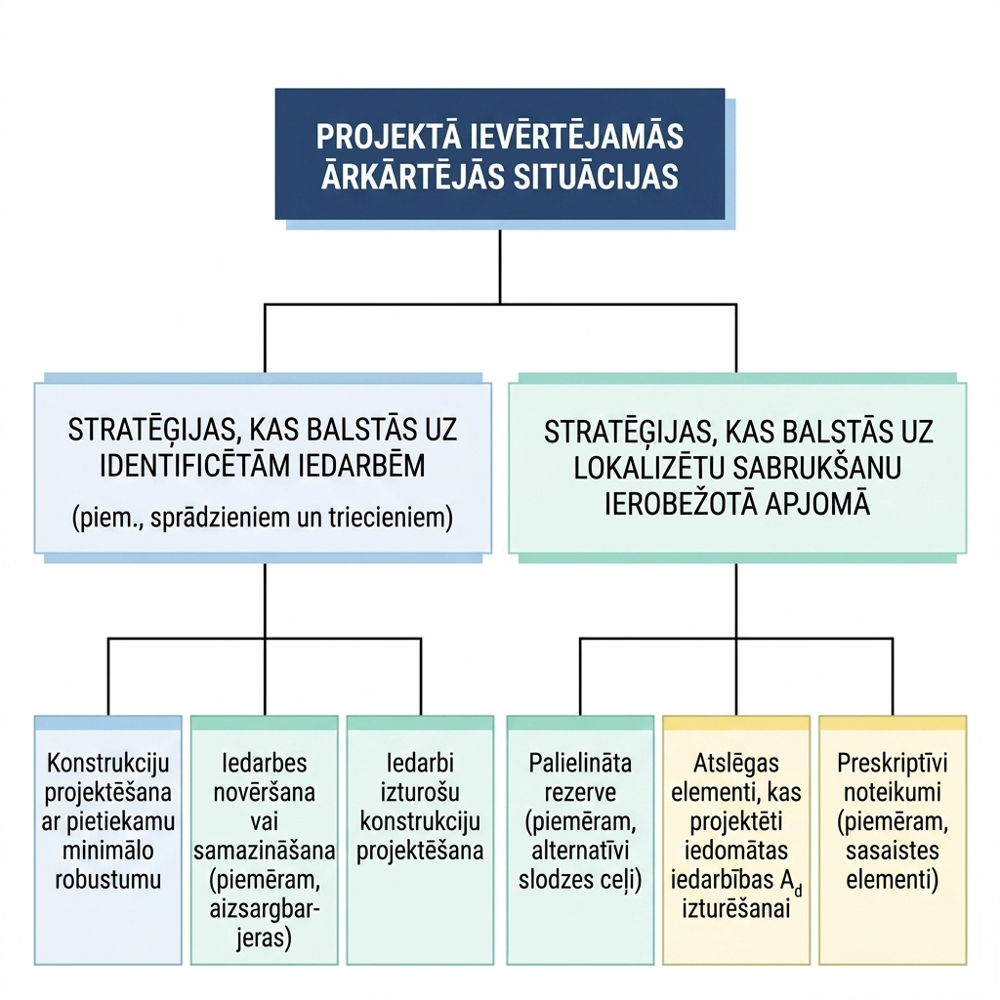
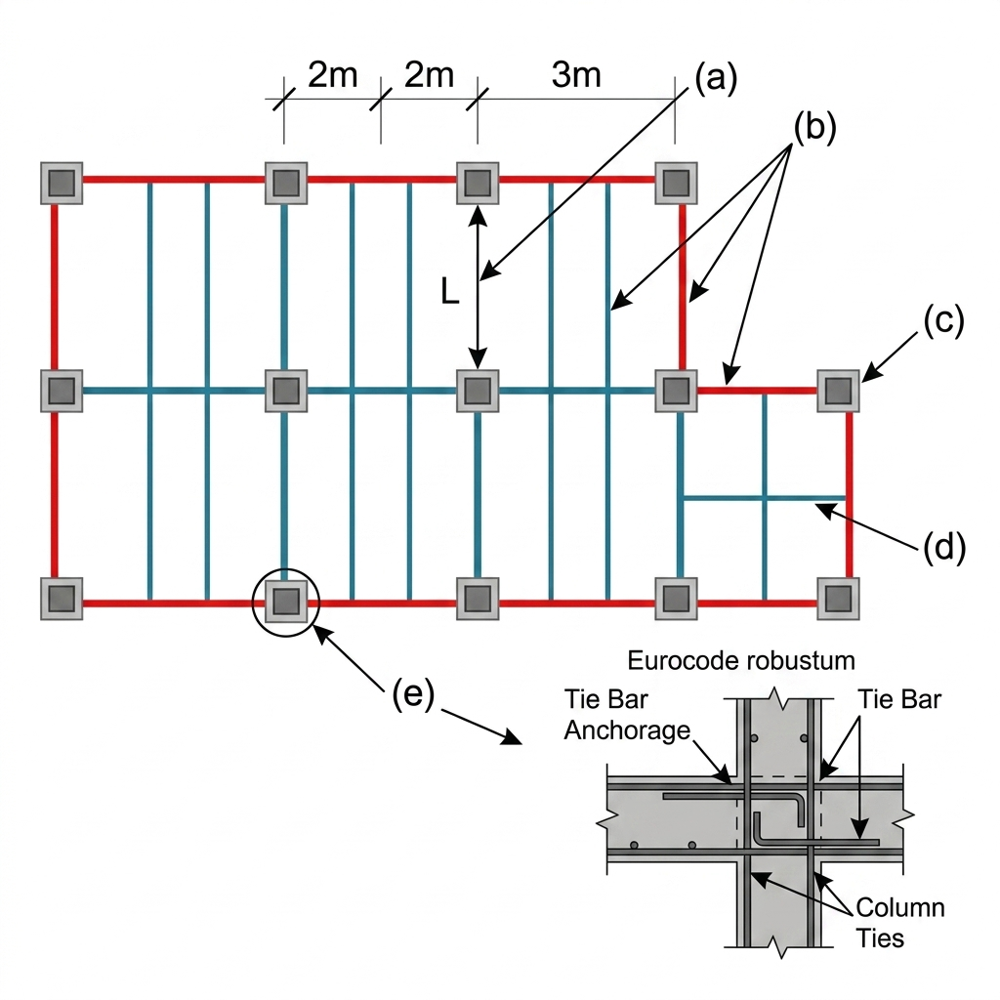
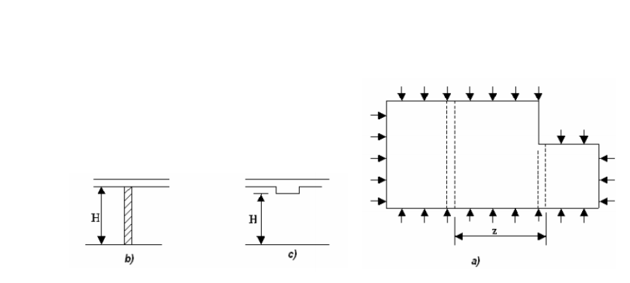

# Būvju robustuma nodrošinājums

Būvju robustums (noturība pret progresējošu sabrukumu) raksturo konstrukcijas spēju saglabāt stabilitāti lokālu bojājumu gadījumā, novēršot sabrukuma izplatīšanos (progresējošo sabrukumu) nesamērīgā platībā.

Prasības robustuma nodrošināšanai ir iestrādātas katras materiālu grupas projektēšanas standartos, bet izvērsti tās ir aprakstītas standartā **LVS EN 1991-1-7** "Vispārīgās iedarbes. Ārkārtas iedarbes". Būves seku klases un to piemērus skatīt sadaļā [Seku klases](file:///C:/Users/Kasutaja/Dropbox/Projects/paligs-buvkonstrukciju-projektesana/src/03-visparigie.md#seku-klases).

---

## Ārkārtējo situāciju projektēšanas stratēģijas

Projektētājam ir jāizvēlas viena vai vairākas stratēģijas ārkārtējo iedarbību (sprādzienu, triecienu, ugunsgrēku) un progresējošā sabrukuma novēršanai:

---

## Robustuma prasības atkarībā no seku klases (CC)

### 1. Seku klase CC1
- **Prasības:** Konstrukcija jāprojektē saskaņā ar vispārīgajām Eirokodeksa prasībām stabilitātes un nestspējas nodrošināšanai normālos ekspluatācijas apstākļos. Papildu prasības ārkārtas iedarbēm netiek izvirzītas.

### 2. Seku klase CC2a (Zema riska grupa)
- **Prasības:** Papildus normālās stabilitātes pārbaudēm ir jānodrošina **horizontāla saišu sistēma pārsegumos** saskaņā ar LVS EN 1991-1-7 A.5. punkta prasībām, lai sasaistītu pārseguma paneļus un nesošās konstrukcijas.

### 3. Seku klase CC2b (Augsta riska grupa)
- **Prasības:** Papildus normālajām stabilitātes pārbaudēm ir jānodrošina:
  - **Saišu sistēma:** Horizontālas saites pārsegumos (LVS EN 1991-1-7 A.5.) un vertikālas saites kolonnās/nesošajās sienās (A.6. punkts).
  - **Lokālā sabrukuma ierobežošana:** Konstrukcijai jābūt projektētai tā, lai, izņemot jebkuru vienu nesošo elementu (piemēram, vienu kolonnu, siju, kas balsta kolonnu, vai nesošās sienas fragmentu viena stāva robežās), lokālais sabrukums nepārsniegtu **15% no stāva platības** un būtu **mazāks par \\(100\text{ m}^2\\)**.
  - **Atslēgas elementi (Key Elements):** Ja kāda nesošā elementa sabrukums rada lielāku sabrukuma apgabalu par 15% vai \\(100\text{ m}^2\\), šis elements ir jāuzskata par atslēgas elementu un jāprojektē tā, lai tas izturētu ārkārtas iedarbību ar raksturīgo vērtību **\\(A_d = 34\text{ kN/m}^2\\)** (spiediens uz elementu no jebkura virziena).

### 4. Seku klase CC3
- **Prasības:** Jāveic detalizēta būves risku analīze. Risku analīzē jāizvērtē gan paredzamas, gan neparedzamas ārkārtas iedarbes. Veicamajiem strukturālajiem pasākumiem jābūt stingrākiem nekā seku klasei CC2b.

---

## Horizontālo saišu aprēķins pārsegumiem, kas balstīti uz kolonnām

Pārseguma plātnēs un sijās ir jāparedz stiepes saites, kuras parasti veido ar konstrukcijas stiegrojumu vai tērauda elementiem.

- **Pārseguma iekšējās saites (\\(T_i\\)):**
  \\[T_i = 0,8 \cdot (g_k + \psi \cdot q_k) \cdot s \cdot L \ge 75\text{ kN}\\]
  
- **Pārseguma perimetra saites (\\(T_p\\)):**
  \\[T_p = 0,4 \cdot (g_k + \psi \cdot q_k) \cdot s \cdot L \ge 75\text{ kN}\\]

Kur:
- \\(g_k\\) — pastāvīgā slodze uz pārseguma (\\(kN/m^2\\));
- \\(q_k\\) — mainīgā slodze uz pārseguma (\\(kN/m^2\\));
- \\(\psi\\) — slodzes kombinācijas koeficients (parasti izmanto \\(\psi_2\\));
- \\(s\\) — kolonu solis / attālums starp saitēm (m);
- \\(L\\) — saites laidums (attālums starp kolonnām) (m).

*Apzīmējumi: (a) saites laidums \\(L\\), (b) sijas vai plātnes stiegrojums (kas pilda saites funkciju), (c) perimetra saite, (d) saites enkurojums kolonnā.*

---

## Horizontālo saišu aprēķins pārsegumiem, kas balstīti uz sienām

Plātnēs, kas balstās uz nesošajām sienām, stiepes saitēm jānodrošina šāda nestspēja:

- **Pārseguma iekšējās saites (\\(T_i\\)):**
  \\[T_i = \frac{F_t}{37,5} \cdot (g_k + \psi \cdot q_k) \cdot z \ge F_t\text{ (kN/m)}\\]
  *(Šī formula izriet no EN 1991-1-7 prasības: \\(T_i = \frac{g_k + \psi \cdot q_k}{7,5} \cdot \frac{z}{5} \cdot F_t \ge F_t\\))*
  
- **Pārseguma perimetra saites (\\(T_p\\)):**
  \\[T_p = F_t\text{ (kN)}\\]

Kur:
- \\(F_t = (20 + 4 \cdot n_s) \le 60\text{ kN/m}\\) (pamata stiepes spēks);
- \\(n_s\\) — būves stāvu skaits;
- \\(z\\) — attālums starp saitēm (m), kur \\(z = L\\) (plātnes laidums), ar ierobežojumu \\(z \le 5H\\) (\\(H\\) ir stāva augstums).

