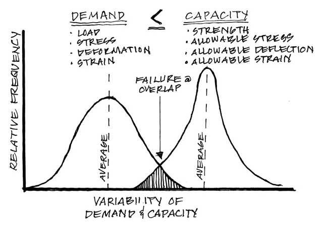

# SLODZES UN IEDARBES

Slodžu parciālie koeficienti palielina pieprasījumu pēc nestspējas (novirza līkni pa labi), kamēr materiālu parciālie koeficienti samazina to nestspēju (novirza līkni pa kreisi) kopumā paaugstinot drošības līmeni. Apgabala robežās, kur abas līknes pārklājās ir iespējama avārija pat gadījumā, ja konstrukcija ir projektēta bez kļūdām (aptuveni 0.01% iespējamība).

Lietojot Eirokodeksu sistēmu primāri ir lietojami parciālie koeficienti, kas ir noteikti projektēšanas standartu nacionālajos pielikumos. Ja vērtība kādam konkrētam koeficientam nacionālajā pielikumā nav dota, tad ir izmantojama normatīva pamatdokumentā uzrādītā rekomendējamā vērtība.
