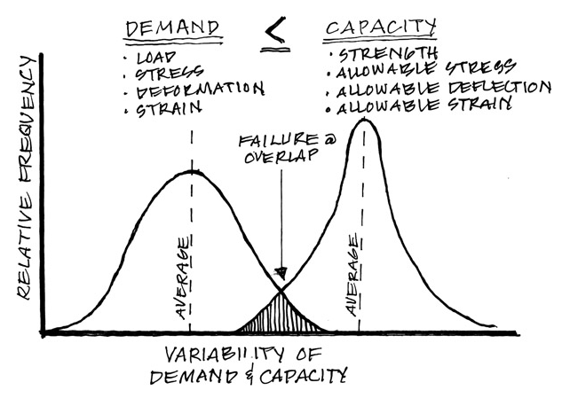

# Slodzes un iedarbes

Slodžu parciālie koeficienti palielina aprēķina iedarbību vērtības (novirza iedarbību sadalījuma līkni pa labi), turpretī materiālu parciālie koeficienti samazina elementu nestspējas aprēķina vērtības (novirza pretestības sadalījuma līkni pa kreisi). Abu šo faktoru kopdarbība nodrošina nepieciešamo būvkonstrukciju drošuma līmeni. Apgabalā, kur abas līknes pārklājas (iedarbe pārsniedz nestspēju), pastāv teorētiska konstrukcijas avārijas iespējamība, kas parasti ir ļoti zema (piemēram, pie uzticamības indeksa \\(\beta = 3.8\\) sabrukuma varbūtība \\(P_f\\) ir aptuveni \\(7.2 \times 10^{-5}\\) jeb 0.007%).

Lietojot Eirokodeksu sistēmu, primāri ir jāizmanto tie parciālie koeficienti un parametri, kas ir noteikti attiecīgo projektēšanas standartu Latvijas nacionālajos pielikumos (LVS EN XXXX-X-X/NA). Ja kāda konkrēta parametra vai koeficienta vērtība nacionālajā pielikumā nav definēta, ir izmantojama standarta pamatdokumentā norādītā rekomendējamā vērtība.
