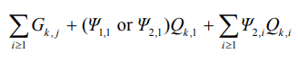

# UGUNDROŠU KONSTRUKCIJU PROJEKTĒŠANA

# FIRE DESIGN

Ugunsgrēka situācijai jāpielieto sekojoša slodžu kombinācija:

Latvijā Ψ1 vai Ψ2 lietošana nacionālajā pielikumā nav noteikta, attiecīgi lietojama rekomendējamais koeficients, kas ir Ψ2 (kvazipastāvīgā mainīgā slodžu vērtība).
