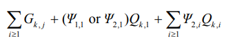

# Ugunsdrošu konstrukciju projektēšana

Projektējot konstrukcijas ugunsgrēka ārkārtas situācijai, ir jāpārbauda to nestspēja un/vai norobežojošā funkcija noteiktā laika periodā (piemēram, 30, 60, 90 vai 120 minūtes).

## Ugunsizturības kritēriji (R, E, I)

Ugunsizturību izsaka minūtēs un apzīmē ar trim galvenajiem kritērijiem:
- **R (Nestspēja - Load-bearing capacity):** Konstrukcijas spēja saglabāt mehānisko izturību un nestspēju ugunsgrēka laikā bez sabrukšanas (piemēram, R60, R90). Šis kritērijs attiecas uz nesošajām kolonnām, sijām, pārsegumiem un nesošajām sienām.
- **E (Vienotība - Integrity):** Konstrukcijas spēja novērst plaisu rašanos un liesmu vai karstu gāzu cauriekļu veidošanos (norobežojošām konstrukcijām).
- **I (Izolācija - Insulation):** Konstrukcijas spēja ierobežot siltuma pārvadi, lai temperatūra neapsildāmajā pusē nepārsniegtu noteikto robežu (vidēji par $140\ ^\circ\text{C}$ vai lokāli par $180\ ^\circ\text{C}$ virs sākuma temperatūras).

Nesošajām un norobežojošajām konstrukcijām (piemēram, pārseguma plātnēm vai ugunsdrošības sienām) parasti tiek izvirzītas apvienotās prasības, piemēram, **REI 60** vai **REI 120**.

---

## Slodžu kombinācija ugunsgrēka situācijā (ULS)

Ugunsgrēks ir ārkārtēja situācija (accidental situation), tādēļ slodžu aprēķina vērtības tiek samazinātas, jo ir maz ticama maksimālās mainīgās slodzes sakrišana ar ugunsgrēku. Saskaņā ar LVS EN 1990 vienādojumu (6.11a/b):

$$E_{d,fi} = \sum G_{k,j} + \psi_{1,1} \cdot Q_{k,1} + \sum \psi_{2,i} \cdot Q_{k,i}$$

vai

$$E_{d,fi} = \sum G_{k,j} + \psi_{2,1} \cdot Q_{k,1} + \sum \psi_{2,i} \cdot Q_{k,i}$$

Kur:
- $G_{k,j}$ — pastāvīgo slodžu raksturīgās vērtības (parciālais drošības koeficients $\gamma_{GA} = 1,0$);
- $Q_{k,1}$ — galvenā mainīgā slodze;
- $\psi_{1,1}$ un $\psi_{2,1}$ — kombināciju koeficienti.

**Piemērošana Latvijā:**
Latvijas nacionālajā pielikumā nav noteikts obligāts nosacījums izmantot biežo vērtību ($\psi_1$), tādēļ praksē ugunsgrēka situācijā mainīgajām slodzēm (piemēram, lietderīgajai slodzei dzīvojamās vai biroju ēkās) parasti piemēro kvazipastāvīgo kombinācijas koeficientu **$\psi_2$** (kas dod ekonomiskāku rezultātu).
