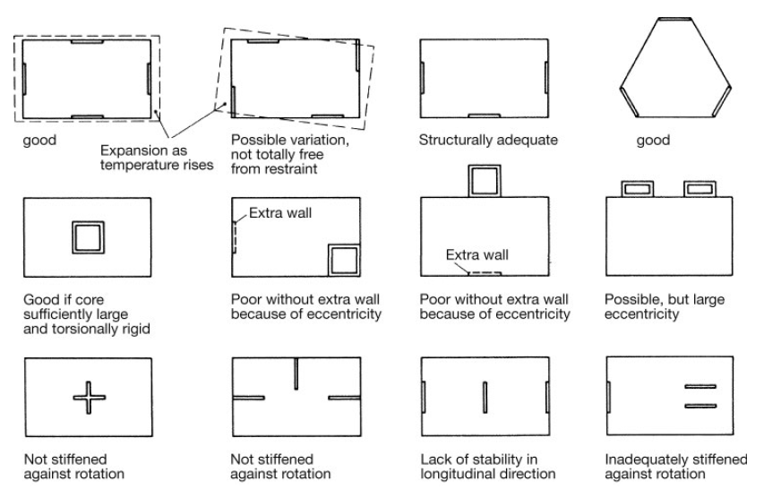
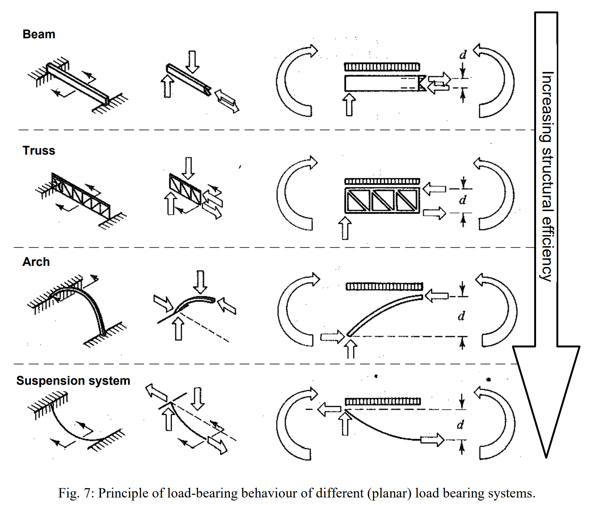

# KONSTRUKTĪVĀS SHĒMAS UN DARBĪBAS PRINCIPI

RISINĀJUMI TELPISKĀS NOTURĪBAS NODROŠINĀŠANAI.

Piemēri telpiskās noturības nodrošināšanai ar papildus stinguma elementiem

DARBĪBAS PRINCIPI LINEĀRIEM PĀRSEGUMA ELEMENTIEM

