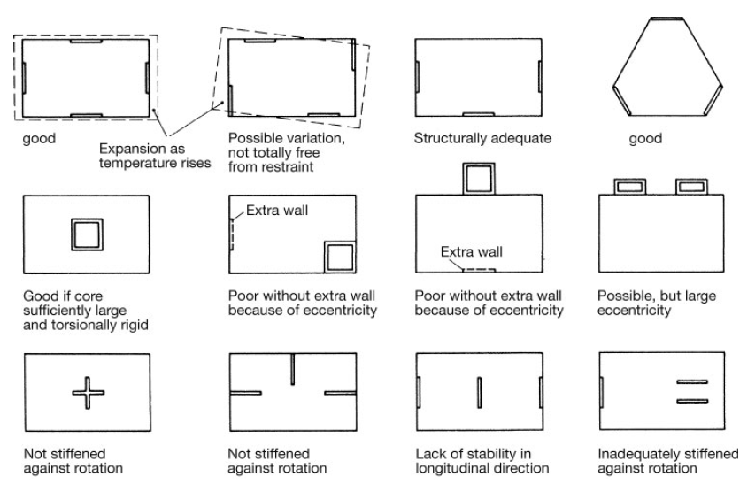
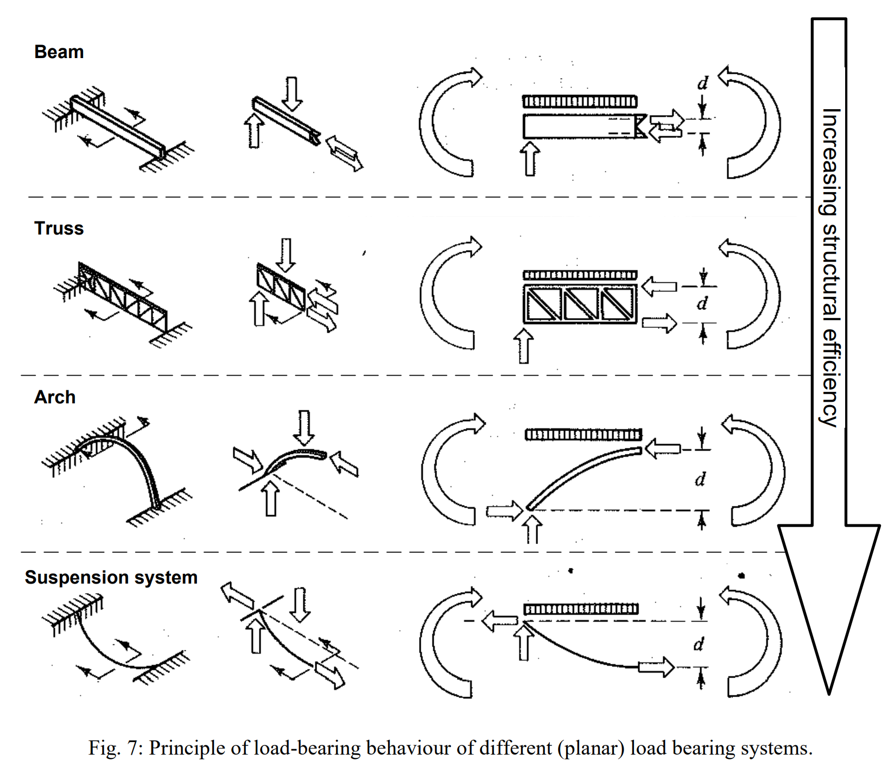

# Konstruktīvās shēmas un darbības principi

Konstruktīvās shēmas izvēle nosaka būves slodžu pārnesi no jumta un stāvu pārsegumiem uz pamatiem un pamatni, kā arī nodrošina ēkas kopējo telpisko noturību un ģeometrisko nemainību.

---

## Risinājumi telpiskās noturības nodrošināšanai

Ēkas telpiskā noturība un pretestība pret horizontālajām iedarbībām (vēju, seismiskajām slodzēm, ģeometriskajām neprecizitātēm) tiek nodrošināta, apvienojot horizontālos un vertikālos stinguma elementus:

- **Horizontālie diski (pārsegumi):** Darbojas kā stingas diafragmas, kas sadala horizontālos spēkus uz vertikālajiem stinguma elementiem.
- **Vertikālie stinguma elementi:**
  - **Stindzināšanas saites (Bracing):** Diagonālie krusti, K-veida vai V-veida saites (raksturīgas tērauda un koka karkasiem). Tie ir visekonomiskākie un mazdeformējamākie elementi.
  - **Bīdes sienas un kodoli (Shear walls / cores):** Monolītā dzelzsbetona kāpņu un liftu šahtas (kodoli) vai nesošās mūra/betona sienas, kas uzņem bīdes spēkus.
  - **Stingie rāmji (Moment frames):** Rāmji ar stingiem (momentizturīgiem) siju-kolonnu mezgliem. Tie ir deformējamāki nekā saites, taču nodrošina lielāku arhitektonisko brīvību.

---

## Darbības principi lineāriem pārseguma elementiem

Lineārie elementi (sijas, dobumotie paneļi, kopnes) uzņem šķērsslodzes un darbojas galvenokārt uz lieci un bīdi. To statiskās shēmas izvēle nosaka piepūļu sadalījumu un konstrukcijas augstumu:

### 1. Vienlaiduma (šarnīrveida) sija
- **Statika:** Statiski nosakāma sistēma. Abos galos ir šarnīrveida atbalsti, kas neuzņem momentu.
- **Moments laidumā:** Maksimālais moments ir laiduma vidū:
  \[M_{\text{max}} = \frac{q \cdot L^2}{8}\]
- **Priekšrocības:** Vienkārša montāža un mezglu izveide, nav jutīga pret atbalstu sēšanos.
- **Trūkumi:** Lielākas izlieces un nepieciešams lielāks šķērsgriezuma augstums.

### 2. Konsoles sija
- **Statika:** Sija ar vienu brīvu galu un otru stingi iespīlētu atbalstā.
- **Moments balstā:** Maksimālais moments veidojas iespīlējuma vietā (stiepta augšējā šķiedra):
  \[M_{\text{max}} = -\frac{q \cdot L^2}{2}\]
- **Trūkumi:** Ļoti jutīga pret iespīlējuma mezgla rotāciju un deformācijām.

### 3. Nepārtraukta (vairāklaidumu) sija
- **Statika:** Statiski nenoteicama sistēma ar starpatbalstiem.
- **Darbības princips:** Momentu diagramma ir vienmērīgāka — virs starpatbalstiem veidojas negatīvi momenti (stiepta augšējā šķiedra), kas samazina momentus laidumos.
- **Priekšrocības:** Mazākas izlieces un mazāks nepieciešamais šķērsgriezuma augstums salīdzinājumā ar vienlaiduma siju.
- **Trūkumi:** Sarežģītāki mezgli, papildu piepūles no atbalstu sēšanās vai temperatūras deformācijām.

