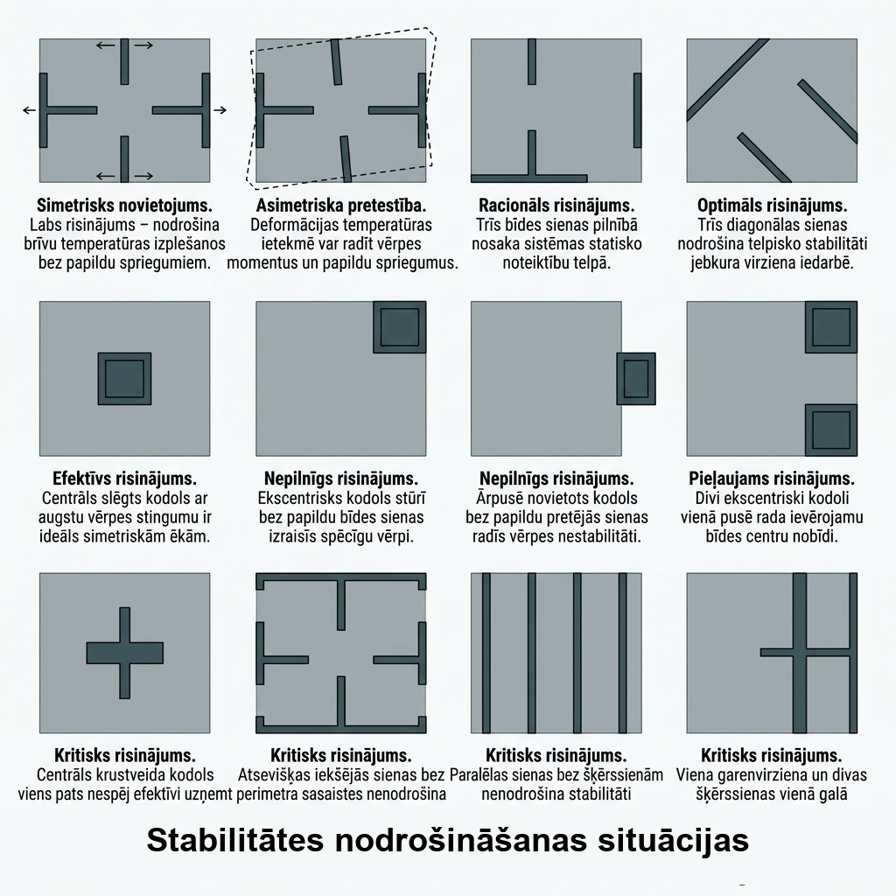

# Konstruktīvās shēmas un darbības principi

Konstruktīvās shēmas izvēle nosaka būves slodžu pārnesi no jumta un stāvu pārsegumiem uz pamatiem un pamatni, kā arī nodrošina ēkas kopējo telpisko noturību un ģeometrisko nemainību.

---

## Risinājumi telpiskās noturības nodrošināšanai

Ēkas telpiskā noturība un pretestība pret horizontālajām iedarbībām (vēju, seismiskajām slodzēm, ģeometriskajām neprecizitātēm) tiek nodrošināta, apvienojot horizontālos un vertikālos stinguma elementus:

- **Horizontālie diski (pārsegumi):** Darbojas kā stingas diafragmas, kas sadala horizontālos spēkus uz vertikālajiem stinguma elementiem.
- **Vertikālie stinguma elementi:**
  - **Stindzināšanas saites (Bracing):** Diagonālie krusti, K-veida vai V-veida saites (raksturīgas tērauda un koka karkasiem). Tie ir visekonomiskākie un mazdeformējamākie elementi.
  - **Bīdes sienas un kodoli (Shear walls / cores):** Monolītā dzelzsbetona kāpņu un liftu šahtas (kodoli) vai nesošās mūra/betona sienas, kas uzņem bīdes spēkus.
  - **Stingie rāmji (Moment frames):** Rāmji ar stingiem (momentizturīgiem) siju-kolonnu mezgliem. Tie ir deformējamāki nekā saites, taču nodrošina lielāku arhitektonisko brīvību.

### Stabilitātes nodrošināšanas situāciju analīze (Skaidrojumi shēmai)

Kā topošajam vai praktizējošam inženierim ir svarīgi izprast, ka telpisko stabilitāti nevar nodrošināt, vienkārši izvietojot bīdes sienas vai kodolus jebkurā ēkas vietā. Ir jāizvērtē slodžu pārvades ceļš, materiālu deformācijas (piemēram, temperatūras izplešanās) un, pats galvenais, **vērpes (rotācijas) ietekme**.

Zemāk apkopoti tehniski skaidrojumi katrai no shēmā attēlotajām situācijām:

#### 1. Rinda: Temperatūras deformācijas un statiskā noteiktība
*   **1. situācija (good):** Simetrisks 4 bīdes sienu novietojums uz ēkas perimetra. Šis ir teicams risinājums, jo ļauj ēkai simetriski un brīvi izplesties temperatūras ietekmē uz visām pusēm (dashed line), neradot papildu spriegumus konstrukcijās.
*   **2. situācija (Possible variation):** Asimetriska sienu izvietojuma gadījumā temperatūras deformācijas ir ierobežotas. Sienu reakcijas rada vērpes momentus un papildu spriegumus pārseguma diskā, kas var izraisīt plaisāšanu.
*   **3. situācija (Structurally adequate):** Minimālais nepieciešamais stinguma sienu skaits pareizai telpiskās stabilitātes nodrošināšanai (2 vertikālas, 1 horizontāla). Sistēma ir statiski noteikta un spēj uzņemt spēkus abos virzienos, kā arī novērst rotāciju.
*   **4. situācija (good):** Trīs diagonāli izvietotas bīdes sienas (piemēram, trīsšķautņu ēkā) nodrošina pilnvērtīgu telpisko stabilitāti un pretestību pret rotāciju jebkura virziena vēja slodzei.

#### 2. Rinda: Stinguma kodolu (šahtu) novietojums un ekscentritāte
*   **5. situācija (Good if core...):** Centrāls, slēgts liftu/kāpņu kodols. Šis ir ļoti efektīvs risinājums, ja kodols ir pietiekami liels un tam ir augsts vērpes stingums (torsional rigidity). Tas ir ideāli piemērots izteikti simetriskām ēkām.
*   **6. situācija (Poor without extra wall...):** Viens kodols stūrī. Horizontālas slodzes gadījumā veidejas liela ekscentritāte starp vēja slodzes rezultējošo spēku un ēkas stinguma centru. Bez papildu bīdes sienas (extra wall) pretējā pusē ēka tiks pakļauta spēcīgai rotācijai.
*   **7. situācija (Poor without extra wall...):** Kodols novietots ārpus ēkas garās malas vidusdaļas. Tāpat kā 6. gadījumā, veidojas liela ekscentritāte. Lai to kompensētu un novērstu vērpi, pretējā fasādē ir nepieciešama papildu stinguma siena.
*   **8. situācija (Possible, but large eccentricity):** Divi kodoli izvietoti vienā ēkas pusē. Šāds risinājums ir pieļaujams, taču tas rada ievērojamu stinguma centra nobīdi (ekscentritāti) pret ēkas ģeometrisko centru.

#### 3. Rinda: Vērpes nestabilitāte un nepietiekams stingums
*   **9. situācija (Not stiffened against rotation):** Krustveida siena ēkas centrā. Lai gan tā nodrošina stabilitāti bīdē abos virzienos, šādam novietojumam ir ļoti mazs inerces moments pret rotāciju, tāpēc ēka nav aizsargāta pret vērpi.
*   **10. situācija (Not stiffened against rotation):** Trīs atsevišķi bīdes sienu segmenti, kas krustojas vienā punktā. Analogi kā 9. situācijā, šis izkārtojums nenodrošina pietiekamu plecu vērpes momentu uzņemšanai.
*   **11. situācija (Lack of stability...):** Paralēlas sienas, kas orientētas tikai vienā virzienā. Ēkai ir izcila stabilitāte šķērsvirzienā, bet pilnībā trūkst stabilitātes garenvirzienā (longitudinal direction) — ēka sabruks kā kāršu namiņš.
*   **12. situācija (Inadequately stiffened...):** Viena garenvirziena siena kreisajā pusē un divas šķērssienas labajā pusē. Lai gan bīdes pretestība ir abos virzienos, sienu novietojums ir pārāk asimetrisks un nepietiekami pasargā ēku pret rotāciju ap kreiso atbalsta punktu.

---

## Darbības principi lineāriem pārseguma elementiem

Lineārie elementi (sijas, dobumotie paneļi, kopnes) uzņem šķērsslodzes un darbojas galvenokārt uz lieci un bīdi. To statiskās shēmas izvēle nosaka piepūļu sadalījumu un konstrukcijas augstumu:

### 1. Vienlaiduma (šarnīrveida) sija
- **Statika:** Statiski nosakāma sistēma. Abos galos ir šarnīrveida atbalsti, kas neuzņem momentu.
- **Moments laidumā:** Maksimālais moments ir laiduma vidū:
  \\[M_{\text{max}} = \frac{q \cdot L^2}{8}\\]
- **Priekšrocības:** Vienkārša montāža un mezglu izveide, nav jutīga pret atbalstu sēšanos.
- **Trūkumi:** Lielākas izlieces un nepieciešams lielāks šķērsgriezuma augstums.

### 2. Konsoles sija
- **Statika:** Sija ar vienu brīvu galu un otru stingi iespīlētu atbalstā.
- **Moments balstā:** Maksimālais moments veidojas iespīlējuma vietā (stiepta augšējā šķiedra):
  \\[M_{\text{max}} = -\frac{q \cdot L^2}{2}\\]
- **Trūkumi:** Ļoti jutīga pret iespīlējuma mezgla rotāciju un deformācijām.

### 3. Nepārtraukta (vairāklaidumu) sija
- **Statika:** Statiski nenoteicama sistēma ar starpatbalstiem.
- **Darbības princips:** Momentu diagramma ir vienmērīgāka — virs starpatbalstiem veidojas negatīvi momenti (stiepta augšējā šķiedra), kas samazina momentus laidumos.
- **Priekšrocības:** Mazākas izlieces un mazāks nepieciešamais šķērsgriezuma augstums salīdzinājumā ar vienlaiduma siju.
- **Trūkumi:** Sarežģītāki mezgli, papildu piepūles no atbalstu sēšanās vai temperatūras deformācijām.

