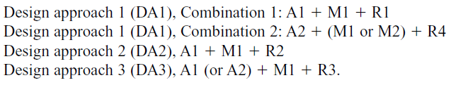
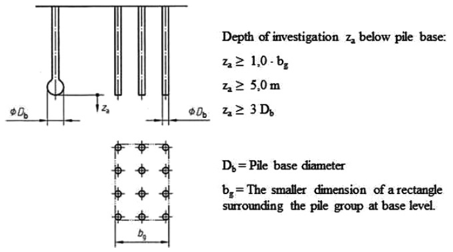

## Vispārīgi

Latvijā pamatu aprēķini veicami pēc DA2 (design approach 2):

Zemāk redzamajā tabulā apkopoti DA2 daļējo koeficientu komplekti (A1+M1+R2) slodžu, augsnes parametru un pretestības koeficientu piemērošanai.

**Nepieciešamais ģeotehniskās izpētes dziļums pāļu pamatiem**

Zemāk redzamajā shēmā attēlots minimālais izpētes dziļums atkarībā no pāļu garuma un to izvietojuma, nodrošinot pietiekamu priekšstatu par grunts slāņojumu zem pāļu gala līmeņa.

