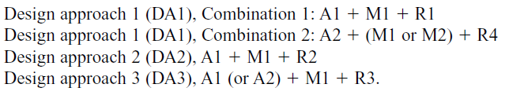
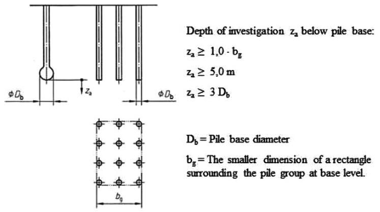

# Pamatu projektēšanas vispārīgie principi

Pamatnes un pamatu aprēķini tiek veikti saskaņā ar standartu **LVS EN 1997-1** (Eirokodekss 7). Robežstāvokļu pārbaudēs izšķir šādus ģeotehniskos robežstāvokļus:
- **EQU (Equilibrium):** Statiskā līdzsvara zudums (piem., apgāšanās vai uzpeldēšana);
- **STR (Structural):** Konstruktīvo elementu nestspējas zudums vai pārmērīga deformācija;
- **GEO (Geotechnical):** Grunts nestspējas zudums vai pārmērīga deformācija pamatnē;
- **UPL (Uplift):** Būves uzpeldēšana hidrostatiskā spiediena ietekmē;
- **HYD (Hydraulic heave):** Grunts uzskalošana vai grunts nesēju slāņu sairšana ūdens spiediena gradienta dēļ.

---

## Ģeotehniskā aprēķina pieeja DA2 Latvijā

Saskaņā ar LVS EN 1997-1 un Latvijas būvnormatīvu LBN 207-21, pamatnes nestspējas aprēķiniem (GEO robežstāvoklim) ir jāizmanto **2. aprēķina pieeja (Design Approach 2, DA2)**.

Aprēķina pieejā DA2 daļējos drošības koeficientus piemēro slodzēm (A komplekts) un grunts pretestībām (R komplekts), savukārt grunts bīdes stiprības parametriem izmanto to raksturīgās vērtības (M1 komplekts, kur koeficienti ir 1,0).

Šo kombināciju apzīmē kā **A1 + M1 + R2**:

### 1. Slodžu parciālie koeficienti ($\gamma_F$ vai $\gamma_E$ — A1 komplekts)
- Pastāvīgā slodze (nelabvēlīga / labvēlīga): $\gamma_{G,sup} = 1,35$ / $\gamma_{G,inf} = 1,00$
- Mainīgā slodze (nelabvēlīga / labvēlīga): $\gamma_{Q,sup} = 1,50$ / $\gamma_{Q,inf} = 0,00$

### 2. Grunts stiprības parametru koeficienti ($\gamma_M$ — M1 komplekts)
- Iekšējās berzes leņķa tangensam ($\tan\phi'$): $\gamma_{\phi'} = 1,00$
- Efektīvajai kohēzijai ($c'$): $\gamma_{c'} = 1,00$
- Nenoslogotai bīdes stiprībai ($c_u$): $\gamma_{cu} = 1,00$

### 3. Pamatnes pretestības koeficienti ($\gamma_R$ — R2 komplekts)
- **Seklajiem pamatiem:**
  - Vertikālā nestspēja (spiedē): $\gamma_{R,v} = 1,4$
  - Horizontālā nestspēja (bīdē): $\gamma_{R,h} = 1,1$
- **Pāļu pamatiem (urbpāļiem un dzenamajiem pāļiem):**
  - Pāļa gala pretestība spiedē: $\gamma_{R,b} = 1,1$
  - Pāļa sānu virsmas pretestība spiedē: $\gamma_{R,s} = 1,1$
  - Kopējā pāļa pretestība spiedē: $\gamma_{R,t} = 1,1$
  - Pāļa pretestība stiepē (izvilkšanai): $\gamma_{R,t,t} = 1,15$

---

## Nepieciešamais ģeotehniskās izpētes dziļums pāļu pamatiem

Ģeotehniskās izpētes urbumu vai statiskās zondēšanas (CPT) dziļumam ir jābūt pietiekamam, lai droši novērtētu grunts slāņu sastāvu un stiprību zem pāļu gala.

Saskaņā ar LVS EN 1997-2 B pielikumu, pāļu pamatiem izpētes dziļumam $z_a$ zem plānotā pāļu gala līmeņa jāatbilst lielākajam no šādiem nosacījumiem:
- $z_a \ge 5,0\text{ m}$ zem pāļa gala;
- $z_a \ge 3 \cdot D_F$ (kur $D_F$ ir pāļu grupas pamata ekvivalentais platums vai diametrs pāļu gala līmenī).

