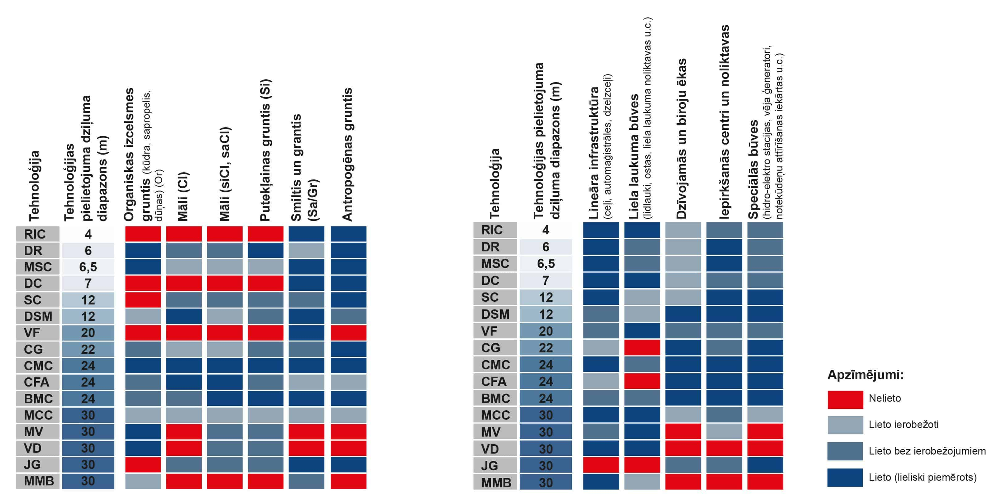
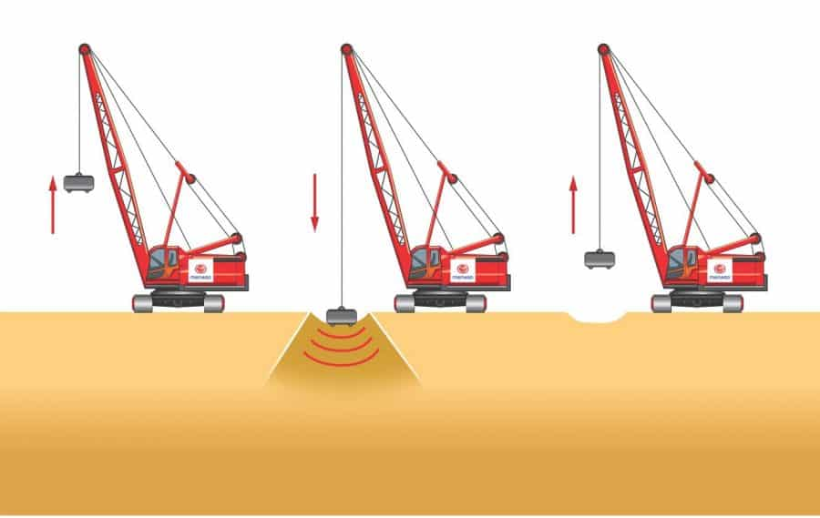
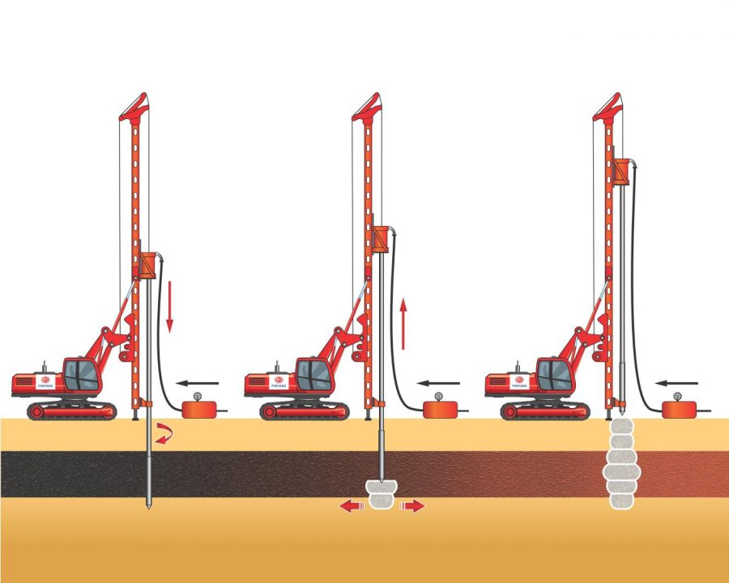
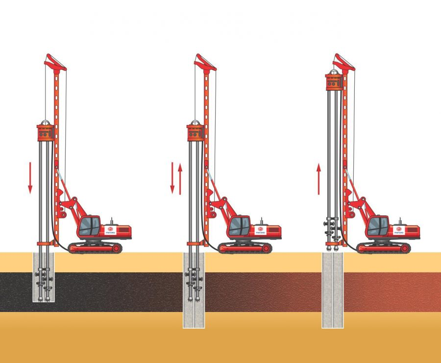
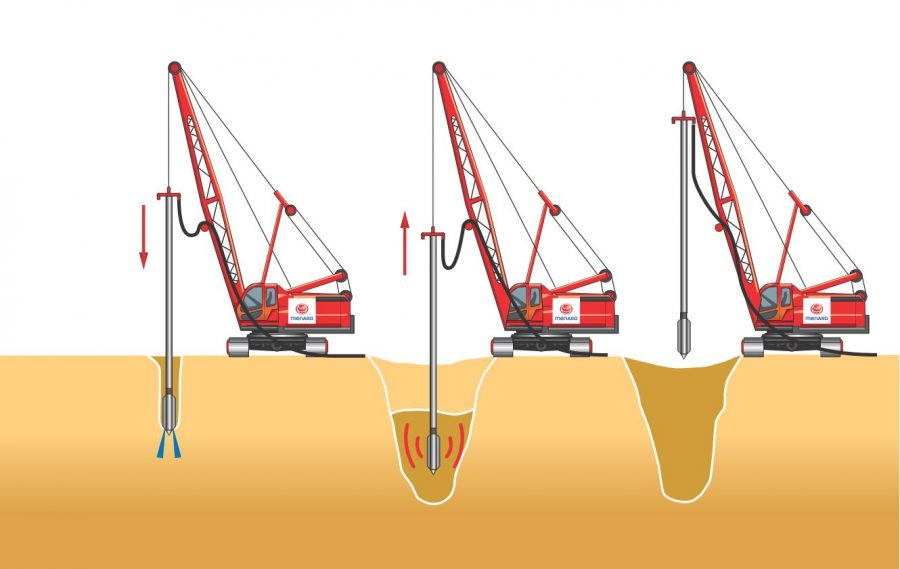
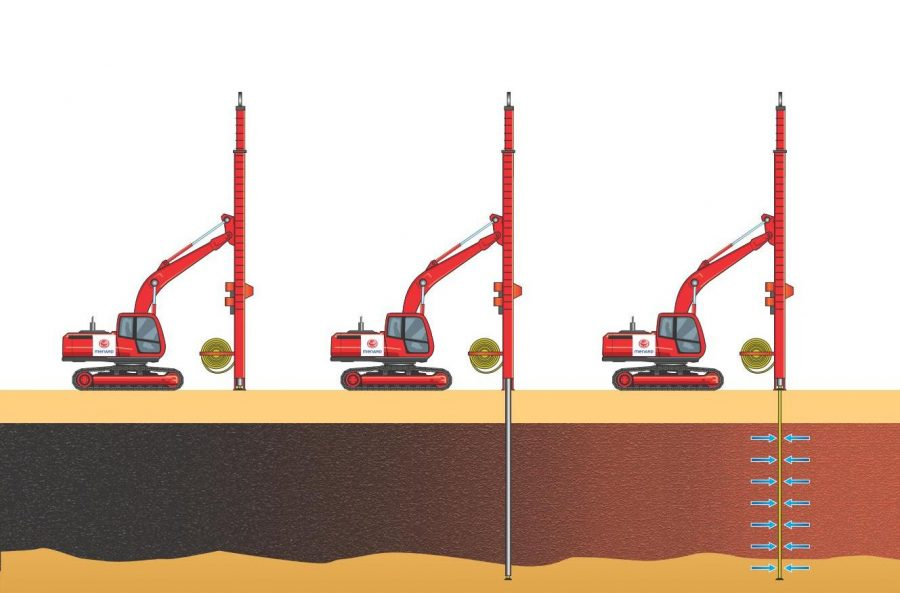
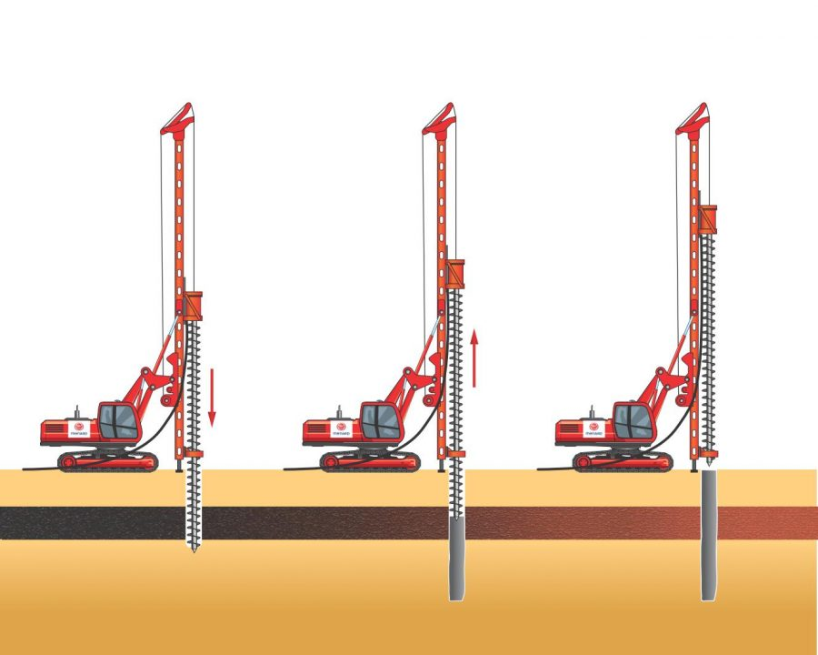

## Tehnoloģiju pielietojamība

Dati no Menard Latvia, kur apkopota darbu piemērotība ģeotehniskajiem apstākļiem un būves veidiem.

Biežāk lietoto tehnoloģiju atšifrējumi:

DC – dinamiskā blietēšana (dynamic compaction)

ISR - Cementācija ar Grunts Blīvēšanu

DSM Columns – Deep Soil Mixing – Dziļā grunts stabilizācija

VF – Vibroflotācija

VD - Vertikālās drenas

CFA Pāļi

