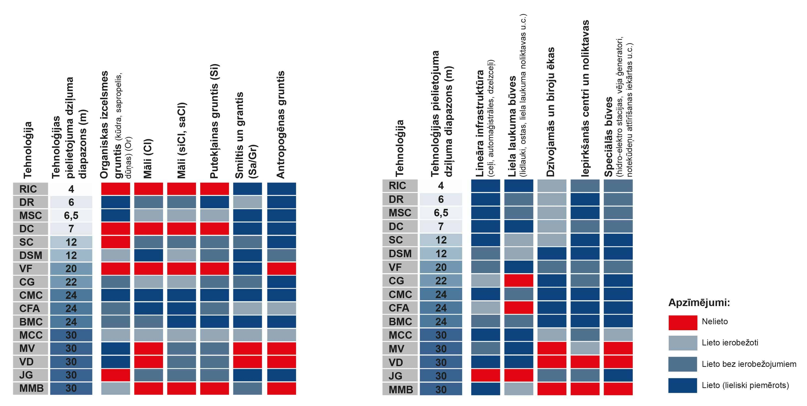
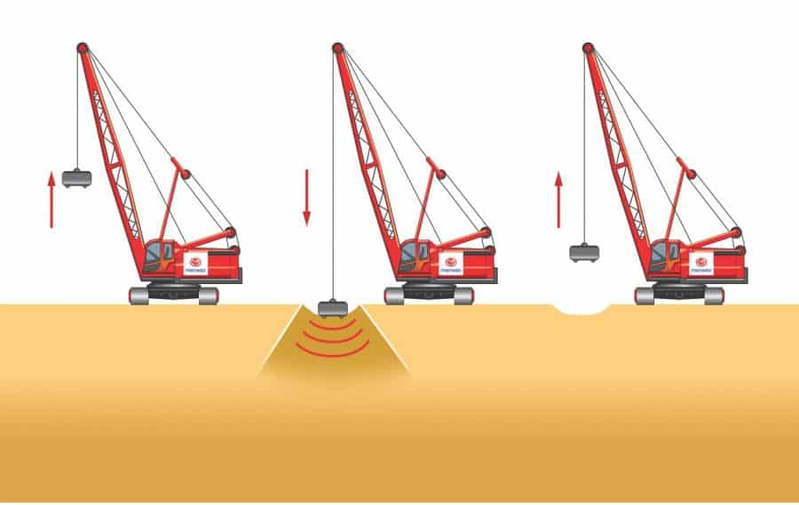
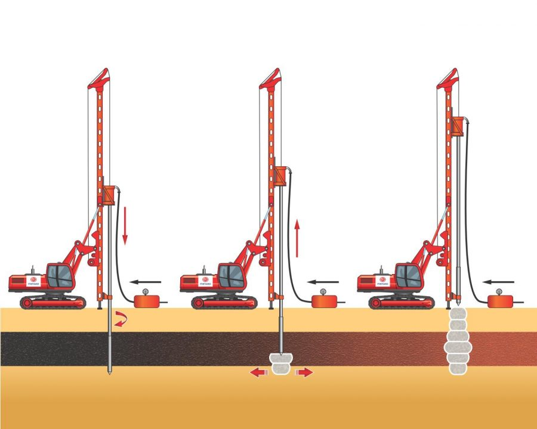
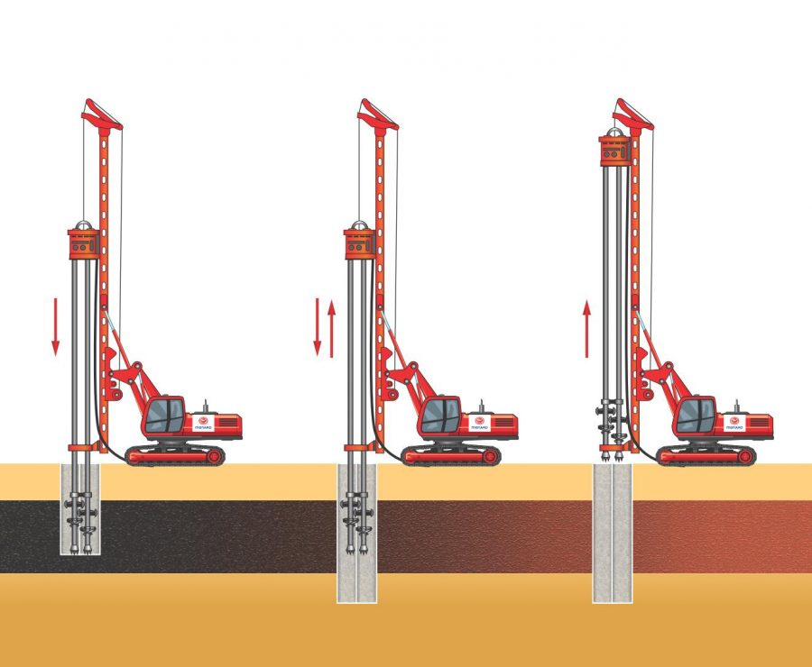
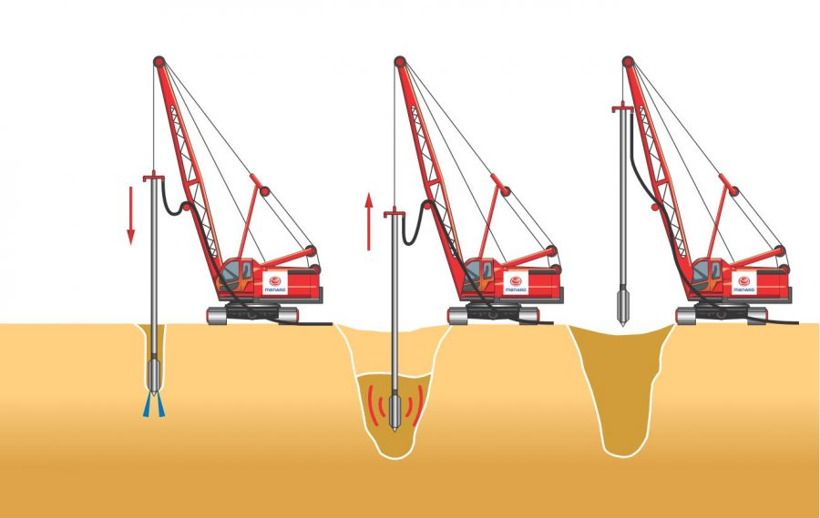
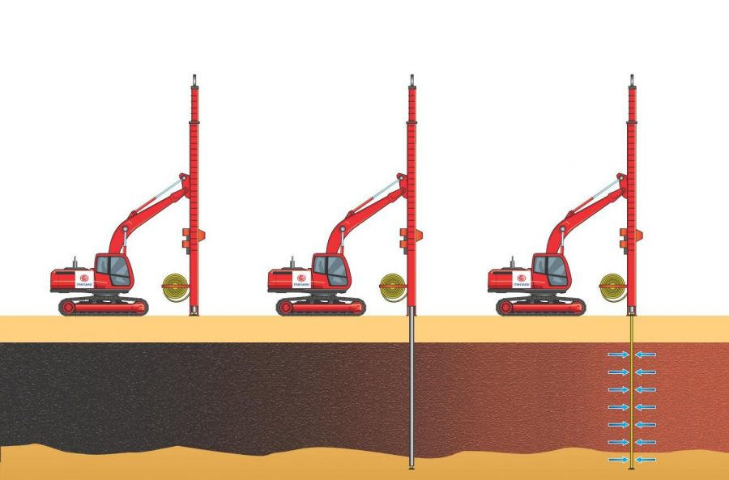
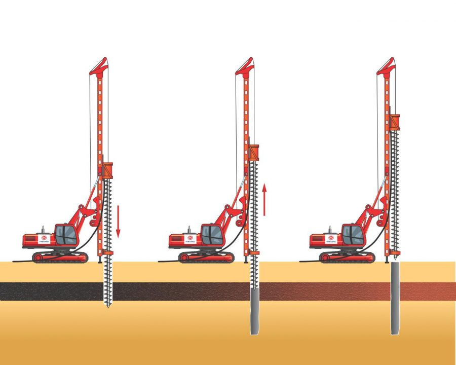

# Grunts uzlabošanas un pamatu izbūves tehnoloģijas

Ģeotehnisko apstākļu uzlabošanai un piemērotāko pamatu izvēlei izmanto dažādas grunts stabilizācijas un pāļu izbūves metodes. Izvēle ir atkarīga no būves veida, slodzēm un grunts slāņojuma.

Dati un darbu piemērotība ģeotehniskajiem apstākļiem un būves veidiem apkopoti šādās diagrammās:

---

## Biežāk lietoto grunts uzlabošanas un pāļu tehnoloģiju apraksts

### 1. DC — Dinamiskā blietēšana (Dynamic Compaction)
Grunts dziļās sablīvēšanas metode, periodiski nometot smagu tērauda vai betona kluci (parasti 10–40 tonnas) no liela augstuma (10–30 metri) uz grunts virsmas.
- **Pielietojums:** Efektīva irdenām smilts, grants un nevienmērīgām uzbērtām gruntīm, lai palielinātu to blīvumu, nestspēju un samazinātu sēšanos līdz pat 10 m dziļumā.

### 2. ISR — Grunts blīvēšanas cementācija (Compaction Grouting)
Tehnoloģija, kurā gruntī pa iepriekš izurbtu nedrošu urbumu zem spiediena tiek injicēta bieza cementa java. Java nesajaucas ar grunti, bet gan izplešas kā stingrs "burbulis", sablīvējot apkārtējo vājo grunti.
- **Pielietojums:** Izmanto esošu pamatu sēšanās apturēšanai, grunts nestspējas paaugstināšanai zem pamata plātnēm un karsta dobumu aizpildīšanai.

### 3. DSM Columns — Dziļā grunts sajaukšana (Deep Soil Mixing)
Vājo grunšu stabilizācija, mehāniski sajaucot esošo grunti ar saistvielu (cementa suspension vai kaļķi), izmantojot speciālu rotējošu urbi. Tā rezultātā veidojas augstas stiprības grunts-cementa kolonnas.
- **Pielietojums:** Piemērota vājām, organiskām gruntīm (kūdrai, dūņām, mīkstiem māliem) kā pamatne plātnēm, ceļu uzbērumiem vai kā rievsienu analogi.

### 4. VF — Vibroflotācija (Vibroflotation)
Grunts dziļā sablīvēšana, izmantojot speciālu vibrējošu zondi (flotatoru), kas ar ūdens un vibrācijas palīdzību nogrimst līdz projektētajam dziļumam. Bieži procesā tiek iestrādātas šķembas, izveidojot blīvas šķembu kolonnas.
- **Pielietojums:** Izmanto irdenu smilšu sablīvēšanai vai vāju mālainu grunšu pastiprināšanai.

### 5. VD — Vertikālās drenas (Vertical Drains)
Sintētisku joslas drenu ievietošana vājās, ūdens piesātinātās mālainās gruntīs. Pēc tam laukumu noslogo ar pagaidu uzbērumu, kas izspiež ūdeni pa drenām uz augšu.
- **Pielietojums:** Izmanto, lai paātrinātu vāju mālu konsolidāciju (sēšanos) no vairākiem gadiem uz dažiem mēnešiem pirms ceļu vai ēku būvniecības uzsākšanas.

### 6. CFA pāļi (Continuous Flight Auger)
Urbtie dzelzsbetona pāļi ar vienlaidu gliemežurbi. Urbis tiek iegremdēts gruntī, un tā izvilkšanas laikā caur urbja centrālo asi spiediena ietekmē tiek padots betons. Pēc tam svaigajā betonā tiek vibrēts stiegrojuma karkass.
- **Pielietojums:** Ļoti ātra pāļu izbūves metode ar zemu vibrāciju un trokšņa līmeni, ideāli piemērota pilsētvidei un blakus esošu būvju tuvumā.

