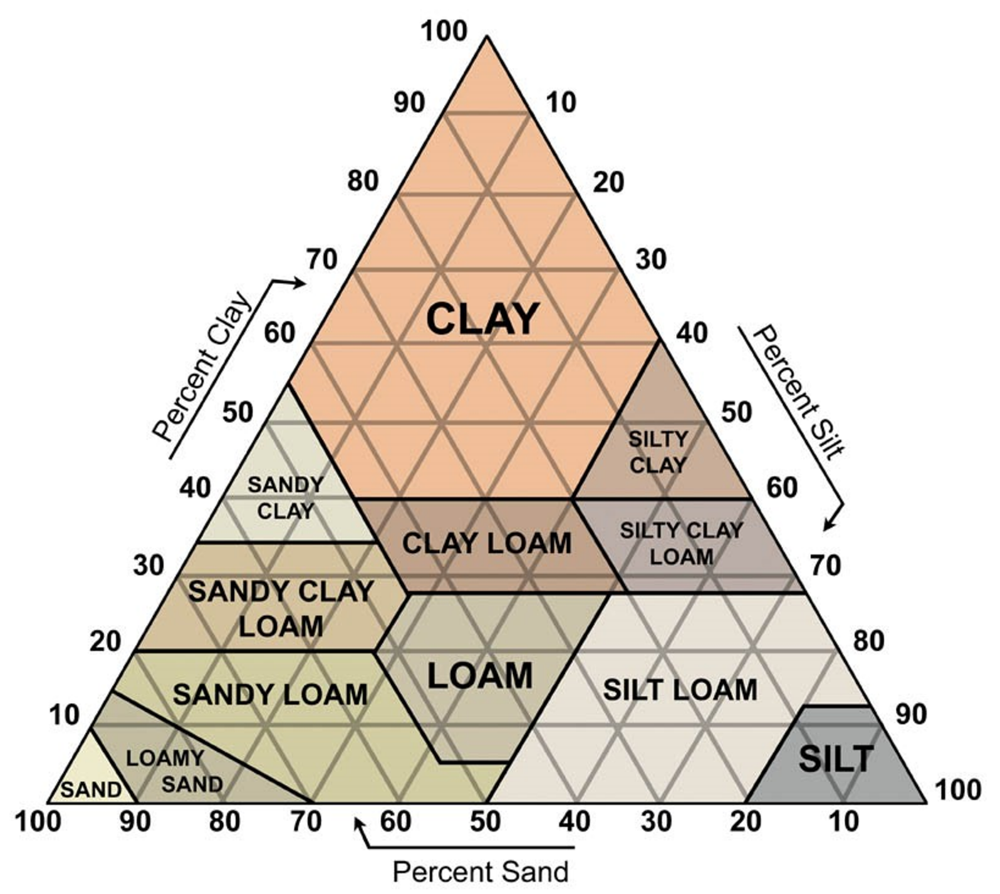
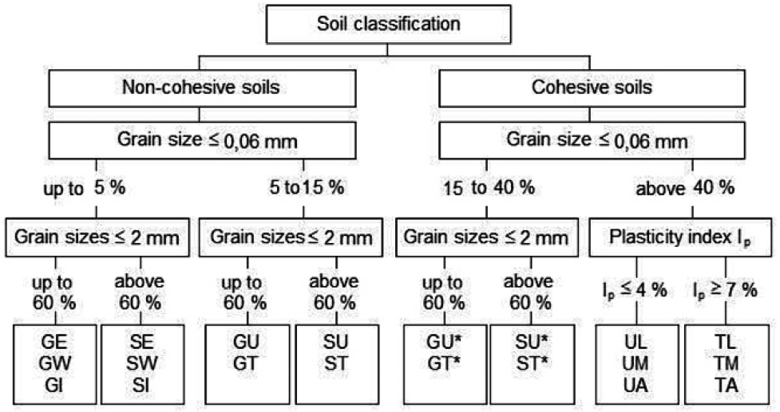
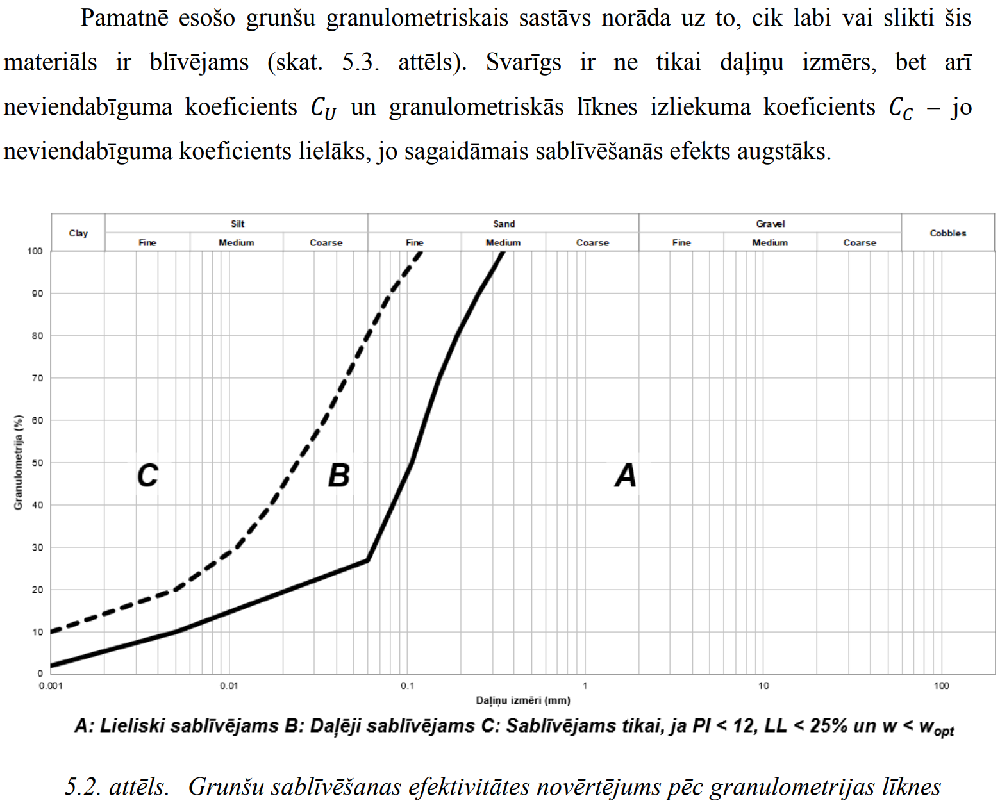
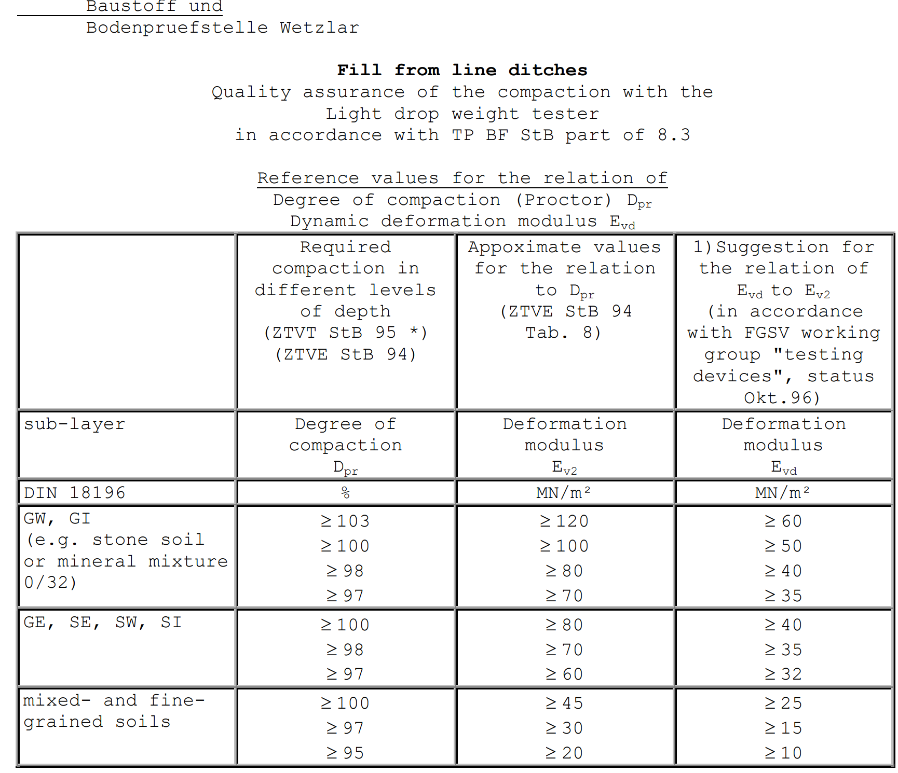

## GRUNŠU BLĪVUMI

| Grunts tips / Soil type | Mitras grunts tilpumsvars / Moist bulk density, Υ (kg/m3) | Mitras grunts tilpumsvars / Moist bulk density, Υ (kg/m3) | Ūdenspiesātinātas grunts tilpumsvars / Saturated bulk density, Υ (kg/m3) | Ūdenspiesātinātas grunts tilpumsvars / Saturated bulk density, Υ (kg/m3) |
| --- | --- | --- | --- | --- |
| Grunts tips / Soil type | Irdena / Loose | Blīva / Dense | Irdena / Loose | Blīva / Dense |
| Rupjgraudainas gruntis / Granular | Rupjgraudainas gruntis / Granular | Rupjgraudainas gruntis / Granular | Rupjgraudainas gruntis / Granular | Rupjgraudainas gruntis / Granular |
| Grants / Gravel | 1600 | 1800 | 2000 | 2100 |
| Grants ar labu granulometriju / Well graded sand and gravel | 1900 | 2100 | 2150 | 2300 |
| Rupja un vidēji rupja smilts / Coarse or medium sand | 1650 | 1850 | 2000 | 2150 |
| Labas granulometrijas smilts / Well graded sand | 1800 | 2100 | 2050 | 2250 |
| Ķieģeļu šķembas / Brick hardcore | 1300 | 1750 | 1650 | 1900 |
| Saistītās gruntis / Cohesive | Saistītās gruntis / Cohesive | Saistītās gruntis / Cohesive | Saistītās gruntis / Cohesive | Saistītās gruntis / Cohesive |
| Mīksts māls / Soft clay | 1700 | 1700 | 1700 | 1700 |
| Sīksts māls / Firm clay | 1800 | 1800 | 1800 | 1800 |
| Sīksts māls / Stiff clay | 1900 | 1900 | 1900 | 1900 |
| Sīksts vai ciets pamatiežu māls / Stiff or hard glacial clay | 2100 | 2100 | 2100 | 2100 |

## GRUNŠU PARAMETRU KORELĀCIJAS UN APRAKSTI

Stiprība mālainām gruntīm atkarībā no to konsistences (avots: Look 2007)

<table>
<colgroup>
  <col style="width:55%">
  <col style="width:25%">
  <col style="width:20%">
</colgroup>
<thead>
<tr><th>Apraksts</th><th>qu (kN / m2), Unconfined compression strength</th><th>Aptuvenā pretestība zondei qc, MPa</th></tr>
</thead>
<tbody>
<tr><td>Ļoti mīksts māls / Very soft</td><td>0 - 24</td><td>&lt; 0.20</td></tr>
<tr><td>Mīksts māls / Soft</td><td>24 - 48</td><td>0.20 – 0.40</td></tr>
<tr><td>Vidēji mīksts māls / Medium</td><td>48 - 96</td><td>0.40 – 0.90</td></tr>
<tr><td>Sīksts māls / Stiff</td><td>96 – 192</td><td>0.90 – 2.00</td></tr>
<tr><td>Ļoti sīksts māls / Very Stiff</td><td>192 – 383</td><td>2.00 – 4.20</td></tr>
<tr><td>Ciets māls</td><td>&gt; 383</td><td>&gt; 4.20</td></tr>
</tbody>
</table>

Nedrenētās bīdes stiprība parasti nosakāma pēc sakarības: Su = Cu = qu / 2

Klinšainu grunšu apraksts un atbilstošais RQD (Rock Quality Designation) rādītājs

<table>
<colgroup>
  <col style="width:70%">
  <col style="width:30%">
</colgroup>
<thead>
<tr><th>Klinšainās grunts apraksts, masas kvalitāte</th><th>RQD rādītājs</th></tr>
</thead>
<tbody>
<tr><td>Lieliska / Exelent</td><td>90 - 100</td></tr>
<tr><td>Laba / Good</td><td>75 - 90</td></tr>
<tr><td>Vidēja / Fair</td><td>50 – 75</td></tr>
<tr><td>Zema / Poor</td><td>25 – 50</td></tr>
<tr><td>Ļoti zema / Very Poor</td><td>&lt; 25</td></tr>
</tbody>
</table>

RQD rādītājs tiek izmantots atsevišķos pāļu aprēķinos, piemēram, pēc Tomlinson.

## MAKSIMĀLĀS ROBEŽDEFORMĀCIJAS

Tabulā apkopotas standarta gadījumos pieļaujamās robeždeformācijas.

### Maksimālās robeždeformācijas

<table>
<colgroup>
  <col style="width:35%">
  <col style="width:25%">
  <col style="width:20%">
  <col style="width:20%">
</colgroup>
<thead>
<tr><th>Konstrukciju tips</th><th>Bojājuma veids</th><th>Kritērijs</th><th>Robežvērtība</th></tr>
</thead>
<tbody>
<tr><td rowspan="4">Karkasa ēkas un dzelzsbetona nesošās sienas</td><td>Strukturāli bojājumi</td><td>Leņķiskā distorsija</td><td>1/150–1/250</td></tr>
<tr><td>Sienu un starpsienu plaisas</td><td>Leņķiskā distorsija</td><td>1/500 (1/1000–1/1400 gala laidumos)</td></tr>
<tr><td>Vizuālais izskats</td><td>Slīpums</td><td>1/300</td></tr>
<tr><td>Savienojums ar inženiertīkliem</td><td>Kopējā sēšanās</td><td>50–75 mm (smiltis), 75–135 mm (māls)</td></tr>
<tr><td>Augstceltnes</td><td>Liftu un eskalatoru darbība</td><td>Slīpums pēc lifta uzstādīšanas</td><td>1/1200–1/2000</td></tr>
<tr><td rowspan="2">Konstrukcijas ar nestiegrotām nesošām sienām</td><td>Plaisas no slogojuma pa luku</td><td>Izlieces attiecība</td><td>1/2500 (L/H=1), 1/1250 (L/H=5)</td></tr>
<tr><td>Plaisas no slogojuma pa āļu</td><td>Izlieces attiecība</td><td>1/5000 (L/H=1), 1/2500 (L/H=5)</td></tr>
<tr><td rowspan="3">Tilti — vispārīgi</td><td>Braukšanas komforts</td><td>Kopējā sēšanās</td><td>100 mm</td></tr>
<tr><td>Strukturāli bojājumi</td><td>Kopējā sēšanās</td><td>63 mm</td></tr>
<tr><td>Funkcija</td><td>Horizontālā kustība</td><td>38 mm</td></tr>
<tr><td>Tilti — vairāklaidumu</td><td>Strukturāli bojājumi</td><td>Leņķiskā distorsija</td><td>1/250</td></tr>
<tr><td>Tilti — vienlaiduma</td><td>Strukturāli bojājumi</td><td>Leņķiskā distorsija</td><td>1/200</td></tr>
</tbody>
</table>

## PUASONA KOEFICIENTI

Ja nav tieši veikti Puasona koeficienta mērījumi, tad Puasona koeficientu pieņem

0.27 rupjdrupu iežiem,

0.30 – smiltij un mālu gruntij ar 1 >IP > 7 % jeb mālsmiltij,

0.35 – mālu gruntij ar 7 > IP> 17% jeb smilšmālam un

0.42 – mālu gruntij ar IP > 17 % jeb mālam.

## GRUNŠU KLASIFIKĀCIJA PĒC DAĻIŅU SASTĀVA

Grunšu klasifikācija pēc DIN 18196

## GRUNŠU BLIETĒŠANA

Fragments no SIA Ceļu ekspets Rokasgrāmatas ″Ceļa zemes klātnes grunts nestspējas nodrošināšanas risinājumu izstrāde″

## SEKLIE PAMATI

Seklajiem pamatiem no sala iedarbības bojājumiem var izvairīties, ja:

Grunts nav jūtīga pret sala iedarbību;

Pamatu līmenis atrodas zem sasalšanas dziļuma;

Sala ietekme ir novērsta ar izolāciju.
