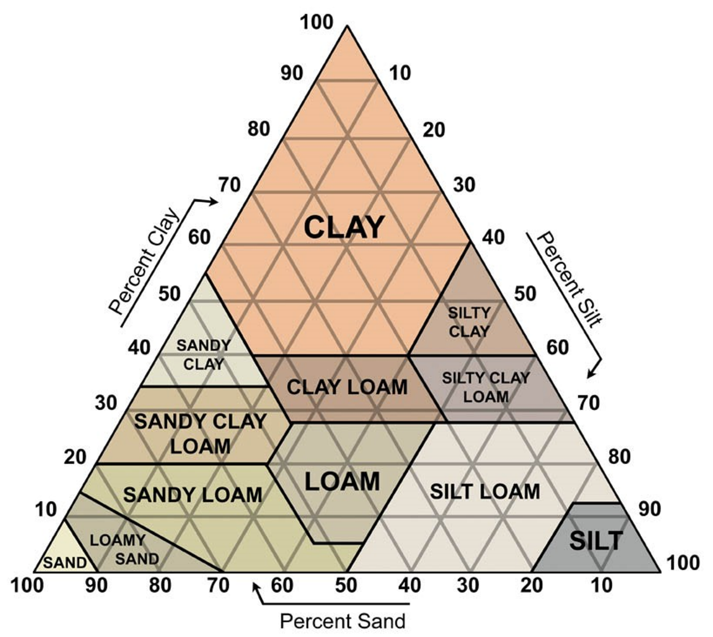
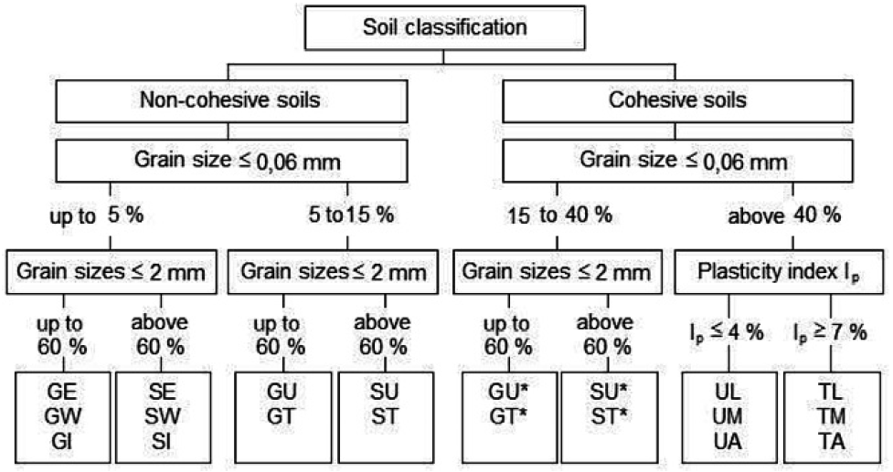
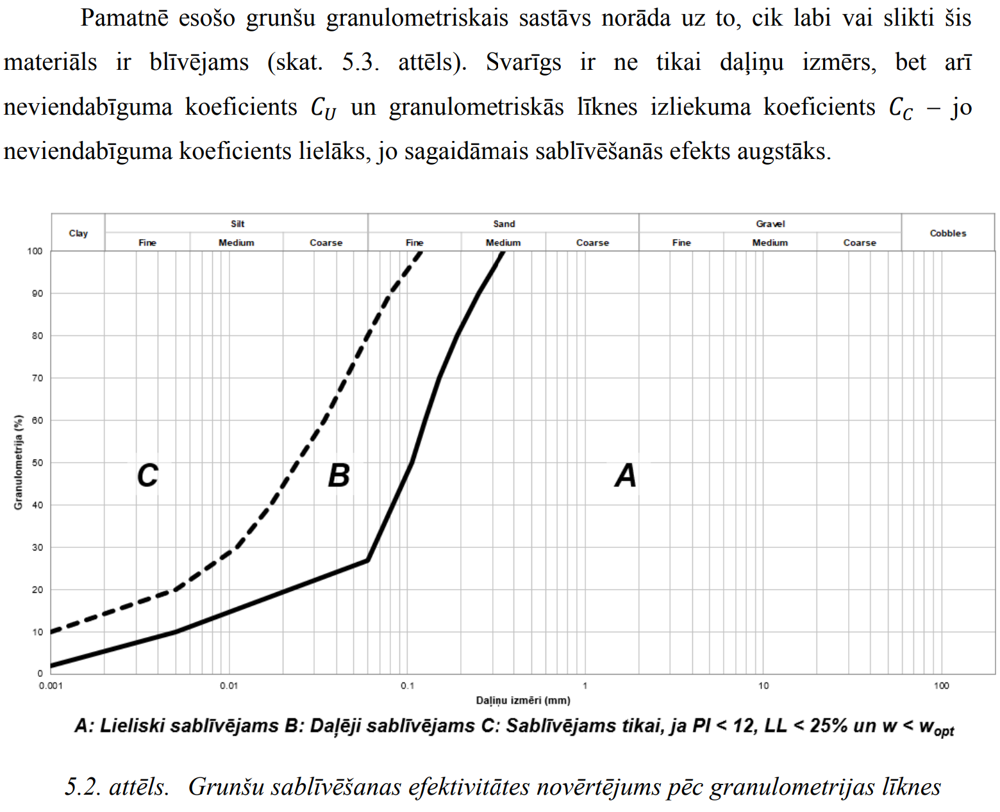
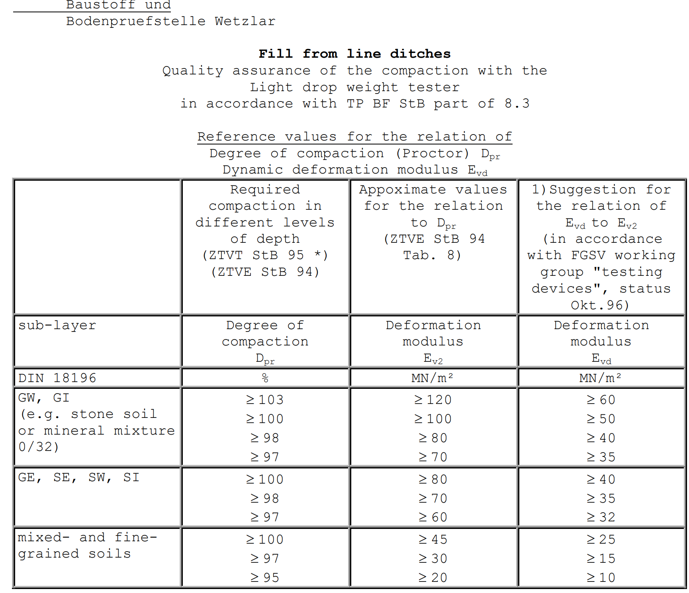

# Grunšu fizikāli mehāniskie parametri

Grunšu parametru pareiza noteikšana ir pamats jebkuram ģeotehniskajam aprēķinam. Tālāk apkopoti praktiski dati un korelācijas dažādiem grunts tipiem.

---

## Grunšu tilpuma masas un tilpumsvaru orientējošās vērtības

Būvkonstrukciju pašsvara un grunts spiediena aprēķiniem izmanto grunts tilpuma masu \\(\rho\\) (\\(\text{kg/m}^3\\)) vai tilpumsvaru \\(\gamma\\) (\\(\text{kN/m}^3\\)), kur \\(\gamma \approx \rho \cdot g\\) (pieņemot \\(g \approx 10\text{ m/s}^2\\), t.i., \\(1800\text{ kg/m}^3 \approx 18,0\text{ kN/m}^3\\)).

| Grunts tips | Mitras grunts tilpuma masa \\(\rho\\) (kg/m³)   (Tilpumsvars \\(\gamma\\), kN/m³) | Mitras grunts tilpuma masa \\(\rho\\) (kg/m³)   (Tilpumsvars \\(\gamma\\), kN/m³) | Ūdenspiesātinātas grunts tilpuma masa \\(\rho\\) (kg/m³)   (Tilpumsvars \\(\gamma\\), kN/m³) | Ūdenspiesātinātas grunts tilpuma masa \\(\rho\\) (kg/m³)   (Tilpumsvars \\(\gamma\\), kN/m³) |
| :--- | :---: | :---: | :---: | :---: |
| | **Irdena** | **Blīva** | **Irdena** | **Blīva** |
| Rupjgraudainas (nesaistītas) gruntis: | | | | |
| — Grants | 1600 (\\(16,0\\)) | 1800 (\\(18,0\\)) | 2000 (\\(20,0\\)) | 2100 (\\(21,0\\)) |
| — Grants ar labu granulometriju | 1900 (\\(19,0\\)) | 2100 (\\(21,0\\)) | 2150 (\\(21,5\\)) | 2300 (\\(23,0\\)) |
| — Rupja un vidēji rupja smilts | 1650 (\\(16,5\\)) | 1850 (\\(18,5\\)) | 2000 (\\(20,0\\)) | 2150 (\\(21,5\\)) |
| — Labas granulometrijas smilts | 1800 (\\(18,0\\)) | 2100 (\\(21,0\\)) | 2050 (\\(20,5\\)) | 2250 (\\(22,5\\)) |
| — Ķieģeļu šķembas (uzbērums) | 1300 (\\(13,0\\)) | 1750 (\\(17,5\\)) | 1650 (\\(16,5\\)) | 1900 (\\(19,0\\)) |
| Saistītās (mālainās) gruntis: | | | | |
| — Mīksts māls | 1700 (\\(17,0\\)) | 1700 (\\(17,0\\)) | 1700 (\\(17,0\\)) | 1700 (\\(17,0\\)) |
| — Sīksts māls (vidējs) | 1800 (\\(18,0\\)) | 1800 (\\(18,0\\)) | 1800 (\\(18,0\\)) | 1800 (\\(18,0\\)) |
| — Sīksts māls (blīvs) | 1900 (\\(19,0\\)) | 1900 (\\(19,0\\)) | 1900 (\\(19,0\\)) | 1900 (\\(19,0\\)) |
| — Sīksts/ciets pamatiežu māls | 2100 (\\(21,0\\)) | 2100 (\\(21,0\\)) | 2100 (\\(21,0\\)) | 2100 (\\(21,0\\)) |

---

## Saistīto grunšu parametru korelācijas un apraksti

Mālaino grunšu stiprību raksturo vienass spiedes stiprība \\(q_u\\) un konusa pretestība zondei \\(q_c\\) (iegūta statiskajā zondēšanā CPT).

**Mālu konsistence un stiprības rādītāji (avots: Look, 2007):**

| Konsistence (apraksts) | Vienass spiedes stiprība \\(q_u\\) (kPa jeb kN/m²) | Aptuvenā konusa pretestība zondei \\(q_c\\) (MPa) |
| :--- | :---: | :---: |
| Ļoti mīksts māls | 0 – 24 | < 0,20 |
| Mīksts māls | 24 – 48 | 0,20 – 0,40 |
| Vidēji sīksts māls | 48 – 96 | 0,40 – 0,90 |
| Sīksts māls | 96 – 192 | 0,90 – 2,00 |
| Ļoti sīksts māls | 192 – 383 | 2,00 – 4,20 |
| Ciets māls | > 383 | > 4,20 |

Nedrenētās bīdes stiprība \\(c_u\\) (vai \\(s_u\\)) ir puse no vienass spiedes stiprības \\(q_u\\):
\[c_u = s_u = \frac{q_u}{2}\]

---

## Klinšainu grunšu apraksts un RQD (Rock Quality Designation)

RQD rādītājs raksturo ieža masas plaisainību un veselumu. To definē kā to serdes gabalu kopējo garumu, kas ir garāki par 10 cm, attiecību pret kopējo urbšanas gaitu (izteiktu procentos).

**Iežu kvalitātes novērtējums pēc RQD:**

| Klinšainās grunts apraksts (kvalitāte) | RQD rādītājs (%) |
| :--- | :---: |
| Lieliska (Excellent) | 90 – 100 |
| Laba (Good) | 75 – 90 |
| Vidēja (Fair) | 50 – 75 |
| Zema (Poor) | 25 – 50 |
| Ļoti zema (Very poor) | < 25 |

*Piezīme: RQD rādītājs tiek izmantots pāļu aprēķinos klintīs (piemēram, pēc Tomlinsona metodes).*

---

## Pamatu maksimālās robeždeformācijas

Tabulā apkopotas standarta gadījumos pieļaujamās robeždeformācijas pēc LVS EN 1997-1 un ģeotehniskās prakses:

| Konstrukciju tips | Bojājuma veids | Deformācijas kritērijs | Robežvērtība |
| :--- | :--- | :--- | :---: |
| Karkasa ēkas un dzelzsbetona nesošās sienas | Strukturāli bojājumi | Leņķiskā distorsija (slīpums) \\(\beta\\) | \\(1/150 - 1/250\\) |
| | Sienu un starpsienu plaisas | Leņķiskā distorsija (slīpums) \\(\beta\\) | \\(1/500\\)   (\\(1/1000 - 1/1400\\) gala laidumos) |
| | Vizuālais izskats | Slīpums \\(\omega\\) | \\(1/300\\) |
| | Savienojums ar inženiertīkliem | Kopējā sēšanās \\(s\\) | \\(50-75\text{ mm}\\) (smiltīs) \\(75-135\text{ mm}\\) (mālos) |
| Augstceltnes | Liftu un eskalatoru darbība | Slīpums pēc lifta uzstādīšanas | \\(1/1200 - 1/2000\\) |
| Konstrukcijas ar nestiegrotām nesošām sienām | Plaisas no lieces pa ieloku (sagging) | Izlieces attiecība \\(\Delta/L\\) | \\(1/2500\\) (pie \\(L/H=1\\)) \\(1/1250\\) (pie \\(L/H=5\\)) |
| | Plaisas no lieces pa izliekumu (hogging) | Izlieces attiecība \\(\Delta/L\\) | \\(1/5000\\) (pie \\(L/H=1\\)) \\(1/2500\\) (pie \\(L/H=5\\)) |
| Tilti — vispārīgi | Braukšanas komforts | Kopējā sēšanās \\(s\\) | \\(100\text{ mm}\\) |
| | Strukturāli bojājumi | Kopējā sēšanās \\(s\\) | \\(63\text{ mm}\\) |
| | Funkcionalitāte | Horizontālā pārvietošanās | \\(38\text{ mm}\\) |
| Tilti — vairāklaidumu | Strukturāli bojājumi | Leņķiskā distorsija \\(\beta\\) | \\(1/250\\) |
| Tilti — vienlaiduma | Strukturāli bojājumi | Leņķiskā distorsija \\(\beta\\) | \\(1/200\\) |

---

## Puasona koeficienti (\\(\nu\\))

Ja nav tiešu lauka vai laboratorijas mērījumu datu, Puasona koeficientu elastīgo deformāciju aprēķinos pieņem:
- **\\(0,27\\)** — rupjgraudainām gruntīm un iežiem (grants, rupja smilts);
- **\\(0,30\\)** — smiltīm un mālsmiltīm ar zemu plastiskumu (\\(1\% < I_p \le 7\%\\));
- **\\(0,35\\)** — smilšmāliem ar vidēju plastiskumu (\\(7\% < I_p \le 17\%\\));
- **\\(0,42\\)** — māliem ar augstu plastiskumu (\\(I_p > 17\%\\)).

---

## Grunšu klasifikācija un blīvēšana

### Grunšu klasifikācija pēc daļiņu sastāva:

**Grunšu klasifikācija pēc DIN 18196:**

---

## Grunšu blīvēšanas kontrole

Grunts sablīvēšanas kvalitāti būvlaukumā kontrolē ar blīvēšanas koeficientu \\(D_P\\) (vai \\(K_C\\)) un deformācijas moduļiem \\(E_{v1}\\) un \\(E_{v2}\\), ko nosaka ar statiskās vai dinamiskās plātnes testu.

*Fragments no ceļa klātnes grunts nestspējas rokasgrāmatas:*

---

## Seklie pamati

Sagatavojot seklos pamatus (pēdas, lentes), no sala iedarbības izraisītiem grunts kūmuma bojājumiem var izvairīties, ja:
1. Pamatnes grunts nav jutīga pret sala iedarbību (piemēram, tīra, rupja smilts vai grants bez smalko daļiņu piemaisījuma);
2. Pamatu pēdas dziļums atrodas zem reģionālā grunts sasalšanas dziļuma (Latvijā parasti robežās no \\(0,9\text{ m}\\) līdz \\(1,2\text{ m}\\));
3. Sasalšanas ietekme ir novērsta, izmantojot perimetra siltumizolāciju (ekstrudēto polistirolu XPS).
