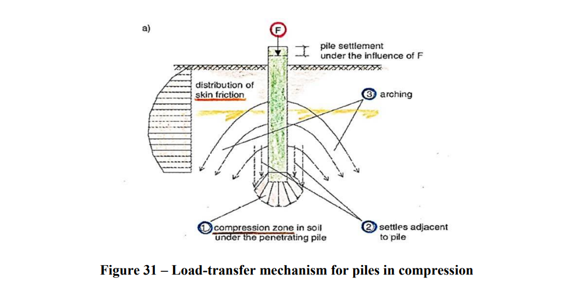
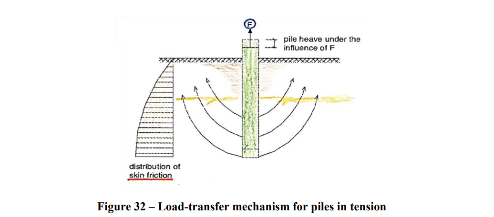

## PĀĻU PAMATI

**Korelācijas faktori pāļu pretestības iegūšanai no grunts pārbaudes rezultātiem**

**A.10. tabula no EN 1997-1**

| ξ, ja n= | 1 | 2 | 3 | 4 | 5 | 7 | 10 |
| --- | --- | --- | --- | --- | --- | --- | --- |
| ξ3 | 1.40 | 1.35 | 1.33 | 1.31 | 1.29 | 1.27 | 1.25 |
| ξ4 | 1.40 | 1.27 | 1.23 | 1.20 | 1.15 | 1.12 | 1.08 |

Raksturīgās nestspējas noteikšanu no aprēķinātās (Cal) veic pēc sakarības:

Ja aprēķinu veic pēc viena rezultāta sliktākajā pozīcijā, tad to var uzskatīt par Rc,min un noteikt pāļa raksturīgo pretestību dalot aprēķināto rezultātu (Cal) ar ξ4.

**Attālums starp pāļiem**

Tipiskais izmantotais attālums starp pāļu centriem ir 3 pāļu diametri, izņēmuma kārtā var pielietot arī 2.5 diametrus (ja izteikti lielāko nestspējas daļu veido pāļa gals).

**Minimālais pāļu stiegrojums pēc EN 1536**

| Pāļa šķērsgriezuma laukums: Ac | Minimālais garenstiegrojuma laukums: As |
| --- | --- |
| Ac ≤ 0.5 m2 | As ≥ 0.005 Ac |
| 0.5 m2 < Ac ≤ 1.0 m2 | As ≥ 25 cm2 |
| Ac > 1.0 m2 | As ≥ 0.0025 Ac |

Stiegrojuma elementi, ja karkass tiek montēts pēc betona iepildīšanas ir robusti jāsametina kopā. Karkasa galu rekomendējams veidot konisku.

**Papildus prasības monolītbetona pāļiem pēc LVS EN 1992-1-1**

Punktā 2.3.4.2(2) noteikts, ka:

Ja neeksistē citi noteikumi, monolītbetona pāļu bez pastāvīga apvalka projekta aprēķinos lietojamais diametrs jāpieņem:

Ja dnom < 400 mm, tad d = dnom – 20 mm;

Ja 400 ≤ dnom ≤ 1000 mm, tad d = 0.95 ∙ dnom;

dnom > 1000 mm, tad d = dnom – 50 mm.

**Slodžu pārneses mehānisms**

**Slodžu pārneses mehānisms pāļiem spiedē**

**Slodžu pārneses mehānisms pāļiem stiepē**

**Pāļu aprēķinu principiālā shēma pēc CPT datiem**

**Nestspējas aprēķins no CPT datiem (shēma pēc Niaziand Mayne**

**Pāļu nestspējas noteikšana no CPT parametriem** (pēc Niazi un Mayne)

**1. Tiešās metodes (Direct Methods)**

- **Tīri empīriskās metodes** — qs un qb novērtējums tieši no qc (vai qt) un/vai fs, u2
- **Daļēji empīriskās metodes** — qs un qb novērtējums no qc (vai qt) un/vai fs ar papildu parametriem: σr, δ, φ′, K, σ′v0, L, d, su, ID

**2. Racionālās (netiešās) metodes (Rational/Indirect Methods)**

<table>
<colgroup><col style="width:18%"><col style="width:44%"><col style="width:38%"></colgroup>
<thead>
<tr><th>Pieeja</th><th>Sānu pretestība qs</th><th>Bāzes pretestība qb</th></tr>
</thead>
<tbody>
<tr><td><strong>Kopējo spriegumu pieeja</strong> (Total Stress)</td><td>α-metodes; parametri: su, σ′v0, OCR, Ip, L</td><td>Nedrenēta slogošana smalkgraudainām gruntīm; parametrs: su</td></tr>
<tr><td><strong>Efektīvo spriegumu pieeja</strong> (Effective Stress)</td><td>β-metodes; parametri: σr, δ, φ′, OCR, K, σ′v0, L, d, su, ID, st, Ip</td><td>Drenēta slogošana smalk- un rupjgraudainām gruntīm; parametri: φ′, σ′v0, L, d, ID</td></tr>
</tbody>
</table>
