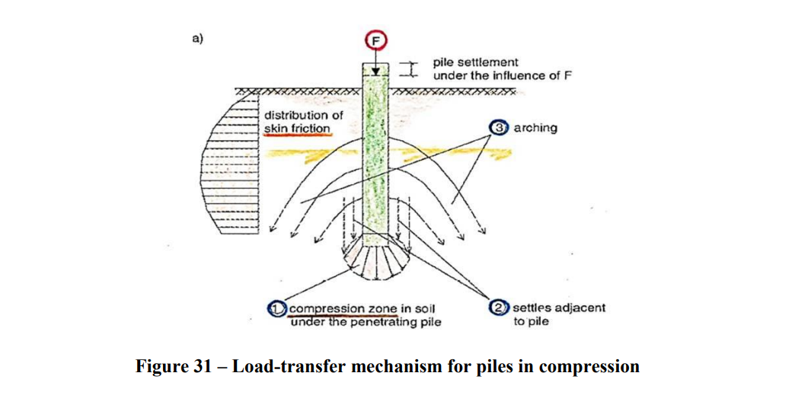
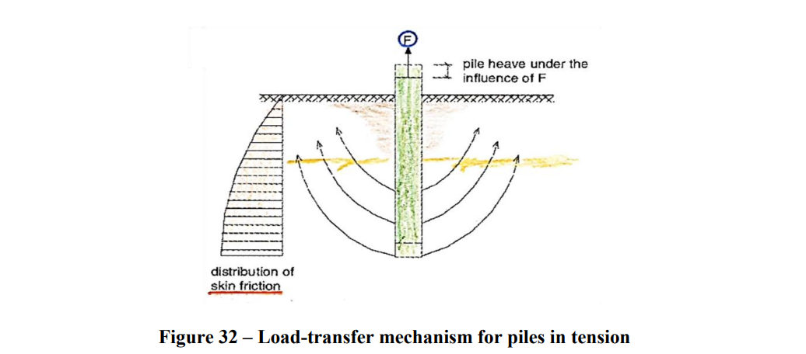

# Pāļu pamati

Pāļu pamatus izmanto slodžu pārnešanai uz dziļākiem, nestspējīgākiem grunts slāņiem, ja seklie pamati nespēj nodrošināt pietiekamu nestspēju vai sēšanās robežvērtību izpildi.

---

## Raksturīgās nestspējas noteikšana un korelācijas faktori \\(\xi\\)

Saskaņā ar LVS EN 1997-1 (Eirokodekss 7), pāļu raksturīgo pretestību spiedē \\(R_{c,k}\\) aprēķina no lauka pārbaudes rezultātiem (vai korelācijām), izmantojot korelācijas (korelācijas) faktorus \\(\xi_3\\) un \\(\xi_4\\):

\\[R_{c,k} = \min \left\{ \frac{(R_{c,cal})_{\text{mean}}}{\xi_3} ; \frac{(R_{c,cal})_{\text{min}}}{\xi_4} \right\}\\]

Kur:
- \\((R_{c,cal})_{\text{mean}}\\) — vidējā aprēķinātā pāļa nestspēja no visiem pārbaudes punktiem;
- \\((R_{c,cal})_{\text{min}}\\) — minimālā aprēķinātā pāļa nestspēja no visiem pārbaudes punktiem.

**Korelācijas faktori \\(\xi\\) atkarībā no pārbaudes punktu skaita \\(n\\) (LVS EN 1997-1 A.10. tabula):**

| Faktors / Punktu skaits (\\(n\\)) | 1 | 2 | 3 | 4 | 5 | 7 | 10 |
| :--- | :---: | :---: | :---: | :---: | :---: | :---: | :---: |
| \\(\xi_3\\) (piemēro vidējai vērtībai) | 1,40 | 1,35 | 1,33 | 1,31 | 1,29 | 1,27 | 1,25 |
| \\(\xi_4\\) (piemēro minimālajai vērtībai) | 1,40 | 1,27 | 1,23 | 1,20 | 1,15 | 1,12 | 1,08 |

*Piezīme: Ja aprēķinu veic pēc viena punkta datiem sliktākajā pozīcijā, to var uzskatīt par \\(R_{c,min}\\) un pāļa raksturīgo nestspēju nosaka, dalot šo aprēķināto vērtību ar \\(\xi_4 = 1,40\\).*

---

## Ģeometriskais izvietojums un attālums starp pāļiem

Pāļu izvietojumam jānovērš pāļu savstarpējā pārklāšanās un "pāļu grupas efekts", kas var samazināt kopējo nestspēju:
- **Standarta attālums:** Minimālais attālums starp pāļu centriem ir **\\(3d\\)** (kur \\(d\\) ir pāļa diametrs).
- **Izņēmums:** Attālumu var samazināt līdz **\\(2,5d\\)**, ja lielāko daļu nestspējas nodrošina pāļa gals (balstpāļi), nevis sānu berze.

---

## Minimālais pāļu stiegrojums (pēc LVS EN 1536)

Urbto pāļu garenstiegrojumam jānodrošina minimālais laukums \\(A_s\\) atkarībā no pāļa šķērsgriezuma laukuma \\(A_c\\):

| Pāļa šķērsgriezuma laukums (\\(A_c\\)) | Minimālais garenstiegrojuma laukums (\\(A_s\\)) |
| :--- | :--- |
| \\(A_c \le 0,5\text{ m}^2\\) | \\(A_s \ge 0,005 \cdot A_c\\) |
| \\(0,5\text{ m}^2 < A_c \le 1,0\text{ m}^2\\) | \\(A_s \ge 25\text{ cm}^2\\) |
| \\(A_c > 1,0\text{ m}^2\\) | \\(A_s \ge 0,0025 \cdot A_c\\) |

- **Konstruēšana:** Ja stiegrojuma karkass tiek montēts (vibrēts) pēc betona iepildīšanas urbumā, karkasa elementiem jābūt stingri sametinātiem. Karkasa apakšējo galu ieteicams veidot konisku, lai atvieglotu tā iegremdēšanu betonā.
- **Minimālais stieņu skaits:** Vismaz 4 garenstieņi, ieteicamais minimālais diametrs \\(\varnothing \ge 12\text{ mm}\\).

---

## Aprēķina diametra samazināšana monolītbetona pāļiem (pēc LVS EN 1992-1-1)

Saskaņā ar LVS EN 1992-1-1 punktu 2.3.4.2(2), monolītbetona pāļu aprēķinos bez pastāvīga apvalka ir jāņem vērā urbuma sieniņu nelīdzenumi, samazinot nominālo diametru \\(d_{\text{nom}}\\) līdz aprēķina diametram \\(d\\):

- Ja \\(d_{\text{nom}} < 400\text{ mm}\\):
  \\[d = d_{\text{nom}} - 20\text{ mm}\\]
- Ja \\(400\text{ mm} \le d_{\text{nom}} \le 1000\text{ mm}\\):
  \\[d = 0,95 \cdot d_{\text{nom}}\\]
- Ja \\(d_{\text{nom}} > 1000\text{ mm}\\):
  \\[d = d_{\text{nom}} - 50\text{ mm}\\]

*Svarīgi: Šis samazinājums tieši ietekmē pāļa šķērsgriezuma laukumu \\(A_c\\) un inerces momentu \\(I\\), ko izmanto pāļa stiprības un nestspējas pārbaudēs.*

---

## Slodžu pārneses mehānismi

Pāļi slodzi uz grunti pārnes ar diviem galvenajiem mehānismiem:
1. **Sānu virsmas pretestība (\\(R_s\\)):** Slodze tiek nodota ar berzi starp pāļa sānu virsmu un grunti.
2. **Gala pretestība (\\(R_b\\)):** Slodze tiek nodota ar pāļa gala spiedienu uz nesošo grunts slāni.

| Spiedē noslogoti pāļi | Stiepē (izvilkšanai) noslogoti pāļi |
| :---: | :---: |
|  |  |

---

## Pāļu nestspējas noteikšana no CPT datiem

Statiskā zondēšana (CPT) sniedz konusa pretestību \\(q_c\\) un sānu berzi \\(f_s\\), ko izmanto pāļu nestspējas tiešai vai netiešai aprēķināšanai:

### 1. Tiešās metodes (Direct Methods)
- **Tīri empīriskās metodes:** Pāļa sānu berze \\(q_s\\) un gala pretestība \\(q_b\\) tiek noteikta tieši no konusa pretestības \\(q_c\\) (vai koriģētās konusa pretestības \\(q_t\\)), izmantojot empīriskos pārejas koeficientus (piemēram, LCPC un Schmertmann metodes).

### 2. Racionālās jeb netiešās metodes (Rational / Indirect Methods)

| Pieeja | Sānu pretestība \\(q_s\\) | Gala pretestība \\(q_b\\) |
| :--- | :--- | :--- |
| Kopējo spriegumu pieeja   (Total Stress — \\(\alpha\\) metode) | **\\(\alpha\\) metodes:** balstās uz nedrenēto bīdes stiprību \\(s_u\\) mālainās gruntīs. Parametri: \\(s_u\\), \\(\sigma'_{v0}\\), OCR, \\(I_p\\), \\(L\\). | Nedrenētā slogošana smalkgraudainās gruntīs. Parametrs: bāzes nestspējas koeficients \\(N_c \approx 9\\) (\\(q_b = 9 \cdot s_u\\)). |
| Efektīvo spriegumu pieeja   (Effective Stress — \\(\beta\\) metode) | **\\(\beta\\) metodes:** balstās uz grunts iekšējās berzes leņķi \\(\phi'\\) un efektīvajiem spriegumiem. Parametri: \\(\sigma'_v\\), \\(K\\), \\(\delta\\), \\(\phi'\\). | Drenētā slogošana rupjgraudainās gruntīs (smiltīs). Parametri: \\(\phi'\\), \\(\sigma'_{v0}\\), grunts nestspējas koeficients \\(N_q\\). |
