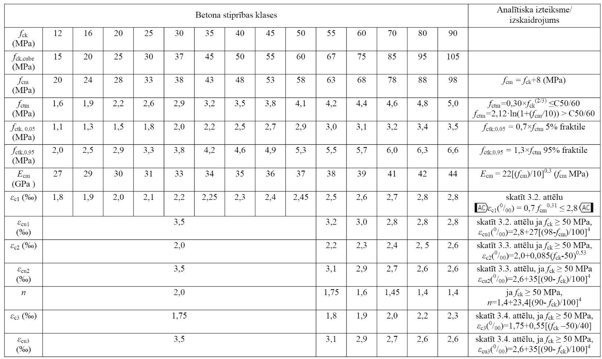
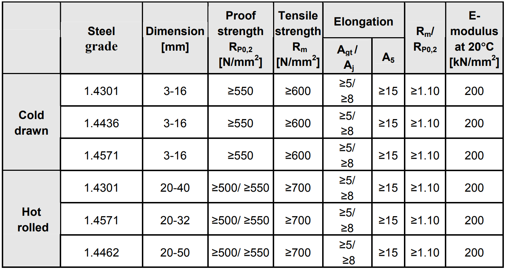

## FIZIKĀLĀS UN MEHĀNISKĀS ĪPAŠĪBAS

Betona īpašības

Stiegrojuma tērauda īpašības

| Nosaukums / Steel name | Ftk (N/mm2) | Ftd (N/mm2) | Fyk (N/mm2) | Fyd (N/mm2) | εuk (%) |
| --- | --- | --- | --- | --- | --- |
| B500A | 525 | 455 | 500 | 435 | 2.5 |
| B500B | 540 | 470 | 500 | 435 | 5.0 |

Nerūsējošā tērauda stiegrojuma īpašības

