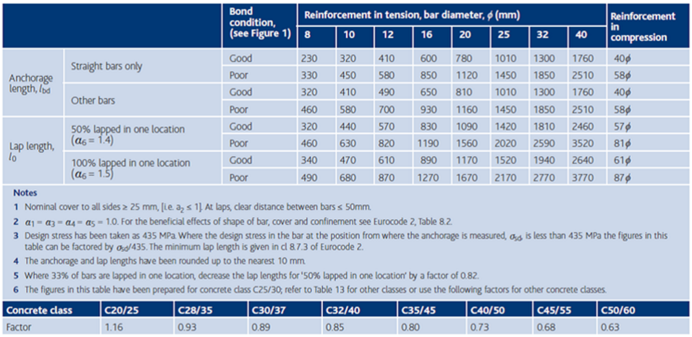
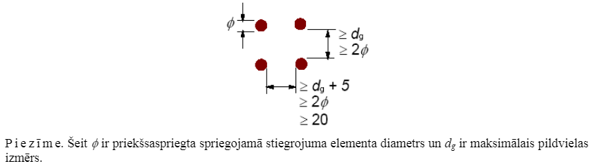
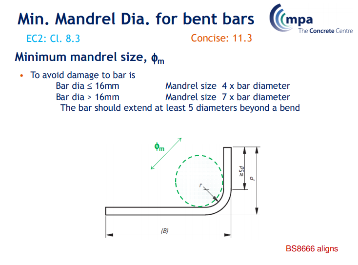
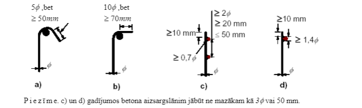

## PAPILDUS PRASĪBAS PROJEKTĒŠANAI UN IZGATAVOŠANAI

Materiālu parciālie faktori

| Projektā ievērtējamās situācijas | yc betonam | ys stiegrojumam | ys spriegotajam stiegrojumam |
| --- | --- | --- | --- |
| Ilgstošas un īslaicīgas | 1.50 | 1.15 | 1.15 |
| Ārkārtējas | 1.20 | 1.00 | 1.00 |

Pievērst uzmanību koeficientiem ārkārtējās (avārijas) situācijās.

Stiegrojuma pārlaidumi un enkurojuma garumi

Enkurojuma garumi un pārlaidumi C25/30 klases betonam

Pārējo klašu betonam dotie izmēri ir reizināmi ar koeficientiem, kas ir doti tabulas apakšpusē

Minimālais attālums starp stiegrām

LVS EN 1992-1-1 8.2

Tīrais attālums (horizontālais un vertikālais) starp atsevišķām paralēlām stiegrām vai paralēlu stiegru horizontālām kārtām nedrīkst būt mazāks par lielāko no ar k1 reizinātu stiegrojuma stieņu diametru, (dg + k2 mm) vai 20 mm, kur dg ir pildvielas maksimālais izmērs (k1 un k2 maksimālās vērtības var būt definētas nacionālajā pielikumā, rekomendējamās vērtības ir 1 un 5).

Minimālais attālums starp priekšspriegotiem spriegojuma stiegrojuma elementiem

LVS EN 1992-1-1 8.10.1.2

Minimālajiem tīrajiem horizontālajiem un vertikālajiem attālumiem starp priekšspriegotiem spriegojamā stiegrojuma elementiem jāatbilst attēla shēmai, kur Ø ir priekšsaspriegta spreigojamā stiegrojuma elementa diametrs un ds ir maksimālais pildvielas izmērs.

Maksimālais attālums starp stiegrām

Maksimālais attālums starp kolonnu šķērsstiegrojuma stiegrām scl,tmax:

mazākais no: 20 garenstiegrojumu diametri, mazākā kolonnas dimensija, 400 mm.

Minimālais stiegru liekuma rādiuss

Aptveru un šķērsspēku uzņemošā stiegrojuma enkurojums

Betona virsmu klasifikācija

Klasificēšana pēc LVS EN 1992-1-1 6.2.5 (2)

Gadījumā, kad nav detalizētākas informācijas, virsmas var klasificēt kā ļoti gludas, gludas, nelīdzenas vai robotas (periodiska profila) ar šādiem piemēriem:

- **Ļoti gluda** (c = 0,025–0,10; μ = 0,5) — virsma, kas izlieta tērauda, plastmasas vai speciāli sagatavotos koka veidņos.
- **Gluda** (c = 0,20; μ = 0,6) — ar slīdošiem veidņiem betonēta vai extrudēta (presēta) virsma, vai brīvi stāvoša virsma, kas pēc vibrēšanas atstāta bez tālākas apstrādes.
- **Nelīdzena** (c = 0,40; μ = 0,7) — virsma ar vismaz 3 mm nelīdzenumiem ar apmēram 40 mm atstarpi, kas iegūta ar liešanu, ar atsegtām pildījuma daļiņām vai kādu citu metodi, kas dod ekvivalentas īpašības.
- **Robota** (periodiska profila) (c = 0,50; μ = 0,9) — virsma ar ierobēm, kas atbilst 6.9. attēlam.
