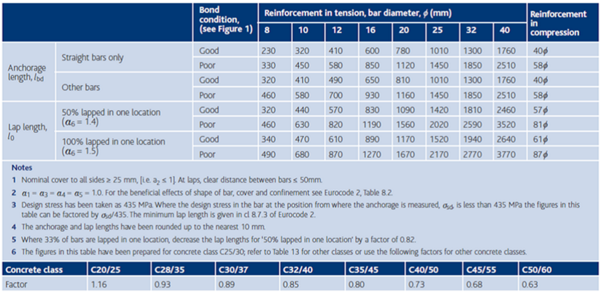
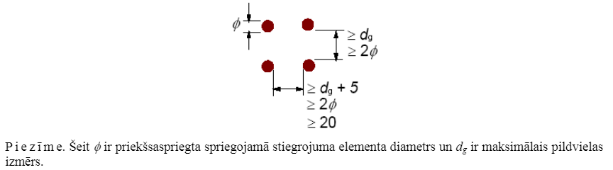
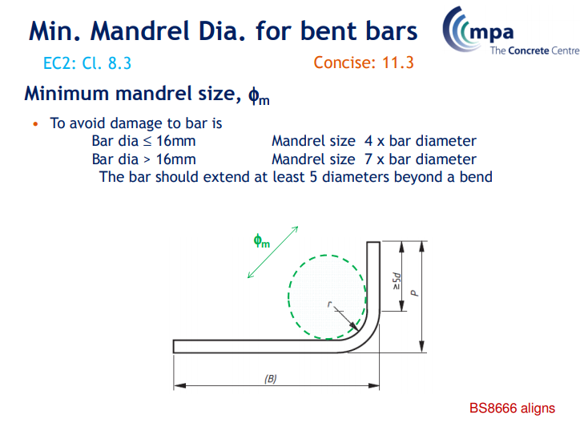
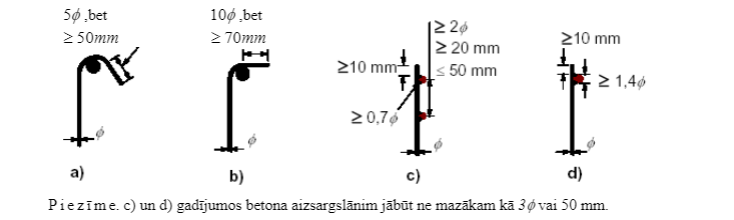

# Papildu prasības projektēšanai un izgatavošanai

Dzelzsbetona elementu dimensionēšanā jāņem vērā materiālu drošuma faktori un stiegrojuma izvietojuma konstruktīvie noteikumi.

---

## Materiālu parciālie koeficienti ($\gamma$)

Nestspējas robežstāvokļa (ULS) pārbaudēm izmanto šādus materiālu parciālos koeficientus:

 | Projektā ievērtējamās situācijas | gamma_c (betonam) | gamma_s (stiegrojumam) | gamma_{s,sp} (spriegotajam stiegrojumam) | 
 | :--- | :---: | :---: | :---: | 
 | Ilgstošas un īslaicīgas | 1,50 | 1,15 | 1,15 | 
 | Ārkārtējas (avārijas, ugunsgrēka) | 1,20 | 1,00 | 1,00 | 
 | Seismiskās (zemestrīces) | 1,20 | 1,00 | 1,00 | 

*Piezīme: Ārkārtējās un seismiskajās situācijās betona un stiegrojuma koeficienti tiek samazināti līdz $\gamma_c = 1,20$ un $\gamma_s = 1,00$, kas atspoguļo zemāku nepieciešamo drošuma rezervi pret mazticamiem notikumiem.*

---

## Stiegrojuma enkurojuma un pārlaidumu garumi

Stiegrošanā jānodrošina pietiekams stieņu enkurojuma garums $l_{bd}$ un pārlaiduma garums $l_0$, lai spēki starp stieņiem un betonu tiktu nodoti bez sānslīdes.

**Enkurojuma un pārlaidumu garumi $\varnothing 8$ līdz $\varnothing 32$ stieņiem C25/30 klases betonam:**

*Citu stiprības klašu betoniem dotos izmērus reizina ar šādiem pārrēķina koeficientiem:*
- **C20/25:** reizinātājs $1,10$
- **C30/37:** reizinātājs $0,89$
- **C35/45:** reizinātājs $0,80$
- **C40/50:** reizinātājs $0,74$

---

## Attālumi starp stieņiem

### 1. Minimālais attālums starp stiegrām (LVS EN 1992-1-1 8.2. punkts)
Tīrais attālums (horizontālais un vertikālais) starp atsevišķām paralēlām stiegrām vai paralēlu stiegru kārtām nedrīkst būt mazāks par lielāko no šiem trim lielumiem:
- $k_1 \cdot \varnothing$ (stiegrojuma stieņa diametrs);
- $d_g + k_2 mm$ (pildvielas maksimālais izmērs);
- $20 mm$.

*Latvijas nacionālajā pielikumā noteiktās vērtības ir $k_1 = 1$ un $k_2 = 5 mm$. Tas nozīmē, ka pie maksimālās pildvielas frakcijas $16 mm$ minimālais tīrais attālums ir $21 mm$ vai stieņa diametrs $\varnothing$.*

### 2. Minimālais attālums starp priekšspriegotā stiegrojuma elementiem (LVS EN 1992-1-1 8.10.1.2. punkts)
Minimālajiem tīrajiem horizontālajiem un vertikālajiem attālumiem starp priekšspriegotā stiegrojuma elementiem (trosēm, kanāliem) jāatbilst attēla shēmai, kur $\varnothing$ ir elementa diametrs un $d_g$ ir maksimālais pildvielas izmērs.

---

## Maksimālais attālums starp stiegrām (aptveru solis)

Maksimālais attālums starp kolonnu šķērsstiegrojuma stiegrām (aptveru solis) $s_{cl,tmax}$ nedrīkst pārsniegt mazāko no šādiem lielumiem:
- $20 \cdot \varnothing_{min}$ (kur $\varnothing_{min}$ ir garenstiegrojuma minimālais diametrs);
- kolonnas mazākais šķērsgriezuma izmērs (platums vai augstums);
- $400 mm$.

*Piezīme: Šķērsstiegrojuma solis jāsamazina par koeficientu $0,6$ (t.i., $0,6 \cdot s_{cl,tmax}$) zonās virs un zem sijām viena stāva augstumā, kā arī stieņu pārlaidumu zonās, ja garenstieņu diametrs $\varnothing > 14 mm$.*

---

## Minimālais stiegru liekuma rādiuss

Stieņu liekšana (piemēram, cilpu, āķu vai stūra stieņu izveidei) jāveic ar pietiekamu liekuma rādiusu (liekšanas rullīša diametru $\phi$), lai novērstu stieņa bojājumus liekšanas procesā un betona sašķelšanos liekuma iekšpusē.

### Aptveru un šķērsspēku uzņemošā stiegrojuma enkurojums:

---

## Betona virsmu klasifikācija (darba šuvēm)

Aprēķinot bīdes spēku pārnesi pa betona darba šuvēm (saskaņā ar LVS EN 1992-1-1 6.2.5. punktu), šuves virsmas klasificē četrās kategorijās. Katrai kategorijai atbilst kohēzijas koeficients $c$ un berzes koeficients $\mu$:

- **Ļoti gluda ($c = 0,025 ... 0,10$; $\mu = 0,5$):** Virsma, kas betonēta pret tērauda, plastmasas vai speciāli sagatavotiem koka veidņiem.
- **Gluda ($c = 0,20$; $\mu = 0,6$):** Ar slīdošajiem veidņiem betonēta, ekstrudēta vai brīva virsma, kas pēc vibrēšanas atstāta bez tālākas apstrādes.
- **Nelīdzena ($c = 0,40$; $\mu = 0,7$):** Virsma ar vismaz 3 mm dziļiem nelīdzenumiem, kas izvietoti ik pēc aptuveni 40 mm, vai virsma ar atsegtām pildvielas daļiņām.
- **Robota ($c = 0,50$; $\mu = 0,9$):** Speciāli veidota rievota vai zobota virsma saskaņā ar standarta 6.9. attēlu.
