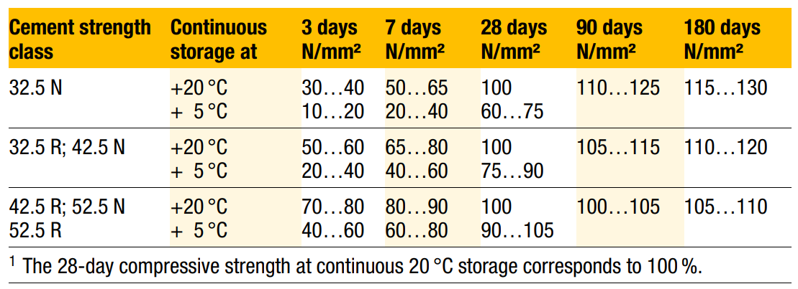
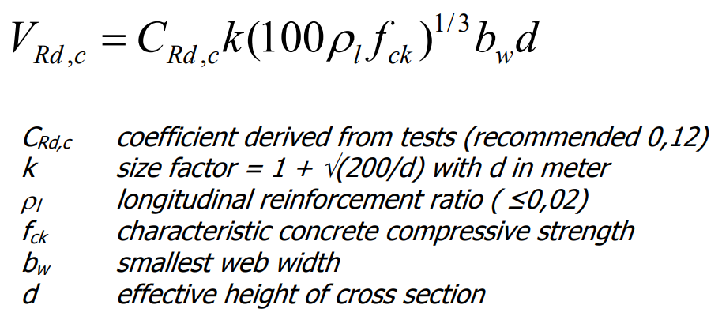
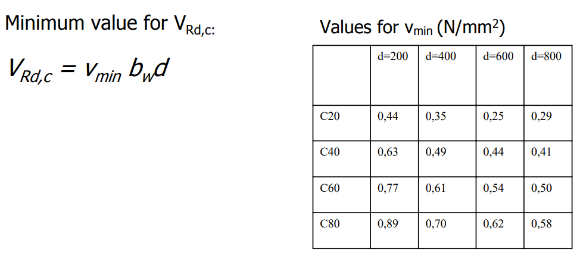

## BETONA CIETĒŠANA

Betona cietēšanas ātrums ir atkarīgs no cementa tipa, temperatūras, ūdens / cementa attiecības un mitruma cietēšanas laikā. EN 206 ir dotas šādas aptuvenās procentuālās vērtības:

Saliekamā dzelzsbetona ražotāji biežāk lieto R tipa cementus, kas izteikti ātrāk cietē.

## VIDES IEDARBĪBAS KLASES

LVS EN 206 ir definētas šādas galvenās vides iedarbības klases:

X0 – vide bez korozijas, sasalšanas / atkušanas, dēdēšanas vai ķīmiskās iedarbības riska

XC – karbonizācijas izraisīta korozija

XD – ne jūras ūdens hlorīdu izraisīta korozija

XS – jūras ūdens hlorīdu izraisīta korozija

XF – sasalšanas – atkušanas iedarbība uz betonu ar vai bez atledošanas reaģentiem

XA – ķīmisku vielu agresīva iedarbība uz betonu.

Vides iedarbības klašu apstākļu apraksts

<table>
<colgroup>
  <col style="width:10%">
  <col style="width:45%">
  <col style="width:45%">
</colgroup>
<thead>
<tr><th>Klases apzīmējums</th><th>Apkārtējās vides apstākļu apraksts</th><th>Informatīvi piemēri</th></tr>
</thead>
<tbody>
<tr><td colspan="3"><strong>1. Nav korozijas vai iedarbības riska</strong></td></tr>
<tr><td>X0</td><td>Attiecināma uz betona bez stiegrojuma vai iebetonētām metāla detaļām, izņemot gadījumus, kas ir iespējama sasalšana – atkušana, abrazīva vai ķīmiska iedarbība.</td><td>Betons, kas izvietots ēkas ar ļoti zemu gaisa mitruma līmeni.</td></tr>
<tr><td colspan="3"><strong>2. Karbonizēšanas izraisīta korozija</strong></td></tr>
<tr><td>XC1</td><td>Sausa vai pastāvīgi mitra vide</td><td>Betons ēkas ar zemu gaisa mitruma līmeni (apkurinātas ēkas); pastāvīgi ūdenī iegremdēts betons.</td></tr>
<tr><td>XC2</td><td>Mitra, reti sausa vide</td><td>Betona virsmas, kuras ir paļautas ilgstošai saskarei ar ūdeni. Bieži attiecinām uz pamatiem.</td></tr>
<tr><td>XC3</td><td>Mēreni mitra vide</td><td>Betons ēkas ar mērenu vai augstu gaisa mitrumu. Piemēro neapkurinātām ēkām un āra betonam, kurš ir pasargāts no lietus.</td></tr>
<tr><td>XC4</td><td>Cikliski mitra un sausa vide</td><td>Betona virsmas, kas pakļautas ūdens kontaktam, ārpus XC2 vides iedarbības klases. Fasādes elementi.</td></tr>
<tr><td colspan="3"><strong>3. Hlorīdu, kas nav jūras ūdens, ierosināta korozija</strong> Attiecināma, ja betons ar stiegrojumu vai iebetonētām tērauda detaļām tiek pakļauts saskarei ar hlorīdus saturošu ūdeni.</td></tr>
<tr><td>XD1</td><td>Mēreni mitra vide</td><td>Betona virsmas, kuras ir pakļautas gaisā esošu hlorīdu iedarbībai.</td></tr>
<tr><td>XD2</td><td>Mitra, reti sausa vide</td><td>Peldbaseini, betons kurš ir pakļauts hlorīdus saturošiem rūpnieciskajiem ūdeņiem.</td></tr>
<tr><td>XD3</td><td>Cikliski mitra – sausa vide</td><td>Tiltu elementi, kuri ir pakļauti hlorīdus saturošu izsmidzinātu vielu iedarbībai. Autostāvvietu segums.</td></tr>
<tr><td colspan="3"><strong>4. Jūras ūdens hlorīdu ierosināta korozija</strong> Attiecināma, ja betons ar stiegrojumu vai iebetonētām tērauda detaļām tiek pakļauts saskarei ar jūras ūdeni vai gaisu, kas satur jūras izcelsmes sāli.</td></tr>
<tr><td>XS1</td><td>Elements, kas ir pakļauts gaisā esošas sāls iedarbībai, bet ne tiešai saskarei ar jūras ūdeni</td><td>Konstrukcijas tuvu krastā vai pie krasta.</td></tr>
<tr><td>XS2</td><td>Pastāvīgi jūras ūdeni iegremdēts elements</td><td>Jūras konstrukciju elementi.</td></tr>
<tr><td>XS3</td><td>Paisuma – bēguma, šļakatu un šalts zonas</td><td>Jūras konstrukciju elementi.</td></tr>
<tr><td colspan="3"><strong>5. Sasalšanas – atkušanas iedarbība ar vai bez atledošanas reaģentiem, piemēram, uzkaisītu sāli</strong> Attiecināma, ja betons ir pakļauts būtiskai cikliskai sasalšanas – atkušanas iedarbībai.</td></tr>
<tr><td>XF1</td><td>Vidējs ūdens piesātinājums bez atledošanas reaģenta</td><td>Vertikālās betona virsmas, kuras ir paļautas lietus un sala iedarbībai, piemēram, betona ārsienas bez papildus apdares.</td></tr>
<tr><td>XF2</td><td>Vidējs ūdens piesātinājums bet ar atledošanas reaģentu.</td><td>Vertikālas ceļa konstrukciju betona virsmas, kuras ir pakļautas sasalšanai un gaisā esošajiem atledošanas reaģentiem.</td></tr>
<tr><td>XF3</td><td>Augsts ūdens piesātinājums bez atledošanas reaģenta.</td><td>Horizontālas betona virsmas, kas pakļautas lietus un sala iedarbībai.</td></tr>
<tr><td>XF4</td><td>Augsts ūdens piesātinājums ar jūras ūdeni vai atledošanas reaģentiem.</td><td>Ceļu un tiltu segumi, kuri ir pakļauti atledošanas reaģentu iedarbībai. Betona virsmas, kuras ir pakļautas tiešām ūdens šaltīm ar atledošanas reaģentiem vai jūras ūdens šaltīm.</td></tr>
<tr><td colspan="3"><strong>6. Ķīmiski agresīvu vielu iedarbība uz betonu</strong> Attiecināma, ja betons ir pakļauts ķīmiski vielu iedarbībai, kas atrodas augsnē un gruntsūdenī.</td></tr>
<tr><td>XA1</td><td>Nedaudz agresīva ķīmiska vide</td><td>Betons, kas ir pakļauts dabiskas grunts un gruntsūdeņu iedarbībai atbilstoši noteiktajam analīzēs. Pāļu pamatiem visbiežāk ir noteikta šī vides iedarbība.</td></tr>
<tr><td>XA2</td><td>Vidēji agresīva ķīmiska vide</td><td>Betons, kas ir pakļauts dabiskas grunts un gruntsūdeņu iedarbībai atbilstoši noteiktajam analīzēs.</td></tr>
<tr><td>XA3</td><td>Ļoti agresīva ķīmiska vide</td><td>Betons, kas ir pakļauts dabiskas grunts un gruntsūdeņu iedarbībai atbilstoši noteiktajam analīzēs.</td></tr>
</tbody>
</table>

## ŠĶĒRSSTIEGROJUMS

Šķērsspēka robežvērtība zem kuras šķērsstiegrojums nav nepieciešams

Vienkāršota tabulas metode robežvērtības noteikšanai, zem kuras šķērsstiegrojums nav nepieciešams:

