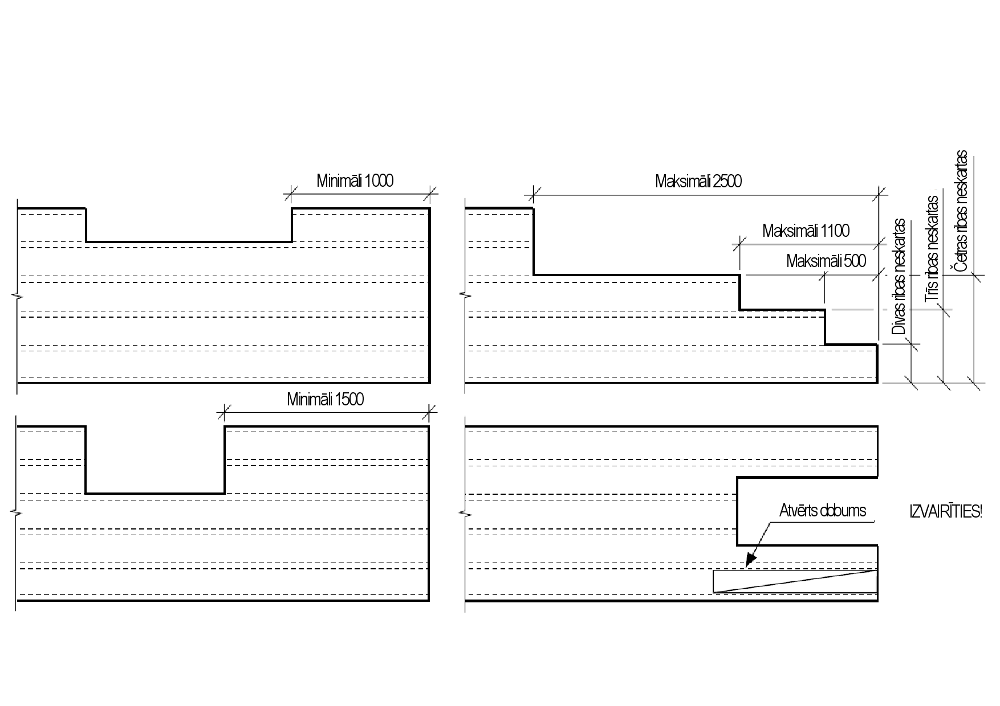
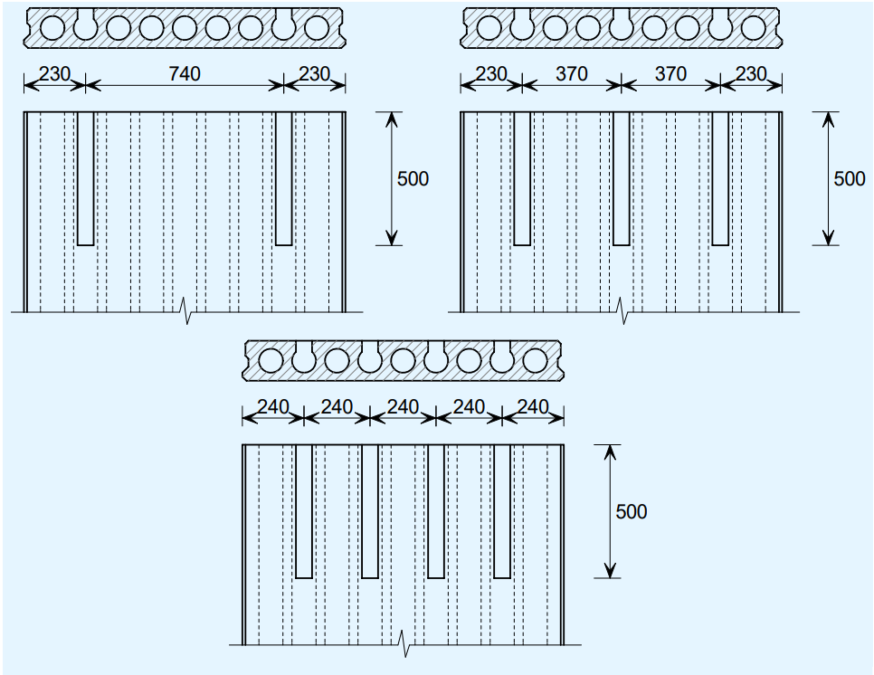
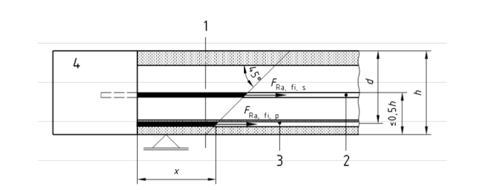
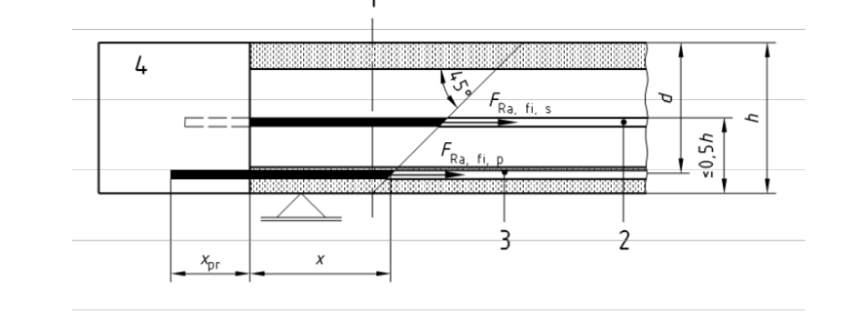
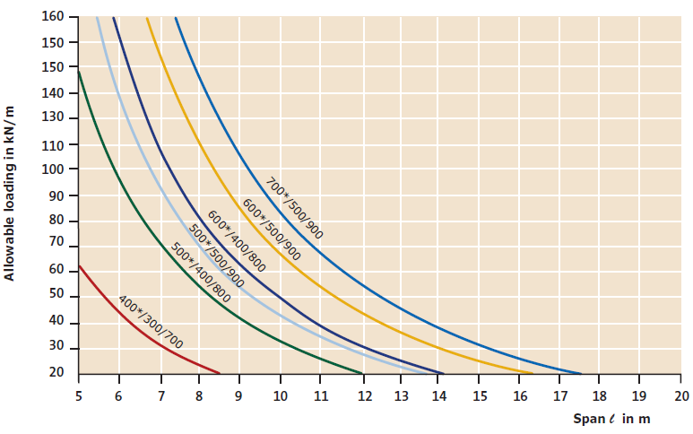
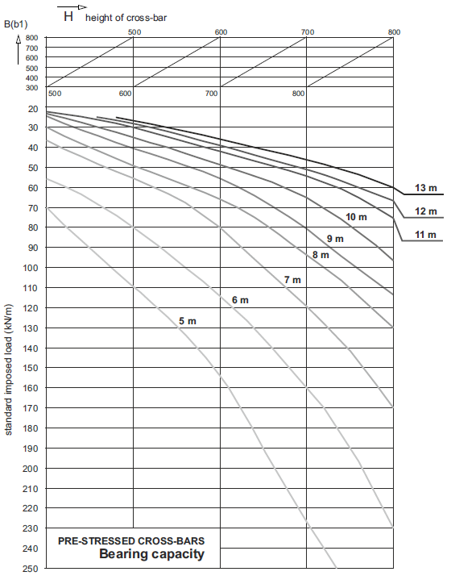
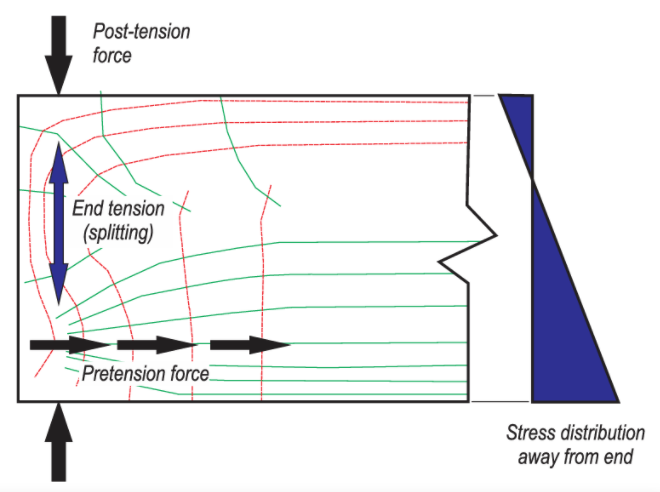
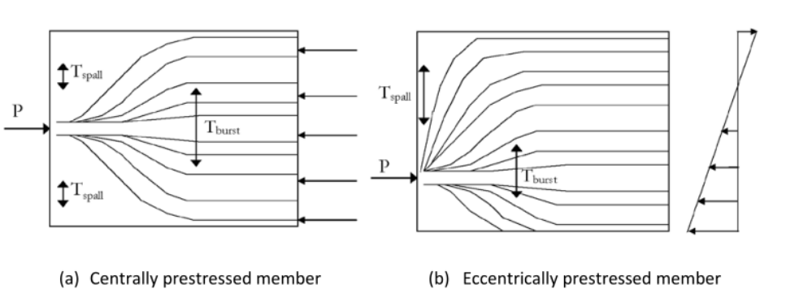

## SALIEKAMAIS DZELZSBETONS

**Elementu izgatavošanas standarti**

| Standarts | Nosaukums latviski | Nosaukums angliski |
| --- | --- | --- |
| LVS EN 14992+A1:2020 | Saliekamā dzelzsbetona izstrādājumi. Sienas elementi | Precast concrete products – Wall elements |
| LVS EN 13225 | Saliekamā dzelzsbetona izstrādājumi. Lineārie elementi | Precast concrete products – Linear structural elements |

**Dobumoto plātņu izgriezumu robežvērtības**

**Dimensijas pēc BETONGELEMENTBOKEN**

**Dobumoto plātņu enkurošana iecirtumiem**

**Dobumoto paneļu ugunsizturība pēc šķērsspēka un enkurojuma**

Pārbaudi definē LVS EN 1168 G pielikums.

Ugunsizturību attiecībā uz šķērsspēka un enkurojuma sabrukumu var noteikt, izmantojot vienkāršotas aprēķina metodes (skat. EN 1992-1-2:2004, 4.2 un B un D pielikumu) ar šādiem pieņēmumiem:

- temperatūra šķērsgriezumā pēc G.1.1;
- empīrisks aprēķina modelis šķērsspēkam un enkurojumam ugunsgrēka apstākļos; ugunsizturības klasei < R60 šī pārbaude nav nepieciešama.

> **Piezīme.** Šķērsspēks–stiepe nav aktuāls vertikālo plaisu dēļ, ko rada termiskais gradients.

**G.2. attēls — Šķērsspēka un enkurojuma pretestības aprēķina modelis (piemērs)**

**Apzīmējumi:** 1 — apskatāmais šķērsgriezums; 2 — savienojuma stiegrojums; 3 — saspriegtā dzīsla; 4 — monolītais betons

**G.3. attēls — Aprēķina modelis ar izvirzītām dzīslām (piemērs)**

Empīriskais šķērsspēka vienādojums ugunsgrēka apstākļos:

VRd,c,fi = [Cθ,1 + αk · Cθ,2] · bw · d

kur:

- **Cθ,1** — koeficients, kas ievērtē betona spriegumu ugunsgrēka apstākļos = 0,15 · min(kp(θp) σcp,20°C; FR,a,fi,p/Ac)
- **αk** = 1 + √(200/d) ≤ 2,0, kur d ir mm
- **Cθ,2** — koeficients, kas ievērtē enkurotā garenstiegrojuma ietekmi = ∛(0,58 · FR,a,fi/(fyk · bw · d) · fc,fi,m)
- **σcp,20°C** — vidējais betona spriegums no saspriegojuma spēka normālā temperatūrā
- **Ac** — betona šķērsgriezuma laukums
- **fc,fi,m** — vidējā betona stiprība paaugstinātā temperatūrā

- **fbpd,fi** — saķeres stiprība saspriegto elementu enkurojumam paaugstinātā temperatūrā = ηp2 · η1 · (0,7 · fctm · kct(θp,m))/γc
- **fbpdr,fi** — saķeres stiprība enkurojumam monolītajā betonā (izvirzītu dzīslu gadījumā)
- **FR,a,fi,s** — savienojuma stiegrojuma spēka kapacitāte apskatāmajā šķērsgriezumā = As · fyk · ks(θs)
- **kp(θp)** — saspriegtā tērauda stiprības samazinājuma koeficients (EN 1992-1-2:2004, 4.2.4.3)
- **ks(θs)** — parastā stiegrojuma stiprības samazinājuma koeficients (EN 1992-1-2:2004, 4.2.4.3)
- **kct(θp,m)** — betona stiepes stiprības samazinājuma koeficients gar enkurojumu (EN 1992-1-2:2004, 3.2.2.2)
- **kct,insitu** — monolītā betona stiepes stiprības samazinājuma koeficients (EN 1992-1-2:2004, 3.2.2.2)

- **bw** — kopējais sieniņas biezums
- **d** — efektīvais augstums normālā temperatūrā
- **fck** — betona raksturīgā cilindra spiedes stiprība 28 dienās
- **vmin** — pieļaujamais betona spriegums bez stiegrojuma (EN 1992-1-1:2004, 6.2.2)
- **FR,a,fi** — saspriegtā un savienojuma stiegrojuma spēka kapacitāte = FR,a,fi,p + FR,a,fi,s
- **FR,a,fi,p** — saspriegtā tērauda spēka kapacitāte apskatāmajā šķērsgriezumā; x — enkurojuma garums, xpr — izvirzītā elementa garums (skat. G.3. attēlu)

ηp2, η1 — pēc EN 1992-1-1:2004, 8.10.2.3.

Jāievērtē tikai stiegrojums elementa apakšējā daļā (≤ 0,5 h). Parasti apskatāmais šķērsgriezums ir balsta malā.

> **1. piezīme.** Garenstiegrojuma enkurojuma kapacitāti balstā var aprēķināt, ievērtējot betona masas ietekmi uz temperatūras sadalījumu (vidējās temperatūras θm un θm,pr).
>
> **2. piezīme.** Ja garenstiegrojums atrodas aptuveni plātnes augstuma vidū, koeficientu ks var pieņemt vienādu ar 1.

**Saliekamo dzelzsbetona elementu fasādes elementu šuvju hidroizolācija**

**Prasības šuvju pildījumam pēc DIN 18540**

<table>
<thead>
<tr><th>Kustība [mm]</th><th>Nominālais šuves platums b1) pie +10°C [mm]</th><th>Minimālais šuves platums min. b [mm]</th><th>Blīvējuma dziļums d2) [mm] (pieļ. nov.)</th></tr>
</thead>
<tbody>
<tr><td>≤ 2</td><td>15</td><td>10</td><td>8 (±2)</td></tr>
<tr><td>&gt; 2 ≤ 3,5</td><td>20</td><td>15</td><td>10 (±2)</td></tr>
<tr><td>&gt; 3,5 ≤ 5</td><td>25</td><td>20</td><td>12 (±2)</td></tr>
<tr><td>&gt; 5 ≤ 6,5</td><td>30</td><td>25</td><td>15 (±3)</td></tr>
<tr><td>&gt; 6,5 ≤ 8</td><td>35</td><td>30</td><td>15 (±3)</td></tr>
</tbody>
</table>

1) Pieļaujamā novirze ±5 mm. 2) Norādītās vērtības attiecas uz galīgo stāvokli.

**Ieteicamie šuvju platumi un dziļumi pēc DIN 18540**

**Maksimālie dzelzsbetona elementu gabarīti transportēšanai**

| Autotransporta veids | Transportējot bez speciālās atļaujas | Transportējot bez speciālās atļaujas | Transportējot bez speciālās atļaujas | Transportējot bez speciālās atļaujas | Transportējot ar speciālo atļauju | Transportējot ar speciālo atļauju | Transportējot ar speciālo atļauju |
| --- | --- | --- | --- | --- | --- | --- | --- |
| Autotransporta veids | Augstums, mm | Platums, mm | Garums, mm | Svars, T | Augstums, mm | Platums, mm | Garums, mm |
| Ar platformu, tentu, izbīdāmu platformu | 2600 | 2450 | 13500 | 24 | 3100 | 2750 | 18000 |
| Ar zemo treileri, JUMBO | 3000 | 2450 | 9000 | 24 | 3300 | 2750 | 9000 |
| Ar zemās grīdas treileri, TITĀNIKS | 3800 | 1500 | 9500 | 22 | 4200 | 1500 | 9500 |

**Nominālie elementu balstījuma garumi**

<table>
<colgroup><col style="width:28%"><col style="width:25%"><col style="width:25%"><col style="width:22%"></colgroup>
<thead>
<tr><th>Balstāmais elements</th><th>Nesošā konstrukcija</th><th>Plātnes biezums h vai sijas laidums l</th><th>Minimālais nominālais balsta garums</th></tr>
</thead>
<tbody>
<tr><td rowspan="4">Dobumotās plātnes</td><td rowspan="2">betons/tērauds</td><td>h ≤ 300 mm</td><td>60–80 mm</td></tr>
<tr><td>h &gt; 300 mm</td><td>100–120 mm</td></tr>
<tr><td rowspan="2">mūris</td><td>h ≤ 250 mm</td><td>100 mm</td></tr>
<tr><td>h &gt; 250 mm</td><td>120 mm</td></tr>
<tr><td rowspan="4">Plātnes (floor planks)</td><td rowspan="2">betons</td><td>ar atbalstiem</td><td>30 mm</td></tr>
<tr><td>bez atbalstiem</td><td>50 mm</td></tr>
<tr><td rowspan="2">mūris</td><td>ar atbalstiem</td><td>40 mm</td></tr>
<tr><td>bez atbalstiem</td><td>50 mm</td></tr>
<tr><td>Ribotie pārsegumi</td><td>betons</td><td>l ≤ 15 m</td><td>150 mm</td></tr>
<tr><td>Sekundārās jumta sijas</td><td>betons</td><td>l ≤ 8 m</td><td>140 mm</td></tr>
<tr><td>Pārseguma sijas</td><td>betons</td><td>l = 12–20 m</td><td>200–230 mm</td></tr>
<tr><td rowspan="2">Jumta sijas</td><td rowspan="2">betons</td><td>l ≤ 24 m</td><td>195 mm</td></tr>
<tr><td>l ≤ 40 m</td><td>225 mm</td></tr>
</tbody>
</table>

**Nestspējas līknes RT un L saspriegtajām sijām**

**Consolis pie lietderīgās un pastāvīgās slodzes sadalījuma 50 / 50**

**TMB Element pie lietderīgās un pastāvīgās slodzes sadalījuma 50 / 50**

**Saspriegto šķērssiju nestspēja atkarībā no laiduma un slodzes**

**Atšķelšanās spriegumi saspriegto elementu gala zonās**

**Spriegumu sadalījums saspriegtā elementa gala zonā**

**Atšķelšanās spriegumi: (a) centriski un (b) ekscentriski saspriegts elements**

