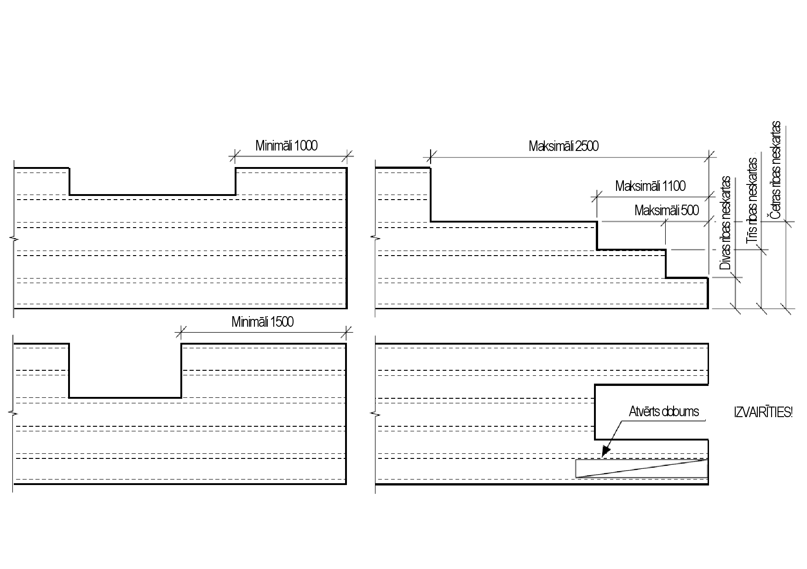
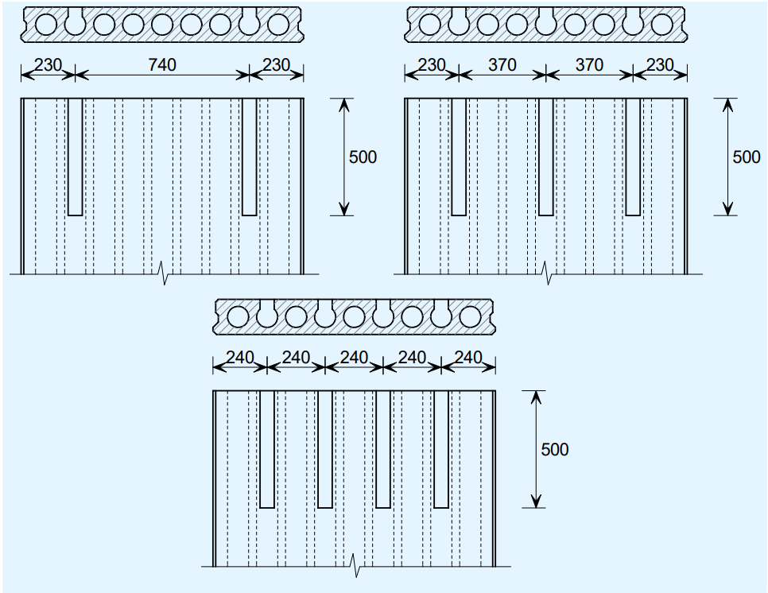
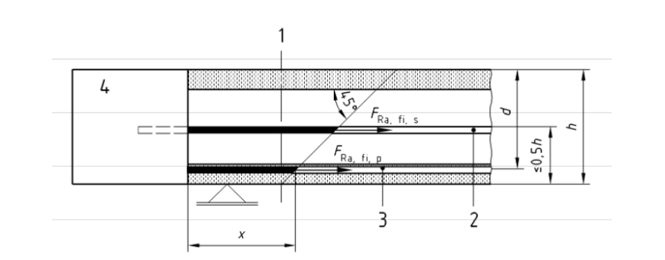
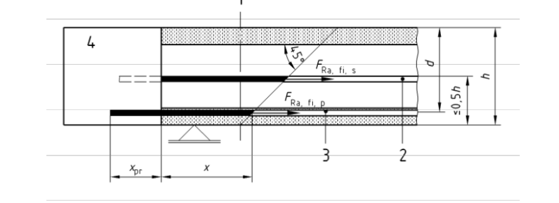
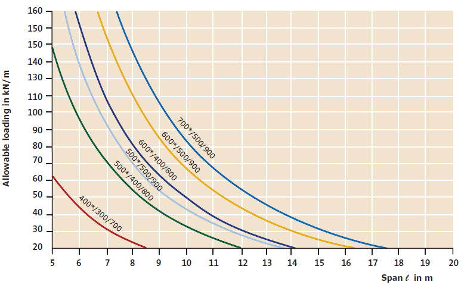
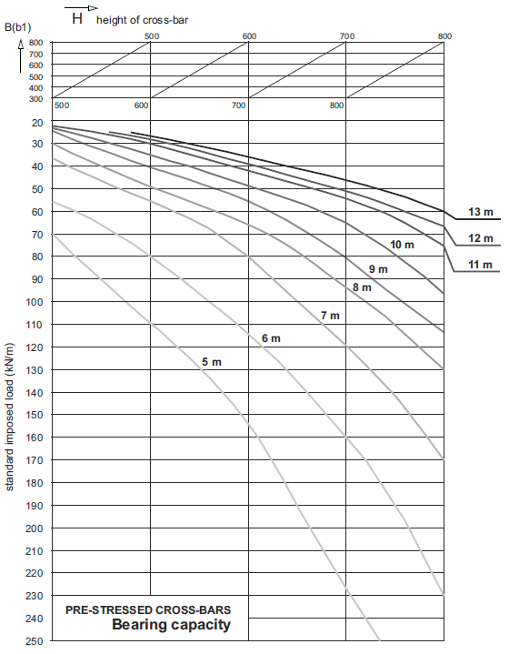
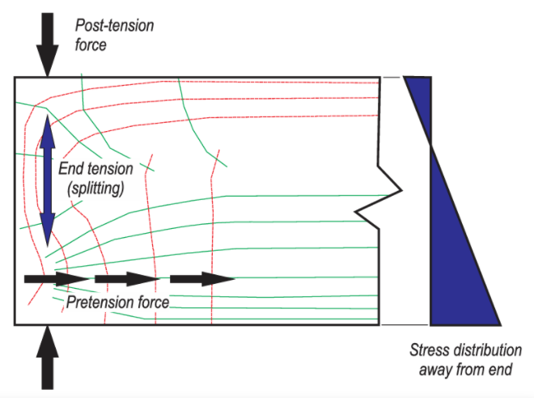
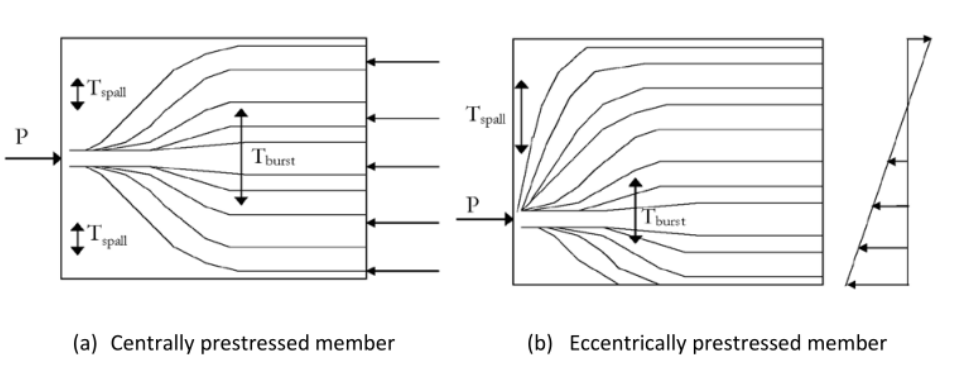

# Saliekamais dzelzsbetons

Saliekamā dzelzsbetona konstrukciju projektēšana un izmantošana prasa precīzu izgatavošanas tolerances, transportēšanas gabarītu, balstījuma mezglu un šuvju risinājumu ievērošanu.

---

## Elementu izgatavošanas standarti

Saliekamo dzelzsbetona elementu izgatavošanu un kvalitātes atbilstības novērtēšanu veic saskaņā ar šādiem standartiem:
- **LVS EN 14992+A1:2020:** Saliekamā dzelzsbetona izstrādājumi. Sienas elementi.
- **LVS EN 13225:** Saliekamā dzelzsbetona izstrādājumi. Lineārie konstrukciju elementi (sijas, kolonnas).
- **LVS EN 1168+A3:2011:** Saliekamā dzelzsbetona izstrādājumi. Dobumotās plātnes.

---

## Dobumoto plātņu (HCS) izgriezumu robežvērtības

Veicot dobumoto plātņu gareniskos vai šķērsvirziena izgriezumus (komunikāciju šahtām, kāpņu ailēm), jānodrošina atlikušā plātnes šķērsgriezuma nestspēja un stabilitāte:

*Saskaņā ar "Betongelementboken" un ražotāju vadlīnijām, maksimālie pieļaujamie izgriezumu izmēri bez papildu tērauda sadalošajiem elementiem (kārbām) ir atkarīgi no plātnes biezuma un izvietojuma (parasti ne vairāk kā 1-2 dobumu platumā).*

### Dobumoto plātņu enkurošana iecirtumos:

---

## Dobumoto paneļu ugunsizturība šķērsspēkā un enkurojumā (LVS EN 1168 G pielikums)

Ugunsgrēka apstākļos dobumotajās plātnēs rodas augsts temperatūras gradients, kas izraisa betona termisko izplešanos un plaisāšanu, ietekmējot šķērsspēka nestspēju un saspriegto stiegru enkurojuma saķeri.

Saskaņā ar LVS EN 1168 G pielikumu, ugunsizturības klasēm, kas ir vienādas vai lielākas par **R60**, ir jāveic šķērsspēka un enkurojuma nestspējas pārbaude ugunsgrēka apstākļos. Klasei < R60 šī pārbaude nav nepieciešama.

### Empīriskais šķērsspēka un enkurojuma vienādojums ugunsgrēka apstākļos:

$$V_{Rd,c,fi} = \left[ C_{\theta,1} + \alpha_k \cdot C_{\theta,2} \right] \cdot b_w \cdot d$$

Kur:
- $\alpha_k = 1 + \sqrt{\frac{200}{d}} \le 2,0$ (izmēra faktors, kur darba augstums $d$ ir milimetros);
- $b_w$ — sieniņu kopējais platums (samazināts, ņemot vērā plaisas);
- $d$ — darba augstums normālā temperatūrā;
- $C_{\theta,1}$ — koeficients, kas ievērtē betona spriegumu ugunsgrēka apstākļos:
  $$C_{\theta,1} = 0,15 \cdot \min\left( k_p(\theta_p) \cdot \sigma_{cp,20^\circ\text{C}} ; \frac{F_{R,a,fi,p}}{A_c} \right)$$
- $C_{\theta,2}$ — koeficients, kas ievērtē enkurotā garenstiegrojuma ietekmi paaugstinātā temperatūrā:
  $$C_{\theta,2} = \sqrt[3]{\frac{0,58 \cdot F_{R,a,fi} \cdot f_{c,fi,m}}{f_{yk} \cdot b_w \cdot d}}$$
- $\sigma_{cp,20^\circ\text{C}}$ — vidējais betona spriegums no saspriegojuma spēka normālā temperatūrā;
- $f_{c,fi,m}$ — betona vidējā spiedes stiprība paaugstinātā temperatūrā;
- $F_{R,a,fi} = F_{R,a,fi,p} + F_{R,a,fi,s}$ (kopējā saspriegtā un parastā stiegrojuma spēka kapacitāte);
- $f_{bpd,fi} = \eta_{p2} \cdot \eta_1 \cdot \frac{0,7 \cdot f_{ctm} \cdot k_{ct}(\theta_{p,m})}{\gamma_c}$ (saķeres stiprība saspriegtajām stiegrām ugunsgrēka apstākļos).

| G.2. attēls — Aprēķina modelis ar parasto enkurojumu | G.3. attēls — Aprēķina modelis ar izvirzītām dzīslām |
| :---: | :---: |
|  |  |

*Apzīmējumi: 1 — apskatāmais šķērsgriezums (balsta malā), 2 — savienojuma stiegrojums (skavas), 3 — saspriegtā dzīsla, 4 — monolītais šuvju aizpildījuma betons.*

---

## Saliekamo fasādes elementu šuvju hidroizolācija un blīvēšana

Ārsienu trīsslāņu paneļu šuvju ilgmūžību un aizsardzību pret mitrumu nodrošina hermētiķi un blīvslāņi.

**Prasības šuvju izmēriem pēc DIN 18540:**

| Kustība šuvē $\Delta L$ (mm) | Nominālais šuves platums $b$ pie $+10\ ^\circ\text{C}$ (mm)* | Minimālais šuves platums $\min b$ (mm) | Blīvējuma (hermētiķa) dziļums $d$ (mm) |
| :---: | :---: | :---: | :---: |
| $\le 2$ | 15 | 10 | $8 \pm 2$ |
| $> 2 \dots \le 3,5$ | 20 | 15 | $10 \pm 2$ |
| $> 3,5 \dots \le 5$ | 25 | 20 | $12 \pm 2$ |
| $> 5 \dots \le 6,5$ | 30 | 25 | $15 \pm 3$ |
| $> 6,5 \dots \le 8$ | 35 | 30 | $15 \pm 3$ |

*\*Nominālā šuves platuma pieļaujamā būvdarbu novirze ir $\pm 5\text{ mm}$. Hermētiķa dziļuma un platuma attiecība parasti ir robežās no $1:1$ līdz $1:2$.*

---

## Maksimālie elementu gabarīti transportēšanai

Saliekamo dzelzsbetona elementu dizainā ir jāņem vērā autotransporta gabarītu ierobežojumi Latvijas teritorijā:

| Autotransporta veids | Gabarītu robežas bez speciālās atļaujas | Gabarītu robežas bez speciālās atļaujas | Gabarītu robežas bez speciālās atļaujas | Gabarītu robežas bez speciālās atļaujas | Gabarītu robežas ar speciālo atļauju | Gabarītu robežas ar speciālo atļauju | Gabarītu robežas ar speciālo atļauju |
| :--- | :---: | :---: | :---: | :---: | :---: | :---: | :---: |
| | **Augstums (mm)** | **Platums (mm)** | **Garums (mm)** | **Svars (t)** | **Augstums (mm)** | **Platums (mm)** | **Garums (mm)** |
| **Ar standarta platformu / tentu** | 2600 | 2450 | 13500 | 24 | 3100 | 2750 | 18000 |
| **Ar zemo treileri (JUMBO)** | 3000 | 2450 | 9000 | 24 | 3300 | 2750 | 9000 |
| **Zemās grīdas treileris (Titāniks)** | 3800 | 1500 | 9500 | 22 | 4200 | 1500 | 9500 |

---

## Nominālie elementu balstījuma garumi

Minimālie balsta garumi (earing lengths) uz nesošajām konstrukcijām, kas nodrošina drošu slodzes pārnesi un pieļauj būvdarbu novirzes:

| Balstāmais elements | Nesošā konstrukcija | Plātnes biezums $h$ vai sijas laidums $L$ | Minimālais nominālais balsta garums (mm) |
| :--- | :--- | :--- | :---: |
| **Dobumotās plātnes (HCS)** | Betons / Tērauds | $h \le 300\text{ mm}$ | 60 – 80 |
| | | $h > 300\text{ mm}$ | 100 – 120 |
| | Mūris | $h \le 250\text{ mm}$ | 100 |
| | | $h > 250\text{ mm}$ | 120 |
| **Masīvās plātnes (Floor planks)** | Betons | Ar palīgatbalstiem montāžā   Bez palīgatbalstiem | 30   50 |
| | Mūris | Ar palīgatbalstiem montāžā   Bez palīgatbalstiem | 40   50 |
| **Ribotie pārsegumi (TT-plātnes)** | Betons | Laidums $L \le 15\text{ m}$ | 150 |
| **Sekundārās jumta sijas** | Betons | Laidums $L \le 8\text{ m}$ | 140 |
| **Pārseguma sijas** | Betons | Laidums $L = 12 \dots 20\text{ m}$ | 200 – 230 |
| **Jumta sijas** | Betons | Laidums $L \le 24\text{ m}$ | 195 |
| | | Laidums $L \le 40\text{ m}$ | 225 |

---

## Nestspējas līknes un gala zonas spriegumi

Saspriegto TT-plātņu un siju nestspējas līknes atkarībā no laiduma un slodzēm (pēc Consolis un TMB datiem pie slodžu sadalījuma 50/50):

| Consolis RT un L saspriegtās sijas | TMB saspriegto siju nestspēja |
| :---: | :---: |
|  |  |

Atšķelšanās (sašķelšanās) spriegumi saspriegto elementu gala zonās, ko rada spriegojuma spēka enkurošanās betona masīvā:

| Spriegumu izkliede saspriegtā elementa gala zonā | Atšķelšanās spriegumu sadalījums |
| :---: | :---: |
|  |  |
