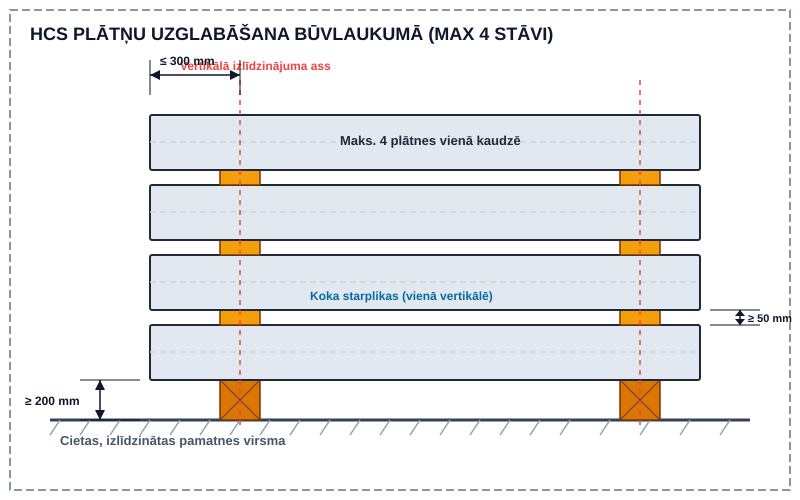
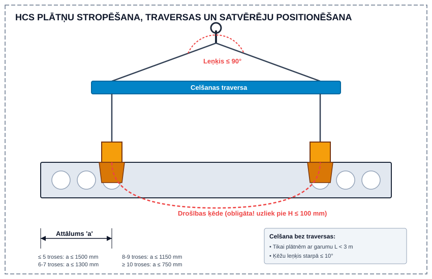
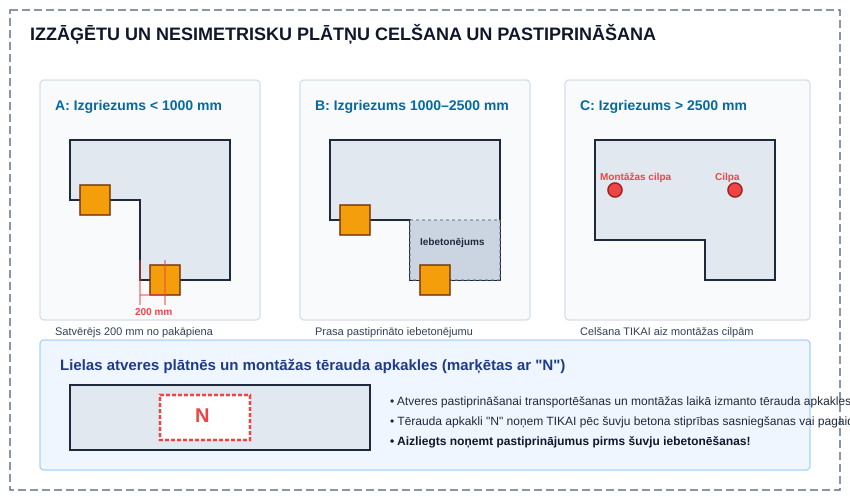
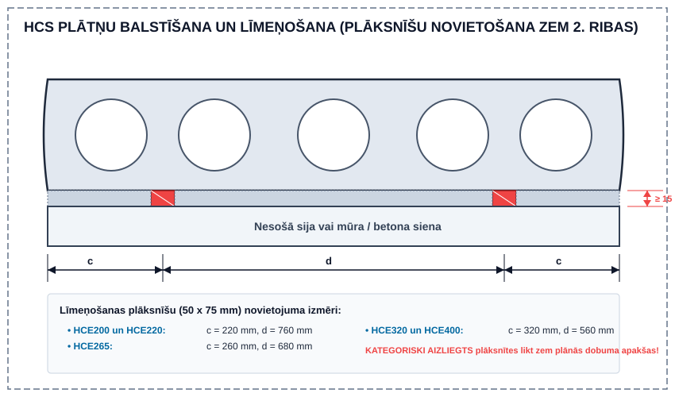
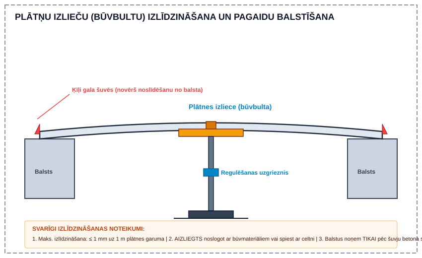
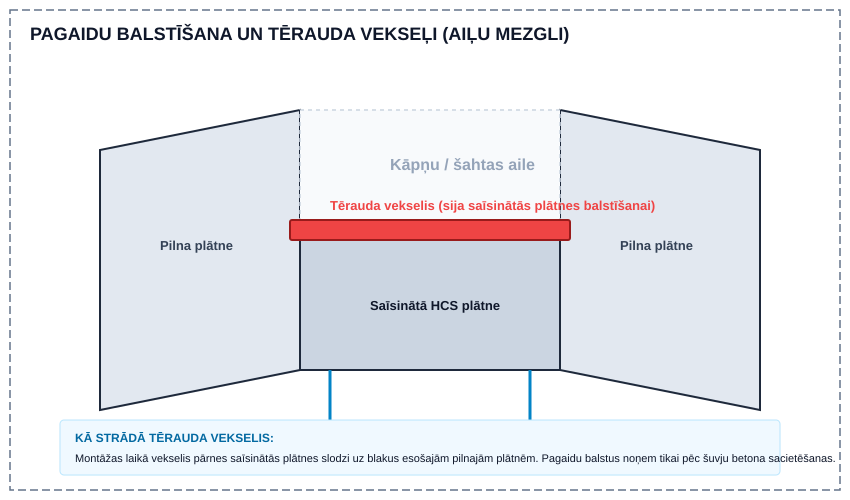

# Dobumoto plātņu (HCS) montāža un nosacījumi

Saliekamo dzelzsbetona dobumoto plātņu (HCS — *Hollow Core Extruder*) montāžā jāievēro LVS EN 1168 standarts un šādi būvlaukuma nosacījumi:

---

## 1. Tipi, marķējums un trošu ieslīdēšanas pielaides

- **HCS tipi un biezumi:** HCE200 (200 mm), HCE220 (220 mm), HCE265 (265 mm), HCE320 (320 mm), HCE400 (400 mm).
- **Marķējuma piemērs:** `HCE220-5x-101` (tips HCE220, 5 saspriegtās troses apakšējā joslā, pozīcijas nr. 101).
- **Trošu ieslīdēšana (libisemine):** Pieļaujamā trošu ieslīdēšana betona masīvā no plātnes gala pēc atspriegošanas:
  - **Ø9,3 mm trosēm:** maks. 2,0 mm
  - **Ø12,5 mm trosēm:** maks. 3,0 mm
  - Troses ar pieļaujamo pārsniegumu, ko rūpnīca pārbaudījusi, tiek atzīmētas ar krāsu gala plaknē. Par neatzīmētām novirzēm pirms montāžas jāziņo ražotājam.

---

## 2. Transportēšana, piegāde un uzglabāšana

- **Piegādes grafiks:** Vispārējais grafiks 2 nedēļas pirms piegādes, stundu precizitātes grafiks — 3 darbdienas pirms.
- **Izkraušana:** Normatīvais kravas izkraušanas laiks būvlaukumā — 1 stunda.
- **Starpuzglabāšana (Vaheladustamine):**
  - Novieto uz cietas, horizontālas pamatnes.
  - Koka starplikas likt **precīzi vienā vertikālē**, maks. **300 mm** no plātnes gala.
  - Apakšējai plātnei virs zemes jābūt vismaz **200 mm** brīvam pacēlumam.
  - Starpliku biezums ≥ 50 mm. Maks. **4 plātnes** kaudzē.
  - **Ziemā aizliegts** raut ar celtni sasalušas plātnes.

---

## 3. Celšana, stropēšana un drošības ķēdes

- **Celšana bez traversas:** Drīkst celt TIKAI plātnes ar garumu L < 3 m, ja ķēžu leņķis starpā ≤ 10°.
- **Celšana ar traversu:** Izmanto teleskopiskās vai fiksētās traversas (ķēžu leņķis virs traversas ≤ 90°).
- **Satvērēja attālums a no plātnes gala:**
  - ≤ 5 troses: a ≤ 1500 mm (min. attālums no gala 200 mm)
  - 6–7 troses: a ≤ 1300 mm
  - 8–9 troses: a ≤ 1150 mm
  - ≥ 10 troses: a ≤ 750 mm
  - HCE400 plātnēm garākām par 11 m obligāti izmanto 4 satvērējus.
- **Drošības ķēdes (Ohutuskett):** Obligātas! Apliek ap plātni tūlīt pēc pacelšanas (pie h ≤ 100 mm), noņem 100 mm virs balsta. **Aizliegts izmantot celšanai.**

### Izzāģētas un nesimetriskas plātnes:
- Izgriezuma gals < 1000 mm: satvērēju atbalsta 200 mm no pakāpiena.
- Izgriezuma gals 1000–2500 mm ar pastiprināto iebetonējumu: satvērēju novieto 200 mm no pakāpiena.
- Izgriezums > 2500 mm: celšana TIKAI aiz montāžas cilpām.
- Tērauda apkakles (marķētas ar "N") pie lielām atverēm noņem TIKAI pēc šuvju betona sacietēšanas.

---

## 4. Balstīšana un līmeņošana

### Minimālais balsta garums:
- **Uz betona / tērauda:** h ≤ 320 mm → min 40 mm (ieteicams 70 mm); h = 400 mm → min 80 mm (ieteicams 100 mm).
- **Uz mūra:** h ≤ 265 mm → min 80 mm (ieteicams 100 mm); h ≥ 320 mm → min 100 mm (ieteicams 120 mm).

### Līmeņošanas plāksnītes (50 x 75 mm):
- Novieto **ZEM OTRĀS RIBAS (zem 2. dobuma sieniņas)**. Aizliegts likt zem dobuma vidus!
- Apakšējās javas šuves biezums ≥ 15 mm.

 | Plātnes tips | Mala c (mm) | Starp plāksnītēm d (mm) | 
 | :--- | :---: | :---: | 
 | **HCE200 un HCE220** | 220 | 760 | 
 | **HCE265** | 260 | 680 | 
 | **HCE320 un HCE400** | 320 | 560 | 

### Plātņu izlieču (būvbultas) izlīdzināšana:
- Izlīdzina no apakšas ar teleskopisko balstu zem 2. ribas vai centra.
- Maks. izlīdzināšana: **1 mm uz 1 m plātnes garuma**.
- Pirms izlīdzināšanas gala šuvēs obligāti jāievieto ķīļi pret plātnes noslīdēšanu no balsta.
- **Aizliegts** izlīdzināt noslogojot ar materiāliem vai spiežot ar celtni.

---

## 5. Pagaidu balstīšana un tērauda vekseļi (stiprinājumu sijas ailēm)

- Saīsinātās plātnes ap kāpņu un šahtu ailēm iekarina uz tērauda vekseļiem (šķērssijām) uz blakus esošajām pilnajām plātnēm.
- Pirms vekseļu uzstādīšanas zem ailēm novieto pagaidu montāžas balstus (stutes), ko noņem tikai pēc šuvju betona sacietēšanas.

---

## 6. Šuvju betonēšana, drenāžas urbumi un komunikāciju atvērumi

- **Šuvju betons:** C25/35 vai C30/37, pildviela 4 vai 8 mm. **Ūdeni būvlaukumā pievienot aizliegts.**
- **Stiegrojums:** Garenstiegras novieto zem šuves viduslīnijas.
- **Betona patēriņš:** HCE200 (7 l/m), HCE220 (8 l/m), HCE265 (11 l/m), HCE320 (13 l/m), HCE400 (15 l/m).
- **Ziemas betonēšana:** **Sniega un ledus kausēšanai šuvēs AIZLIEGTS izmantot tvaiku** (tvaiks kondensējas dobumos, sasalt un iznīcina saķeri). Izmanto karsto gaisu vai gāzes degli.
- **Drenāžas urbumi:** Rūpnīcā galos (līdz 300 mm) katra dobuma apakšā ir Ø10 mm urbumi (autostāvvietām Ø20 mm). Montāžnieks tos pārbauda un iztīra tūlīt pēc šuvju betonēšanas.
- **Urbumi un atvērumi:** Maks. 3 atveres vienā griezumā (2 atveres HCE320/400). **Plātnes apakšējās ribās UZURBT AIZLIEGTS.** Kabeļu caurules garenšuvē maks. 2x Ø20 mm.

---

## 7. Apdare un darba drošība

- **Griestu apdare:** Aizture 5–7 nedēļas līdz žūšanas beigām (pie telpas t° > +10°C).
- **Drošība:** Drošības ķiveres, apavi, nožogojumi brīvajām malām. Stāvēt zem paceļamas plātnes aizliegts.
