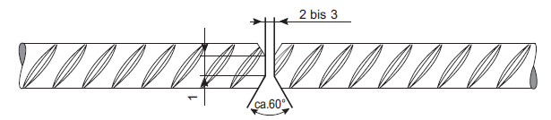
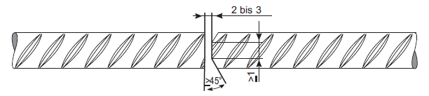
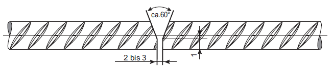
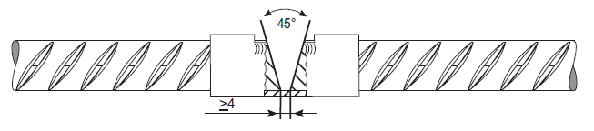
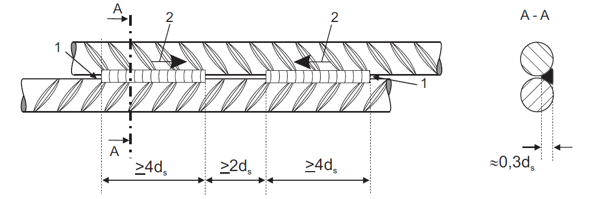
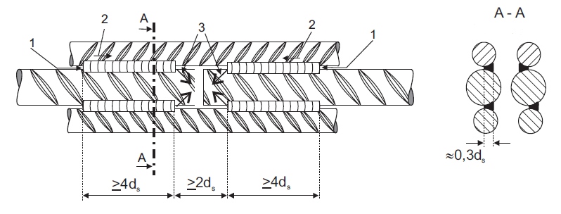
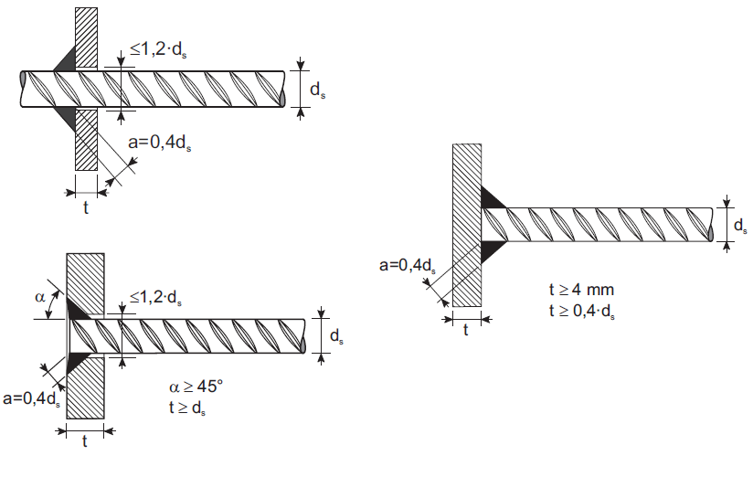

## STIEGROJUMA METINĀŠANAS RISINĀJUMI PĒC DIN 4099

Pilnas stiprības savienojumi pēc DIN 4099 (testēti, nevis matemātiski aprēķināti). Visi izmēri milimetros.

Ar sadursavienojumu

Variants 1: ar D-V šuvi

Variants 2: ar DH-V šuvi

Variants 3: ar V šuvi

Variants 4: sadursavienojums ar speciālu metināšanas vannu

Ar pārlaidumu

1 – metināšanas sākumā elektrodam jāatrodas savienojuma punktā starp stiegrām

2 – metināšanas virziens

ds – mazākās savienojamās stiegras diametrs

Ar uzlikām

1 – metināšanas sākumā elektrodam jāatrodas savienojuma punktā starp stiegrām

2 – metināšanas virziens, ja metināšanu veic horizontālā stāvoklī; metinot vertikāli virziens no apakšas uz augšu

3 – elektroda noņemšanas vieta

ds – mazākās savienojamās stiegras diametrs

Piemetināšanas varianti pie tērauda loksnēm

