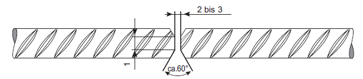
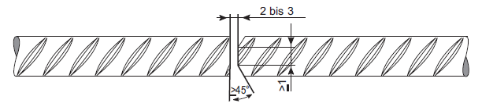
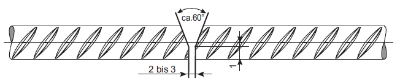
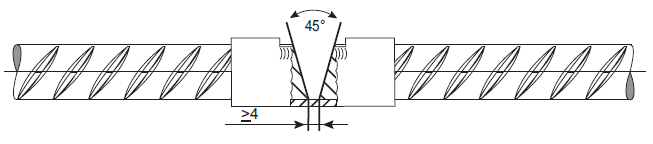
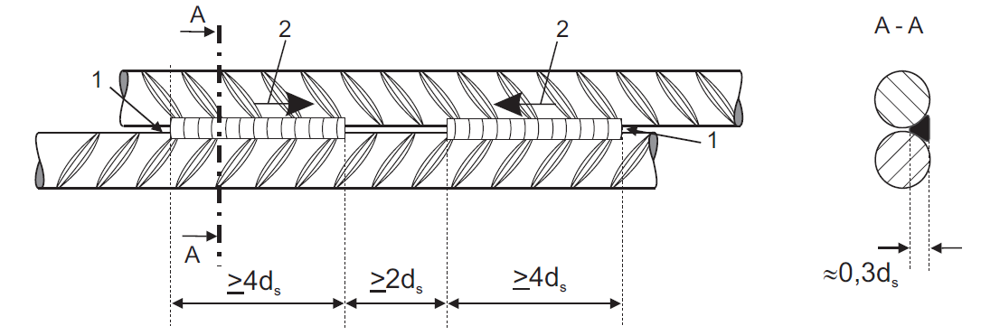
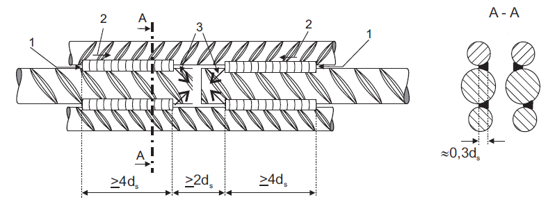
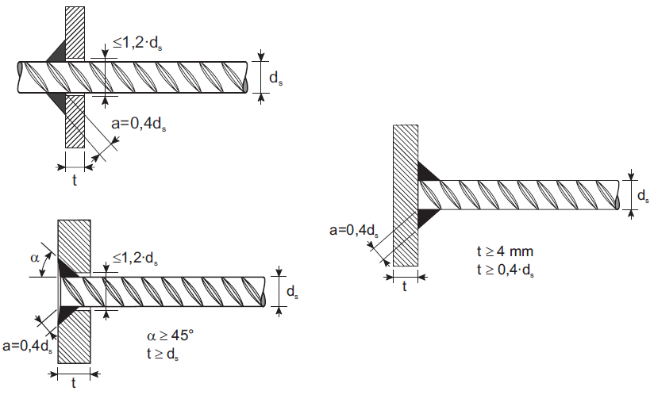

# Stiegrojuma metināšanas risinājumi

Stiegrojuma metinātos savienojumus izmanto monolītā un saliekamā dzelzsbetona izbūvē. Metināšana jāveic saskaņā ar standartu **LVS EN ISO 17660** (kas aizstāja veco DIN 4099 standartu), kas nodrošina pilnas stiprības (slodzi nesošus) savienojumus. Visi izmēri attēlos ir norādīti milimetros.

---

## Sadursavienojumi (Butt joints)

Sadursavienojumus izmanto taisnu stieņu savienošanai galos, veicot stieņu malu sagatavošanu (griešanu/noslīpināšanu).

### Variants 1: Ar D-V šuvi (divpusēja V-veida šuve)

### Variants 2: Ar DH-V šuvi (divpusēja pus-V-veida šuve)

### Variants 3: Ar V šuvi (vienpusēja V-veida šuve)

### Variants 4: Sadursavienojums ar speciālu paliktni (metināšana vannā)

---

## Pārlaidsavienojumi ar flankējošām šuvēm (Lap joints)

Stieņu pārseguma metināšana ar gareniskajām šuvēm.

*Skaidrojums:*
- **1** — metināšanas sākumā elektrodam jāatrodas savienojuma punktā starp stiegrām (metināšanas saknē);
- **2** — metināšanas virziens;
- **\\(d_s\\)** — mazākās savienojamās stiegras diametrs;
- minimālais šuves garums parasti ir \\(5d_s\\) (vienpusējai šuvei) vai \\(10d_s\\) atkarībā no aprēķina slodzes.

---

## Savienojumi ar uzlikām (Strap joints)

Divu stieņu savienojums, izmantojot uzlikas (stiegrojuma gabalus) un flankējošās metināšanas šuves.

*Skaidrojums:*
- **1** — metināšanas sākumā elektrodam jāatrodas savienojuma punktā starp stiegrām;
- **2** — metināšanas virziens, ja metināšanu veic horizontālā stāvoklī. Metinot vertikāli, šuve jāveic virzienā no apakšas uz augšu;
- **3** — elektroda noņemšanas vieta (krātera aizpildīšana);
- **\\(d_s\\)** — mazākās savienojamās stiegras diametrs.

---

## Piemetināšana pie tērauda plāksnēm

Izmanto saliekamā dzelzsbetona ieliekamo detaļu (tērauda plākšņu) enkurošanai betonā.

