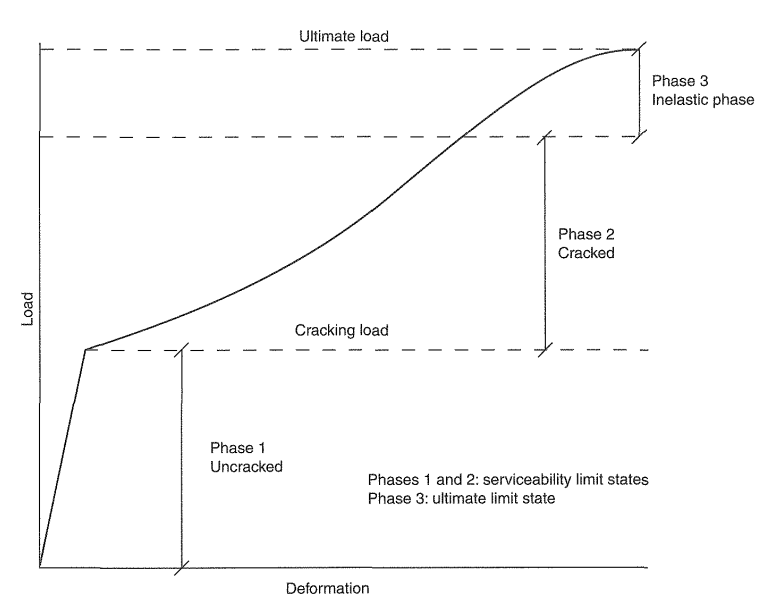

# DELZSBETONA KONSTRUKCIJAS

## VISPĀRĪGI PRINCIPI

Tipiska slodzes attiecība pret pārbaudes robežvērtībām

Kopumā EN 1992 sniedz ļoti limitētu informāciju par kopējām būves aprēķina metodikām. Vispārīgi konstrukciju (būvi) var projektēt pieņemot kādu no sekojošām aprēķina metodēm:

Elastīgu aprēķinu;

Elastīgu aprēķinu ar limitētu slodžu pārdalīšanos;

Plastisku aprēķinu;

Nelineāru aprēķinu.

EN 1992 ar B un C tipa stiegrojumu pieļauj veikt momentu pārdalīšanu līdz 30% no to vērtības, bet tikai karkasiem ar saitēm (braced structures).

Pilnam būves modelim nelineāru aprēķinu dēļ sarežģītības lieto reti. Plastisku aprēķinu galvenokārt lieto tikai nestspējas robežstāvokļa pārbaudei. Spiesti – stieptu stieņu aprēķini ir plastiski aprēķini.
