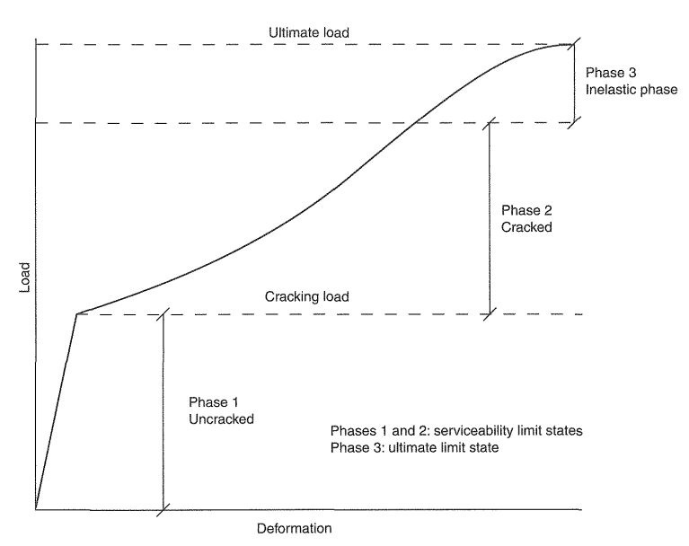

# Dzelzsbetona konstrukcijas

Dzelzsbetons ir kompozītmateriāls, kurā betons uzņem spiedes spēkus, bet tērauda stiegrojums — stiepes spēkus. Dzelzsbetona konstrukciju projektēšana tiek veikta saskaņā ar standartu **LVS EN 1992-1-1** (Eirokodekss 2) un nacionālo pielikumu.

---

## Statiskās analīzes un aprēķina metodes

Dzelzsbetona konstrukciju aprēķiniem var izmantot šādas metodes:
- **Lineāri elastīga analīze (Linear elastic analysis):** Standarta metode, ko izmanto lielākajā daļā ikdienas aprēķinu un FEM programmatūru (pieņemot materiālu lineāru elastību).
- **Lineāri elastīga analīze ar ierobežotu momentu pārdali (Linear elastic analysis with limited redistribution):** Eirokodekss pieļauj lieces momentu pārdali starp balsta un laiduma zonām nepārtrauktās sijās un plātnēs līdz pat **30%** (lai vienkāršotu stiegrošanu), ja tiek izmantots pietiekami plastisks stiegrojums (B vai C klase, kur C klase ir viselastīgākā) un konstrukcija ir telpiski nodrošināta pret sānu pārvietojumiem (braced structure).
- **Plastiskā analīze (Plastic analysis):** Izmanto galvenokārt nestspējas robežstāvokļa (ULS) pārbaudēm (piemēram, plātņu aprēķinam pēc tecēšanas līniju metodes).
- **Spiedes un stiepes stieņu analoģijas metode (Strut-and-Tie method):** Plastiskās analīzes metode, ko izmanto diskontinuitātes zonu (D-reģionu) aprēķiniem, piemēram, augstām sijām (sijām-sienām), konsolēm, siju pakāpieniem un pāļu cepurēm.
- **Nelineāra analīze (Non-linear analysis):** Ņem vērā plaisu veidošanos un betona/stiegrojuma nelineārās fizikāli mehāniskās īpašības. Sarežģītības dēļ ēku kopējos modeļos to izmanto reti, galvenokārt īpašu konstrukciju izpētei.

**Tipiska slodzes attiecība pret pārbaudes robežvērtībām:**

