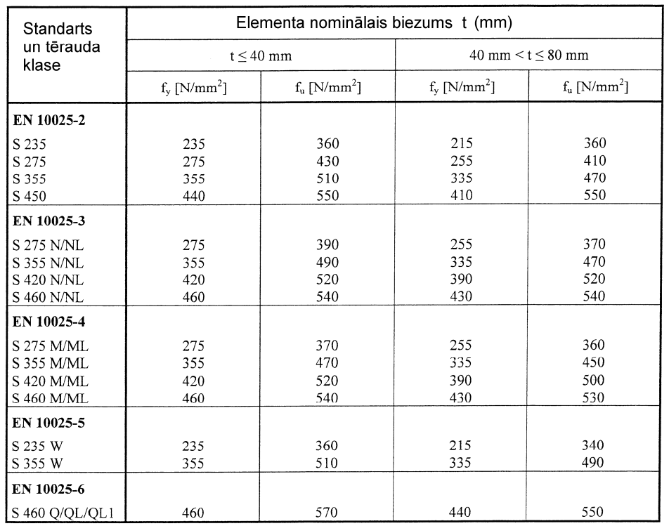

## FIZIKĀLĀS UN MEHĀNISKĀS ĪPAŠĪBAS

Plūstamības un pārraušanas pretestības konstrukciju tēraudam

Konstrukciju tērauda konstantes

LVS EN 1993 nosaka, ka aprēķinos ir jāpielieto šādi tērauda raksturojumi:

Elastības modulis (Junga modulis) E = 210 000 N·mm-2;

Bīdes modulis G = E/2(1+v) ≈ 81 000 N·mm-2;

Puasona koeficients v = 0.30;

Termiskās izplešanas koeficients α = 12·106 uz 1K;

Blīvums ρ = 7850 kG·m-3.

Korozivitātes klases

<table>
<colgroup>
  <col style="width:8%">
  <col style="width:12%">
  <col style="width:40%">
  <col style="width:40%">
</colgroup>
<thead>
<tr><th>Apzīmējums pēc ISO 12944</th><th>Ietekme</th><th>Vides piemēru apraksts, ja tā ir iekštelpās.</th><th>Vides piemēru apraksts, ja tā ir ārtelpā.</th></tr>
</thead>
<tbody>
<tr><td>C1</td><td>Ļoti zema</td><td>Apkurināmās ēkās ar tīru gaisu, piemēram, biroji, veikali, skolas, viesnīcas, un tamlīdzīgi.</td><td>Nav.</td></tr>
<tr><td>C2</td><td>Zema</td><td>Neapkurināmās ēkās, kur var notikt mitruma kondensēšanās, piemēram, noliktavas, neapkurināmas sporta halles.</td><td>Atmosfēra ar mazu piesārņojumu piemēram lauku apgabali.</td></tr>
<tr><td>C3</td><td>Vidēja</td><td>Ražošanas ēkas ar augstu mitruma līmeni un nelielu gaisa piesārņojumu, piemēram, pārtikas ražošanas cehi, alus brūži, veļas mazgātavas.</td><td>Pilsētas un industriālās teritorijas, teritorijas ar vidēju sēra dioksīda piesārņojumu. Piekrastes teritorijas ar zemu sāls saturu atmosfērā.</td></tr>
<tr><td>C4</td><td>Augsta</td><td>Ķīmiskās industrijas ražotnes, peldbaseini, kuģu piestātnes.</td><td>Industriālās teritorijas un piekrastes teritorijas ar vidēju sāls iedarbi.</td></tr>
<tr><td>C5-I</td><td>Ļoti augsta – industriāla</td><td>Ēkas ar pastāvīgu mitruma kondensēšanos un augstu gaisa piesārņojumu.</td><td>Industriālās teritorijas ar augstu gaisa mitrumu un agresīvu atmosfēru.</td></tr>
<tr><td>C5-M</td><td>Ļoti augsta</td><td>Ēkas ar pastāvīgu mitruma kondensēšanos un augstu gaisa piesārņojumu.</td><td>Piekrastes zonas un jūras platformas ar augstu sāls saturu atmosfērā.</td></tr>
</tbody>
</table>
