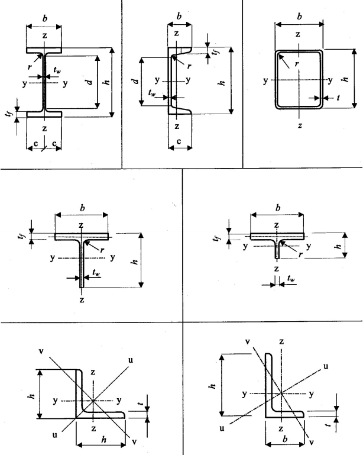
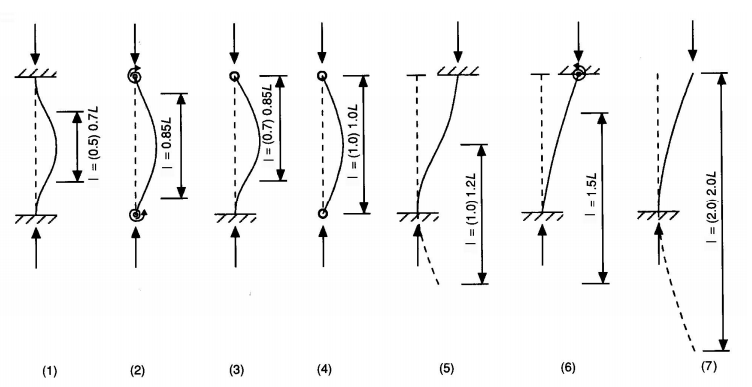
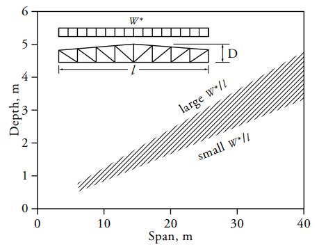

## APRĒĶINS PĒC ROBEŽSTĀVOKĻU METODES

Materiāla parciālie koeficienti

<table>
<colgroup><col style="width:20%"><col style="width:55%"><col style="width:25%"></colgroup>
<thead><tr><th>Elementi</th><th>Elementa pretestības raksturojums</th><th>Materiāla drošības koeficients γM</th></tr></thead>
<tbody>
<tr><td rowspan="3">Elementu un šķērsgriezumu pretestība</td><td>Šķērsgriezuma pretestība no pārmērīgas plūstamības, iekaitot sāniskās vērpes lodzi</td><td>γM0 = 1,00</td></tr>
<tr><td>Elementu pretestība noturības zudumam, kura tiek novērtēta stieņu pārbaudēs</td><td>γM1 = 1,10</td></tr>
<tr><td>Stieptu šķēlumu pretestība sabrukumam</td><td>γM1 = 1,25</td></tr>
<tr><td rowspan="6">Savienojumu pretestība</td><td>Augstas stiprības skrūvju savienojumiem, kniežu savienojumiem, parastas stiprības skrūvju savienojumiem, metinātam savienojumam</td><td>γM2 = 1,25</td></tr>
<tr><td>Virsmu berzes pretestībai (nomināla diametra skrūvju caurumi): — stiprības robežstāvoklim — lietojamības robežstāvoklim</td><td>γM3 = 1,25 γM3,ser = 1,10</td></tr>
<tr><td>Injekcijas skrūvju pretestībai</td><td>γM4 = 1,10</td></tr>
<tr><td>Slēgta profila elementu savienojumu pretestība režģotās sijās</td><td>γM5 = 1,10</td></tr>
<tr><td>Kniežu savienojuma pretestība lietojamības robežstāvoklim</td><td>γM6,ser = 1,00</td></tr>
<tr><td>Augstas stiprības skrūvju iepriekšējais saspriegums</td><td>γM7 = 1,10</td></tr>
</tbody>
</table>

Asu izvietojuma shēma

X ass vienmēr ir elementa garenass.

Aprēķina garumi tipiskām situācijām

## RAKSTURĪGĀS PĀRSEGUMU LAIDUMU UN AUGSTUMU ATTIECĪBAS

Dotās vērtības ir izmantojamas, lai projekta sākumstadijā aptuveni noteiktu paredzamos elementu augstumus.

<table>
<colgroup>
  <col style="width:20%"><col style="width:10%">
  <col style="width:7%"><col style="width:7%"><col style="width:7%"><col style="width:7%">
  <col style="width:7%"><col style="width:7%"><col style="width:7%"><col style="width:7%">
  <col style="width:7%"><col style="width:7%">
</colgroup>
<thead>
<tr>
  <th>Elements</th><th>Dziļums/ laidums</th>
  <th colspan="10">Laidums (m)</th>
</tr>
<tr>
  <th></th><th>dziļums (mm)</th>
  <th>3</th><th>4,5</th><th>6</th><th>7,5</th><th>9</th><th>12</th><th>15</th><th>23</th><th>30</th><th>45–90</th>
</tr>
</thead>
<tbody>
<tr><td>Sija</td><td><strong>20</strong></td><td>230</td><td>300</td><td>390</td><td>460</td><td>610</td><td>770</td><td>1150</td><td>—</td><td>—</td><td>—</td></tr>
<tr><td>Kompozītā sija</td><td><strong>28</strong></td><td>200</td><td>220</td><td>270</td><td>320</td><td>440</td><td>550</td><td>820</td><td>—</td><td>—</td><td>—</td></tr>
<tr><td>Rāmja sija</td><td><strong>10</strong></td><td>460</td><td>610</td><td>760</td><td>900</td><td>1100</td><td>1500</td><td>2300</td><td>—</td><td>—</td><td>—</td></tr>
<tr><td>Grīdas joists</td><td><strong>20</strong></td><td>150</td><td>230</td><td>300</td><td>400</td><td>450</td><td>600</td><td>750</td><td>—</td><td>—</td><td>—</td></tr>
<tr><td>Jumta joists</td><td><strong>24</strong></td><td>—</td><td>—</td><td>—</td><td>—</td><td>—</td><td>640</td><td>800</td><td>950</td><td>1250</td><td>—</td></tr>
<tr><td>Plāksnes sija</td><td><strong>15</strong></td><td>—</td><td>400</td><td>500</td><td>600</td><td>800</td><td>1000</td><td>1500</td><td>2000</td><td>—</td><td>—</td></tr>
<tr><td>Kopne</td><td><strong>12</strong></td><td>—</td><td>500</td><td>640</td><td>760</td><td>1000</td><td>1300</td><td>1900</td><td>2500</td><td>3000</td><td>5000–7000</td></tr>
<tr><td>Telpiskais rāmis</td><td><strong>16</strong></td><td>—</td><td>—</td><td>—</td><td>570</td><td>760</td><td>950</td><td>1400</td><td>1900</td><td>2860</td><td>3800–5700</td></tr>
</tbody>
</table>

*Piezīme: Tabula paredzēta tikai provizoriskajam izmēru novērtējumam. Galīgie izmēri jānosaka ar aprēķiniem.*

Pēc DESIGN GUIDE FOR RECTANGULAR HOLLOW SECTION (RHS) JOINTS UNDER PREDOMINANTLY STATIC LOADING ideāla laiduma / augstuma attiecība cauruļveida paralēljoslu kopnēm ir robežās no 10 līdz 15. Parasti optimālā vērtība ir tuvu 15.

Kopņu projektēšanas procesā lielākā vērība ir pievērsta joslu šķērsgriezumu izvēlei, jo tradicionāli ap 50% no kopņu svara veido spiestās joslas, 30% stieptās joslas kamēr režģa elementi sastāda tikai 20%. Lai nodrošinātu optimālu pārseguma kopņu konstrukciju pie projektēšanas ievēroti šādi nosacījumi:

● Lietots konstants režģa paneļu platums pa kopnes garumu;

● Lietots pāra skaits režģa elementu;

● Noslogotākie režģa elementi orientēti tā, lai tie darbotos stiepē;

● Atgāžņu slīpums veidots robežās no 35° līdz 50°;

● Ja tas ir iespējams kopturi izvietojami iespējami tuvu režģa elementiem.

<table>
<colgroup><col style="width:40%"><col style="width:15%"><col style="width:45%"></colgroup>
<thead><tr><th>Konstrukciju veids</th><th>L/D</th><th>Piezīmes</th></tr></thead>
<tbody>
<tr><td>Velmētie tērauda profili</td><td>&lt; 20</td><td></td></tr>
<tr><td>Kopnes (vienlaiduma) — smaga slodze — vidēja slodze — viegla slodze (jumts)</td><td>12–15 15–18 18–21</td><td>Lietot lielākas vērtības, ja ir stingri savienojumi mezglos</td></tr>
<tr><td>Telpiskās plātnes un režģi</td><td>15–45</td><td>Skrūvmetināti savienojumi</td></tr>
</tbody>
</table>

