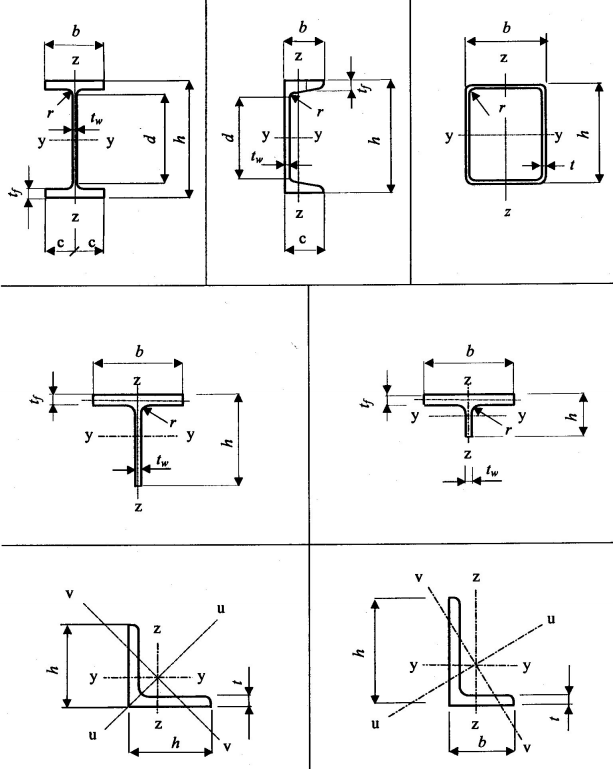
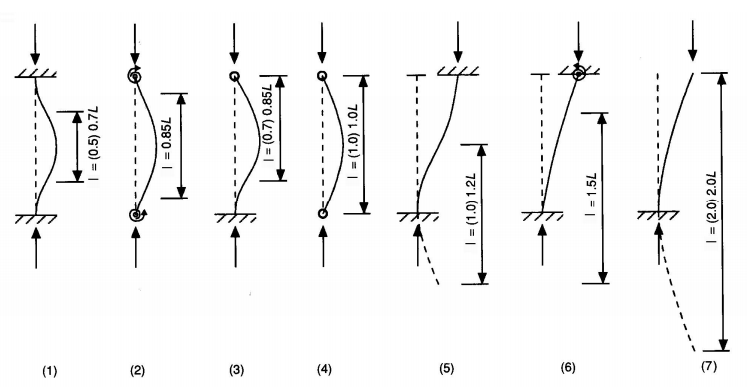
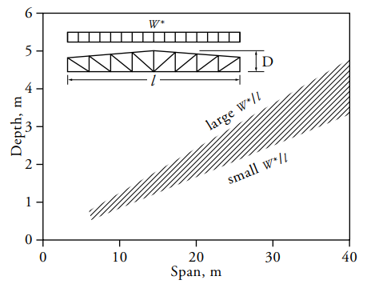

# Šķērsgriezumu un elementu aprēķins (ULS)

Tērauda elementu nestspējas un stabilitātes pārbaudes tiek veiktas saskaņā ar LVS EN 1993-1-1.

---

## Materiāla parciālie drošības koeficienti (\\(\gamma_M\\))

Aprēķinot elementu un savienojumu pretestību nestspējas robežstāvoklī (ULS), tērauda stiprību dala ar materiāla parciālajiem koeficientiem \\(\gamma_M\\). 

**Latvijā piemērojamie koeficienti saskaņā ar LVS EN 1993-1-1/NA:**

| Elementi / Pārbaudes | Pretestības raksturojums | Drošības koeficients \\(\gamma_M\\) |
| :--- | :--- | :---: |
| Elementu un šķērsgriezumu pretestība: | | |
| — Šķērsgriezuma nestspēja (visām klasēm) | Pretestība šķērsgriezuma plastiskai plūstamībai, ieskaitot sāniskās vērpes klupšanu | \\(\gamma_{M0} = 1,00\\) |
| — Elementu stabilitāte (noturības pārbaudes) | Stieņu pretestība izlieces un vērpes klupšanai stieņu pārbaudēs | **\\(\gamma_{M1} = 1,00\\)** * |
| — Stieptu šķērsgriezumu sabrukums | Pretestība trauslam sabrukumam stieptos šķēlumos pie skrūvju caurumiem | \\(\gamma_{M2} = 1,25\\) |
| Savienojumu pretestība: | | |
| — Skrūvju un metinātie savienojumi | Pretestība skrūvēm, kniedēm, tapām un metinātajām šuvēm | \\(\gamma_{M2} = 1,25\\) |
| — Virsmu berzes pretestība (berzes šuvēm) | Pretestība slīdei (normāliem skrūvju caurumiem):   — nestspējas robežstāvoklī (ULS)   — lietojamības robežstāvoklī (SLS) |  \\(\gamma_{M3} = 1,25\\)  \\(\gamma_{M3,ser} = 1,10\\) |
| — Injekcijas skrūvju savienojumi | Pretestība injekcijas skrūvēm | \\(\gamma_{M4} = 1,10\\) |
| — Slēgto profilu (cauruļprofilu) savienojumi | Režģoto kopņu mezglu nestspēja | \\(\gamma_{M5} = 1,10\\) |
| — Kniedētie savienojumi | Kniedēto savienojumu pārbaude SLS | \\(\gamma_{M6,ser} = 1,00\\) |
| — Augstas stiprības skrūvju iepriekšējais saspriegums | Skrūvju spriegošanas spēka pārbaude | \\(\gamma_{M7} = 1,10\\) |

*\*Svarīga piezīme: LVS EN 1993-1-1/NA nosaka stabilitātes koeficientu **\\(\gamma_{M1} = 1,00\\)** (Eirokodeksa pamatdokumentā rekomendētā vērtība ir \\(1,10\\)). Tas nodrošina ekonomiskāku tērauda elementu stabilitātes aprēķinu Latvijas teritorijā.*

---

## Elementu asu izkārtojums un aprēķina garumi

Tērauda elementu šķērsgriezuma koordinātu asis tiek definētas šādi:
- **X-X:** Elementa garenass;
- **Y-Y:** Stiprā ass (liece pret šo asi rada lieces momentu \\(M_y\\), kur šķērsgriezuma elastības pretestības modulis \\(W_y\\) ir maksimālais);
- **Z-Z:** Vājā ass (pretestības modulis \\(W_z\\) ir minimālais).

| Koordinātu asu izvietojums | Aprēķina garumi \\(L_{\text{cr}}\\) tipiskām atbalsta situācijām |
| :---: | :---: |
|  |  |

---

## Provizoriskās laidumu un augstumu attiecības (\\(L/d\\))

Konstruēšanas sākumposmā elementu šķērsgriezuma augstumu (dziļumu) \\(d\\) var provizoriski noteikt pēc laiduma un augstuma attiecības \\(L/d\\):

  <table>
    <thead>
      <tr>
        <th rowspan="2">Elements</th>
        <th rowspan="2">Attiecība \(L/d\)</th>
        <th colspan="10">Provizoriskais augstums \(d\) (mm) atkarībā no laiduma (\(L\), m)</th>
      </tr>
      <tr>
        <th>3 m</th>
        <th>4,5 m</th>
        <th>6 m</th>
        <th>7,5 m</th>
        <th>9 m</th>
        <th>12 m</th>
        <th>15 m</th>
        <th>23 m</th>
        <th>30 m</th>
        <th>45-90 m</th>
      </tr>
    </thead>
    <tbody>
      <tr>
        <td>Sija (vispārīga)</td>
        <td><strong>20</strong></td>
        <td>230</td><td>300</td><td>390</td><td>460</td><td>610</td><td>770</td><td>1150</td><td>—</td><td>—</td><td>—</td>
      </tr>
      <tr>
        <td>Kompozītā sija</td>
        <td><strong>28</strong></td>
        <td>200</td><td>220</td><td>270</td><td>320</td><td>440</td><td>550</td><td>820</td><td>—</td><td>—</td><td>—</td>
      </tr>
      <tr>
        <td>Rāmja sija (stinga)</td>
        <td><strong>10</strong></td>
        <td>460</td><td>610</td><td>760</td><td>900</td><td>1100</td><td>1500</td><td>2300</td><td>—</td><td>—</td><td>—</td>
      </tr>
      <tr>
        <td>Grīdas sek. sijas</td>
        <td><strong>20</strong></td>
        <td>150</td><td>230</td><td>300</td><td>400</td><td>450</td><td>600</td><td>750</td><td>—</td><td>—</td><td>—</td>
      </tr>
      <tr>
        <td>Jumta sek. sijas</td>
        <td><strong>24</strong></td>
        <td>—</td><td>—</td><td>—</td><td>—</td><td>—</td><td>640</td><td>800</td><td>950</td><td>1250</td><td>—</td>
      </tr>
      <tr>
        <td>Metināta sija</td>
        <td><strong>15</strong></td>
        <td>—</td><td>400</td><td>500</td><td>600</td><td>800</td><td>1000</td><td>1500</td><td>2000</td><td>—</td><td>—</td>
      </tr>
      <tr>
        <td>Kopne</td>
        <td><strong>12</strong></td>
        <td>—</td><td>500</td><td>640</td><td>760</td><td>1000</td><td>1300</td><td>1900</td><td>2500</td><td>3000</td><td>5000-7000</td>
      </tr>
      <tr>
        <td>Telpisks režģis</td>
        <td><strong>16</strong></td>
        <td>—</td><td>—</td><td>—</td><td>570</td><td>760</td><td>950</td><td>1400</td><td>1900</td><td>2860</td><td>3800-5700</td>
      </tr>
    </tbody>
  </table>

*Piezīme: Šī tabula paredzēta tikai provizoriskam izmēru novērtējumam. Galīgais šķērsgriezums vienmēr jānosaka ar stiprības, stabilitātes un izlieces aprēķiniem.*

---

## Paralēlo joslu kopņu projektēšanas nosacījumi

Saskaņā ar cauruļveida profilu (RHS) kopņu projektēšanas rokasgrāmatām, optimālā laiduma un augstuma attiecība paralēlo joslu kopnēm ir robežās no **\\(10\\) līdz \\(15\\)** (optimāli tuvu **\\(15\\)**).

Kopņu pašsvarā lielāko daļu sastāda joslas (ap 50% spiestā josla, 30% stieptā josla), bet režģa elementi (atgāžņi un statņi) sastāda tikai ap 20%. Tādēļ kopņu projektēšanā jāievēro šāda labā prakse:
- izvēlēties konstantu režģa paneļu platumu visā kopnes garumā, lai standartizētu mezglus;
- paredzēt pāra skaitu režģa elementu (atgāžņu);
- noslogotākos režģa elementus (it īpaši pie balstiem) orientēt tā, lai tie darbotos **stiepē** (stiepti stieņi nav pakļauti klupšanai, kas ļauj izmantot mazākus šķērsgriezumus);
- atgāžņu slīpuma leņķi pret joslām veidot robežās no **\\(35^\circ\\) līdz \\(50^\circ\\)**;
- sekundārās slodzes (kopturus) izvietot tieši kopnes mezglos, lai novērstu joslu lokālo lieci.

**Kopņu laiduma pret augstumu (\\(L/D\\)) attiecības:**

| Konstrukciju veids | Attiecība \\(L/D\\) | Piezīmes |
| :--- | :---: | :--- |
| Velmētie tērauda profili (sijas) | \\(< 20\\) | Lieces un izlieces kritēriji. |
| Vienlaiduma kopnes:   — smagai slodzei   — vidējai slodzei   — vieglai slodzei (jumti) |  \\(12 \dots 15\\)  \\(15 \dots 18\\)  \\(18 \dots 21\\) | Var izmantot lielākas attiecības robežas, ja mezglos tiek nodrošināti stingri (momentizturīgi) savienojumi. |
| Telpiskie režģi un plātnes | \\(15 \dots 45\\) | Balstās uz skrūvējamiem un metinātiem mezgliem. |

