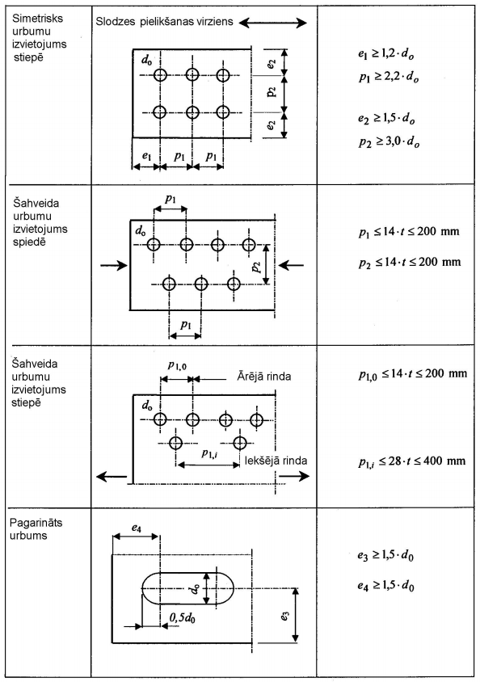
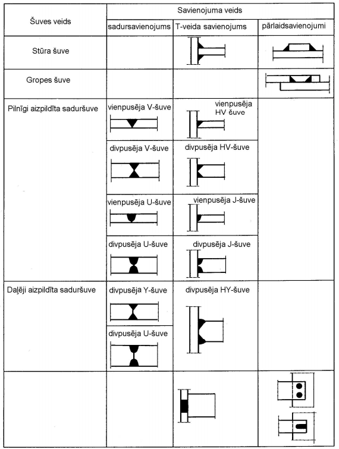
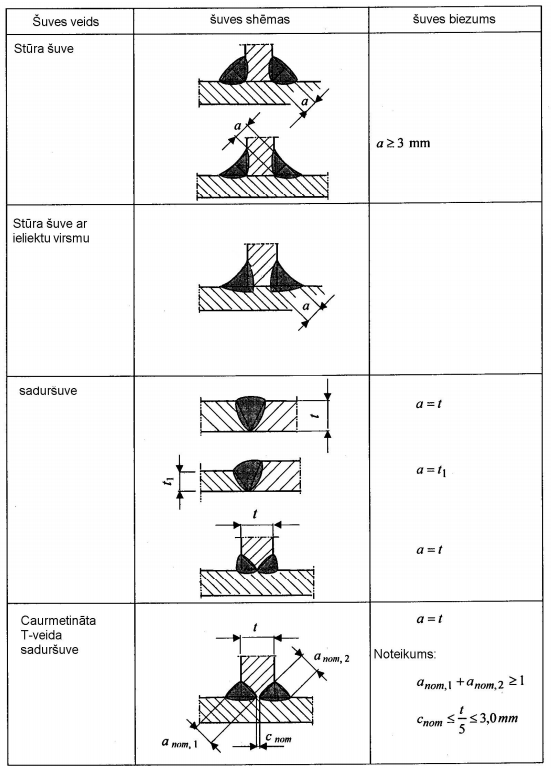
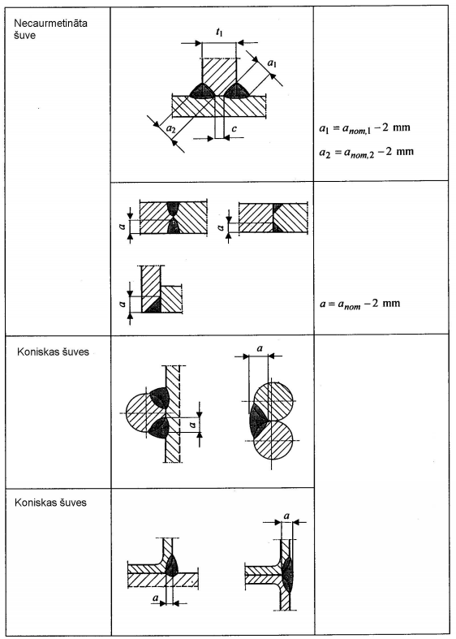
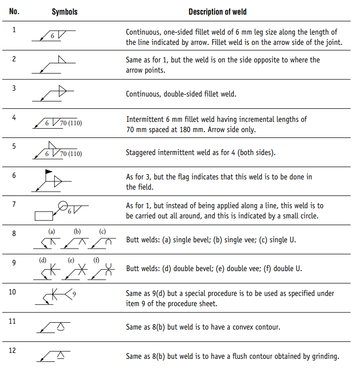
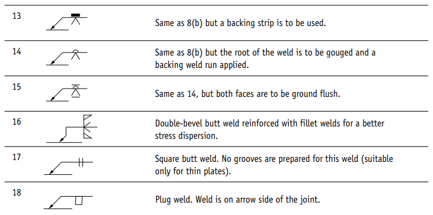

## Tērauda konstrukciju savienojumi

### Metrisko skrūvju parametri un nestspējas

Skrūvju ģeometriskie parametri, šķērsgriezuma laukumi un viena skrūves bīdes un stiepes nestspējas klasēm 8.8 un 10.9 pēc LVS EN 1993-1-8 (3.4. tabula).

<table>
<colgroup>
  <col style="width:8%"><col style="width:7%"><col style="width:7%"><col style="width:9%"><col style="width:9%">
  <col style="width:15%"><col style="width:15%"><col style="width:15%"><col style="width:15%">
</colgroup>
<thead>
<tr>
  <th rowspan="2">Skrūve</th>
  <th rowspan="2">d (mm)</th>
  <th rowspan="2">d0 (mm)</th>
  <th rowspan="2">As (mm²)</th>
  <th rowspan="2">A (mm²)</th>
  <th colspan="2">Fv,Rd (kN)</th>
  <th colspan="2">Ft,Rd (kN)</th>
</tr>
<tr>
  <th>8.8</th><th>10.9</th><th>8.8</th><th>10.9</th>
</tr>
</thead>
<tbody>
<tr><td>M12</td><td>12</td><td>13</td><td>84,3</td><td>113</td><td>32,4</td><td>33,7</td><td>48,6</td><td>60,7</td></tr>
<tr><td>M16</td><td>16</td><td>18</td><td>157</td><td>201</td><td>60,3</td><td>62,8</td><td>90,4</td><td>113,0</td></tr>
<tr><td>M20</td><td>20</td><td>22</td><td>245</td><td>314</td><td>94,1</td><td>98,0</td><td>141,1</td><td>176,4</td></tr>
<tr><td>M24</td><td>24</td><td>26</td><td>353</td><td>452</td><td>135,6</td><td>141,2</td><td>203,3</td><td>254,2</td></tr>
<tr><td>M27</td><td>27</td><td>30</td><td>459</td><td>573</td><td>176,3</td><td>183,6</td><td>264,4</td><td>330,5</td></tr>
<tr><td>M30</td><td>30</td><td>33</td><td>561</td><td>707</td><td>215,4</td><td>224,4</td><td>323,1</td><td>403,9</td></tr>
<tr><td>M36</td><td>36</td><td>39</td><td>817</td><td>1018</td><td>313,7</td><td>326,8</td><td>470,6</td><td>588,2</td></tr>
</tbody>
</table>

> **Piezīmes.** Fv,Rd = αv · fub · As / γM2 — dota **vienai bīdes plaknei**, kas iet caur skrūves vītņoto daļu (αv = 0,6 klasei 8.8; αv = 0,5 klasei 10.9; lietots laukums As). Ft,Rd = k2 · fub · As / γM2, k2 = 0,9. Pieņemts γM2 = 1,25; fub = 800 N/mm² (8.8) un 1000 N/mm² (10.9). d0 — standarta urbuma diametrs (normāla atstarpe); A — nominālais kāta laukums.

**Šuves biezuma noteikšana**

**Metināto šuvju apzīmējumi**

**Apzīmējumu skaidrojums:**

<table>
<colgroup><col style="width:8%"><col style="width:92%"></colgroup>
<thead><tr><th>Nr.</th><th>Metinājuma apraksts</th></tr></thead>
<tbody>
<tr><td>1</td><td>Nepārtraukta vienpusēja stūra šuve ar 6 mm kāti gar bultas norādīto līniju. Šuve atrodas bultas pusē.</td></tr>
<tr><td>2</td><td>Tāpat kā 1, bet šuve ir pretējā pusē bultas norādītajai.</td></tr>
<tr><td>3</td><td>Nepārtraukta divpusēja stūra šuve.</td></tr>
<tr><td>4</td><td>Pārtraukta 6 mm stūra šuve ar 70 mm posmiem, izvietotiem ik 180 mm. Tikai bultas pusē.</td></tr>
<tr><td>5</td><td>Pārmaiņus pārtraukta šuve kā 4 (abās pusēs).</td></tr>
<tr><td>6</td><td>Tāpat kā 3, bet karodziņš norāda, ka šuve veicama būvobjektā.</td></tr>
<tr><td>7</td><td>Tāpat kā 1, bet šuve veicama pa visu perimetru, ko norāda mazs aplis.</td></tr>
<tr><td>8</td><td>Sadurmetinājumi: (a) vienpusēja slīpā; (b) vienpusēja V; (c) vienpusēja U.</td></tr>
<tr><td>9</td><td>Sadurmetinājumi: (d) divpusēja slīpā; (e) divpusēja V; (f) divpusēja U.</td></tr>
<tr><td>10</td><td>Tāpat kā 9(d), bet jāizmanto īpaša procedūra, kas norādīta procedūru lapas 9. punktā.</td></tr>
<tr><td>11</td><td>Tāpat kā 8(b), bet šuvei jābūt izliektai virsmai.</td></tr>
<tr><td>12</td><td>Tāpat kā 8(b), bet šuvei jābūt līdzenai virsmai, kas iegūta slīpējot.</td></tr>
<tr><td>13</td><td>Tāpat kā 8(b), bet jāizmanto paliktņa josla.</td></tr>
<tr><td>14</td><td>Tāpat kā 8(b), bet šuves sakne jāizgriež un jāuzliek paliktņa šuve.</td></tr>
<tr><td>15</td><td>Tāpat kā 14, bet abas virsmas jānoslīpē līdzenas.</td></tr>
<tr><td>16</td><td>Divpusējs slīpais sadurmetinājums, pastiprināts ar stūra šuvēm labākai sprieguma izkliedei.</td></tr>
<tr><td>17</td><td>Taisnstūra sadurmetinājums. Šim metinājumam neveido gropi (piemērots tikai plānām loksnēm).</td></tr>
<tr><td>18</td><td>Aizpildmetinājums (plug weld). Šuve ir savienojuma bultas pusē.</td></tr>
</tbody>
</table>

**Metinājuma šuvju nestspēja pie S355 tērauda**

| Katete / Leg length | Rīkle / Throat thickness | Stiprība garenvirzienā / Longitudinal capacity | Stiprība šķērsvirzienā / Transverse capacity |
| --- | --- | --- | --- |
| s | a | PL | PT |
| mm | mm | kN/mm | kN/mm |
| 3.0 | 2.1 | 0.53 | 0.66 |
| 4.0 | 2.8 | 0.70 | 0.88 |
| 5.0 | 3.5 | 0.88 | 1.09 |
| 6.0 | 4.2 | 1.05 | 1.31 |
| 8.0 | 5.6 | 1.40 | 1.75 |
| 10.0 | 7.0 | 1.75 | 2.19 |
| 12.0 | 8.4 | 2.10 | 2.62 |
| 15.0 | 10.5 | 2.62 | 3.28 |
| 18.0 | 12.6 | 3.15 | 3.94 |
| 20.0 | 14.0 | 3.50 | 4.38 |
| 22.0 | 15.4 | 3.85 | 4.81 |
| 25.0 | 17.5 | 4.38 | 5.47 |

**Tipiska savienojuma ar ausi nestspējas tabulas biežākiem gadījumiem**

Lai paātrinatu un atvieglotu projektēšanas procesu, ir apkopota informācija ar nestspēju pie biežāk izmantotiem šķērsgriezumiem un skrūvju diametriem. Aprēķini veikti pēc šķērsspēka.

Aprēķinā izmantotie parametri:

Skrūves: M16 un M20, klase 8.8 (fub = 800 N/mm²), auss (fin plate): T=10mm, S355 (fy = 355 N/mm²)
Siju profili: IPE 180-500, HEA 160-300, Parciālie koeficienti: γM2 = 1.25 (skrūvēm), γM0 = 1.0 (tēraudam)

**Skrūvju izvietojuma nosacījumi**

**Urbuma diametri un minimālās distances**

| Skrūve | Urbuma Ø (d₀) | e1, e2 min | p1 min | p2 min |
| --- | --- | --- | --- | --- |
| M16 | 18mm | 22mm (1.2×d₀) | 40mm (2.2×d₀) | 44mm (2.4×d₀) |
| M20 | 22mm | 27mm (1.2×d₀) | 49mm (2.2×d₀) | 53mm (2.4×d₀) |

**Skrūvju konfigurācijas**

| Skrūvju skaits | M16 izvietojums | M20 izvietojums | M16 plate izmērs | M20 plate izmērs |
| --- | --- | --- | --- | --- |
| 2 skrūves | Vertikāli, 40mm distance | Vertikāli, 49mm distance | 110×128×10mm | 120×148×10mm |
| 3 skrūves | Vertikāli, 2×40mm | Vertikāli, 2×49mm | 110×168×10mm | 120×198×10mm |
| 4 skrūves | 2×2, 44×40mm | 2×2, 53×49mm | 154×128×10mm | 173×148×10mm |
| 6 skrūves | 2×3, 44×80mm | 2×3, 53×98mm | 154×168×10mm | 173×198×10mm |

**Savienojumu nestspējas IPE profiliem**

| Profils | tw (mm) | 2×M16 | 3×M16 | 4×M16 | 6×M16 | 2×M20 | 3×M20 | 4×M20 | 6×M20 |
| --- | --- | --- | --- | --- | --- | --- | --- | --- | --- |
| IPE 180 | 5.3 | 76 | 114 | 152 | 228 | 119 |  | 238 |  |
| IPE 200 | 5.6 | 80 | 120 | 160 | 240 | 126 |  | 251 | 376 |
| IPE 240 | 6.2 | 89 | 133 | 178 | 266 | 139 | 209 | 278 | 418 |
| IPE 300 | 7.1 | 101 | 152 | 203 | 304 | 159 | 239 | 318 | 478 |
| IPE 360 | 8.0 | 114 | 171 | 228 | 342 | 179 | 269 | 359 | 538 |
| IPE 400 | 8.6 | 123 | 184 | 245 | 368 | 193 | 289 | 386 | 578 |
| IPE 450 | 9.4 | 134 | 201 | 268 | 403 | 211 | 316 | 421 | 632 |
| IPE 500 | 10.2 | 146 | 218 | 291 | 437 | 229 | 343 | 458 | 687 |

**Savienojumu nestspējas HEA profiliem**

| Profils | tw (mm) | 2×M16 | 3×M16 | 4×M16 | 6×M16 | 2×M20 | 3×M20 | 4×M20 | 6×M20 |
| --- | --- | --- | --- | --- | --- | --- | --- | --- | --- |
| HEA 160 | 6.0 | 86 | 129 | 172 | 258 | 135 |  | 269 |  |
| HEA 180 | 6.0 | 86 | 129 | 172 | 258 | 135 |  | 269 |  |
| HEA 200 | 6.5 | 93 | 139 | 186 | 279 | 146 | 219 | 292 | 437 |
| HEA 240 | 7.5 | 107 | 161 | 215 | 322 | 168 | 253 | 337 | 505 |
| HEA 260 | 7.5 | 107 | 161 | 215 | 322 | 168 | 253 | 337 | 505 |
| HEA 280 | 8.0 | 114 | 171 | 228 | 342 | 179 | 269 | 359 | 538 |
| HEA 300 | 8.5 | 122 | 182 | 243 | 365 | 191 | 287 | 383 | 574 |

Citiem velmētajiem profiliem nestspējas var aptuveni pielasīt pēc sieniņu biezuma.

Krāsu kodi: <100 kN – zaļš, 100-200 kN – gaiši zils, 200-300 kN – gaiši oranžs, virs 300 kN – tumši oranžs.

**Metinājumu kapacitātes pielasīšana izejot no skrūvju (savienojuma) nestspējas**

Pieņemts nosacījums VRd,weld ≥ 1.2 × VRd,bolts, a = VRd,nep. / (fw × lw,eff × √3 / γM2). Šuves abās loksnes pusēs.

| Skrūves | Skrūvju kapacitāte | Nep. kapacitāte | Plātnes augst. | Ieteicamais izmērs | Pārbaude |
| --- | --- | --- | --- | --- | --- |
| 2×M16 | 121 kN | 145 kN | 128mm | a = 4mm | 149 kN |
| 3×M16 | 181 kN | 217 kN | 168mm | a = 5mm | 249 kN |
| 4×M16 | 241 kN | 289 kN | 128mm | a = 7mm | 334 kN |
| 6×M16 | 362 kN | 434 kN | 168mm | a = 8mm | 481 kN |
| 2×M20 | 188 kN | 226 kN | 148mm | a = 6mm | 270 kN |
| 3×M20 | 282 kN | 338 kN | 198mm | a = 6mm | 361 kN |
| 4×M20 | 376 kN | 451 kN | 148mm | a = 9mm | 481 kN |
| 6×M20 | 565 kN | 678 kN | 198mm | a = 9mm | 723 kN |

**Rekomendētie savienojumu risinājumi pēc siju profila**

| Profils | Augstums | Ieteicamais risinājums | Alternatīva |
| --- | --- | --- | --- |
| IPE 180 | 180mm | 3×M16 vert. (114 kN) | 4×M16 2×2 (152 kN) |
| IPE 200 | 200mm | 4×M16 2×2 (160 kN) | 4×M20 2×2 (251 kN) |
| IPE 240 | 240mm | 4×M20 2×2 (278 kN) | 3×M20 vert. (209 kN) |
| IPE 300+ | 300mm+ | 6×M20 2×3 (478+ kN) | 4×M20 2×2 (318+ kN) |
| HEA 160-180 | 160-180mm | 3×M16 vert. (129 kN) | 4×M16 2×2 (172 kN) |
| HEA 200 | 200mm | 4×M20 2×2 (292 kN) | 3×M20 vert. (219 kN) |
| HEA 240+ | 240mm+ | 6×M20 2×3 (505+ kN) | 4×M20 2×2 (337+ kN) |

**Rekomendētie savienojumu risinājumi pēc šķērsspēka**

| Slodze | V1 | V2 | V3 |
| --- | --- | --- | --- |
| 50-100 kN | 3×M16 vert. | 2×M16 vert. | 2×M20 vert. |
| 100-150 kN | 4×M16 (2×2) | 3×M16 vert. | 2×M20 vert. |
| 150-250 kN | 4×M20 (2×2) | 4×M16 (2×2) | 3×M20 vert. |
| 250-400 kN | 6×M20 (2×3) | 6×M16 (2×3) | 4×M20 (2×2) |
| 400+ kN | 6×M20 | 6×M20 | 6×M20 |

**Augstuma ierobežojumi skrūvju izvietošanai**

| Konfigurācija | Vajadzīgais augstums | Piemērojami profili |
| --- | --- | --- |
| 3×M16 vert. | 168mm | IPE 180+ |
| 3×M20 vert. | 198mm | IPE 240+ |
| 6×M16 vert. | 208mm | IPE 240+ |
| 6×M20 vert. | 296mm | IPE 360+ |
