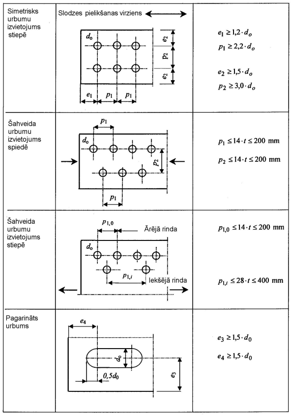
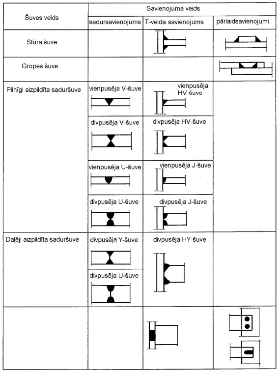
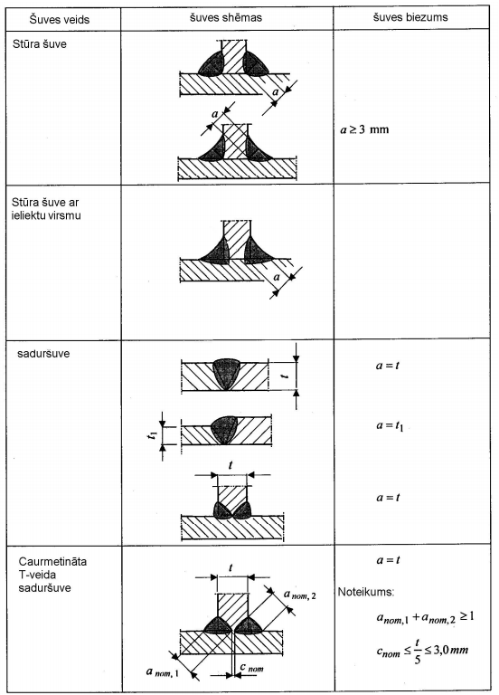
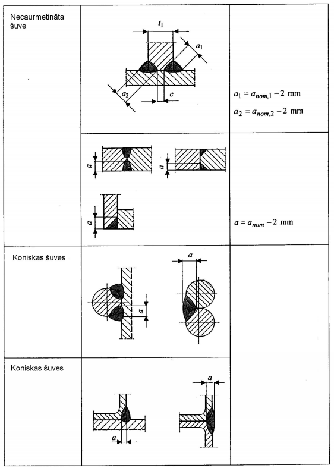
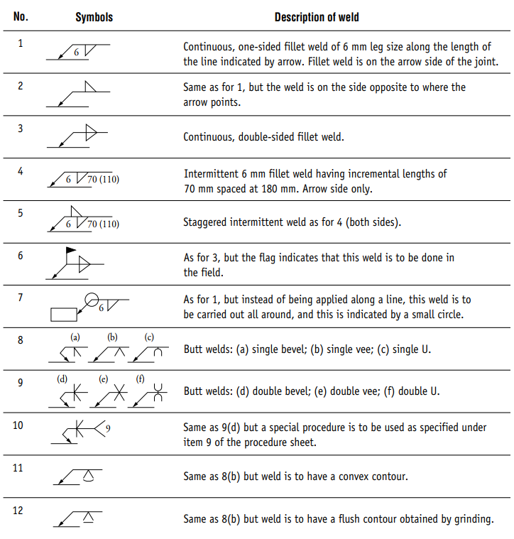
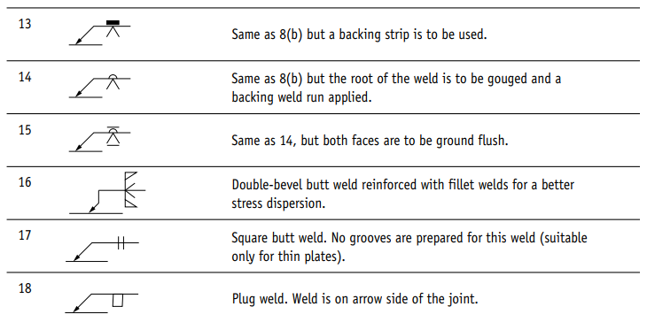

# Tērauda konstrukciju savienojumi

Tērauda būvkonstrukciju savienojumu (mezglu) aprēķini un konstruēšana tiek veikta saskaņā ar standartu **LVS EN 1993-1-8**. Mezgli var būt bīdizturīgi (šarnīri) vai momentizturīgi (stingie mezgli).

---

## Metrisko skrūvju parametri un nestspējas (8.8 un 10.9 klase)

Skrūvju ģeometriskie lielumi, šķērsgriezuma laukumi un viena stieņa bīdes un stiepes nestspēja saskaņā ar LVS EN 1993-1-8 Table 3.4:

| Skrūve | Diametrs \\(d\\) (mm) | Urbuma \\(\varnothing\\) \\(d_0\\) (mm)* | Vītnes laukums \\(A_s\\) (mm²) | Kāta laukums \\(A\\) (mm²) | Bīdes nestspēja \\(F_{v,Rd}\\) (kN) (8.8 klase) | Bīdes nestspēja \\(F_{v,Rd}\\) (kN) (10.9 klase) | Stiepes nestspēja \\(F_{t,Rd}\\) (kN) (8.8 klase) | Stiepes nestspēja \\(F_{t,Rd}\\) (kN) (10.9 klase) |
| :--- | :---: | :---: | :---: | :---: | :---: | :---: | :---: | :---: |
| **M12** | 12 | 13 | 84,3 | 113 | 32,4 | 33,7 | 48,6 | 60,7 |
| **M16** | 16 | 18 | 157,0 | 201 | 60,3 | 62,8 | 90,4 | 113,0 |
| **M20** | 20 | 22 | 245,0 | 314 | 94,1 | 98,0 | 141,1 | 176,4 |
| **M24** | 24 | 26 | 353,0 | 452 | 135,6 | 141,2 | 203,3 | 254,2 |
| **M27** | 27 | 30 | 459,0 | 573 | 176,3 | 183,6 | 264,4 | 330,5 |
| **M30** | 30 | 33 | 561,0 | 707 | 215,4 | 224,4 | 323,1 | 403,9 |
| **M36** | 36 | 39 | 817,0 | 1018 | 313,7 | 326,8 | 470,6 | 588,2 |

*\*Piezīme:*
- *Bīdes nestspēja \\(F_{v,Rd} = \frac{\alpha_v \cdot f_{ub} \cdot A_s}{\gamma_{M2}}\\) ir norādīta **vienai bīdes plaknei**, kas šķērso skrūves vītņoto daļu (\\(\alpha_v = 0,6\\) klasei 8.8; \\(\alpha_v = 0,5\\) klasei 10.9). Ja bīdes plakne šķērso nevītņoto kātu, izmanto laukumu \\(A\\) un \\(\alpha_v = 0,6\\).*
- *Stiepes nestspēja \\(F_{t,Rd} = \frac{k_2 \cdot f_{ub} \cdot A_s}{\gamma_{M2}}\\), kur \\(k_2 = 0,9\\) un \\(\gamma_{M2} = 1,25\\).*
- *Pieņemts \\(\gamma_{M2} = 1,25\\), \\(f_{ub} = 800\text{ MPa}\\) (8.8) un \\(1000\text{ MPa}\\) (10.9).*

| Skrūvsavienojuma principiālā shēma | Skrūvju attālumu apzīmējumi |
| :---: | :---: |
|  |  |

---

## Metinātie savienojumi (šuvju noformēšana)

Stūra šuvju izmērus nosaka pēc to rīkles biezuma \\(a\\) (metinājuma teorētiskais augstums) vai katetes izmēra \\(s\\) (\\(s \approx a \cdot \sqrt{2}\\)):

### Metināto šuvju apzīmējumi rasējumos (ISO 2553):

**Apzīmējumu skaidrojums:**

| Nr. | Metinājuma apraksts un izpildes kārtība |
| :---: | :--- |
| **1** | Nepārtraukta vienpusēja stūra šuve ar \\(6\text{ mm}\\) kāti (kateti) gar bultas norādīto līniju. Šuve atrodas bultas pusē. |
| **2** | Tāpat kā 1, bet šuve atrodas pretējā pusē bultas norādītajai līnijai. |
| **3** | Nepārtraukta divpusēja stūra šuve. |
| **4** | Pārtraukta \\(6\text{ mm}\\) stūra šuve ar \\(70\text{ mm}\\) posmiem, izvietotiem ik pēc \\(180\text{ mm}\\). Tikai bultas pusē. |
| **5** | Šaha veidā izvietota pārtraukta stūra šuve abās pusēs. |
| **6** | Tāpat kā 3, bet karodziņš norāda, ka šuve veicama montāžas vietā (būvlaukumā). |
| **7** | Tāpat kā 1, bet šuve veicama pa visu elementa perimetru (aplis uz bultas lūzuma punkta). |
| **8** | Vienpusēji sadurmetinājumi: (a) vienpusēja slīpā šuve, (b) vienpusēja V-veida šuve, (c) vienpusēja U-veida šuve. |
| **9** | Divpusēji sadurmetinājumi: (d) divpusēja slīpā, (e) divpusēja V-veida, (f) divpusēja U-veida šuve. |
| **10** | Tāpat kā 9(d), bet jāizmanto īpaša procedūra, kas norādīta rasējuma piezīmēs. |
| **11** | Tāpat kā 8(b), bet šuvei jābūt ar izliektu virsmu. |
| **12** | Tāpat kā 8(b), bet šuves virsmai jābūt noslīpētai līdzenai. |
| **13** | Tāpat kā 8(b), izmantojot metināšanas paliktni (backing bar). |
| **14** | Tāpat kā 8(b), kur šuves sakne pirms pretmetināšanas ir jāizgriež/jāizstrādā. |
| **15** | Tāpat kā 14, bet abas šuves virsmas pēc tam jānoslīpē līdzenas. |
| **16** | Divpusēja slīpā saduršuve ar papildu stūra šuvēm labākai spriegumu pārejai un noguruma stiprībai. |
| **17** | Sadursavienojums bez malu noslīpināšanas (taisnstūra šuve, tikai plānām loksnēm \\(t \le 3\text{ mm}\\)). |
| **18** | Aizpildmetinājums (plug weld / apaļš vai iegarens aizmetināts caurums). |

---

### Metināto šuvju nestspēja S355 tēraudam (\\(f_u = 490\text{ MPa}\\))

Robežstiprība uz vienu šuves garuma milimetru (aprēķināta pēc vienkāršotās metodes ar konservatīvu \\(f_u = 490\text{ MPa}\\)):

| Katete \\(s\\) (mm) | Rīkle \\(a\\) (mm) | Stiprība garenvirzienā \\(P_L\\) (kN/mm) | Stiprība šķērsvirzienā \\(P_T\\) (kN/mm) |
| :---: | :---: | :---: | :---: |
| 3,0 | 2,1 | 0,53 | 0,66 |
| 4,0 | 2,8 | 0,70 | 0,88 |
| 5,0 | 3,5 | 0,88 | 1,09 |
| 6,0 | 4,2 | 1,05 | 1,31 |
| 8,0 | 5,6 | 1,40 | 1,75 |
| 10,0 | 7,0 | 1,75 | 2,19 |
| 12,0 | 8,4 | 2,10 | 2,62 |
| 15,0 | 10,5 | 2,62 | 3,28 |
| 18,0 | 12,6 | 3,15 | 3,94 |
| 20,0 | 14,0 | 3,50 | 4,38 |
| 22,0 | 15,4 | 3,85 | 4,81 |
| 25,0 | 17,5 | 4,38 | 5,47 |

---

## Bīdizturīgi savienojumi ar ausi (Fin Plate Joints)

Šos savienojumus plaši izmanto sekundāro siju pieslēgšanai pie galvenajām sijām vai kolonnām. Tie uzņem tikai šķērsspēku (šarnīrs).

### 1. Skrūvju izvietojuma robežattālumi (M16 un M20, klase 8.8)

| Skrūve | Urbuma \\(\varnothing\\) \\(d_0\\) | Minimālais malas attālums \\(e_1, e_2\\) | Minimālais solis \\(p_1\\) (rindā) | Minimālais solis \\(p_2\\) (starp rindām) |
| :---: | :---: | :---: | :---: | :---: |
| **M16** | 18 mm | 22 mm (\\(1,2 d_0\\)) | 40 mm (\\(2,2 d_0\\)) | 44 mm (\\(2,4 d_0\\)) |
| **M20** | 22 mm | 27 mm (\\(1,2 d_0\\)) | 49 mm (\\(2,2 d_0\\)) | 53 mm (\\(2,4 d_0\\)) |

### 2. Standarta auss plākšņu konfigurācijas

| Skrūvju skaits | M16 izvietojums (solis) | M20 izvietojums (solis) | M16 auss izmēri (\\(B \times H \times t\\)) | M20 auss izmēri (\\(B \times H \times t\\)) |
| :---: | :--- | :--- | :---: | :---: |
| 2 skrūves | Vertikāli, 40 mm attālums | Vertikāli, 49 mm attālums | \\(110 \times 128 \times 10\text{ mm}\\) | \\(120 \times 148 \times 10\text{ mm}\\) |
| 3 skrūves | Vertikāli, \\(2 \times 40\text{ mm}\\) | Vertikāli, \\(2 \times 49\text{ mm}\\) | \\(110 \times 168 \times 10\text{ mm}\\) | \\(120 \times 198 \times 10\text{ mm}\\) |
| 4 skrūves | 2 rindās pa 2 (\\(44 \times 40\text{ mm}\\)) | 2 rindās pa 2 (\\(53 \times 49\text{ mm}\\)) | \\(154 \times 128 \times 10\text{ mm}\\) | \\(173 \times 148 \times 10\text{ mm}\\) |
| 6 skrūves | 2 rindās pa 3 (\\(44 \times 80\text{ mm}\\)) | 2 rindās pa 3 (\\(53 \times 98\text{ mm}\\)) | \\(154 \times 168 \times 10\text{ mm}\\) | \\(173 \times 198 \times 10\text{ mm}\\) |

---

### 3. Savienojuma šķērsspēka nestspēja (kN) IPE profiliem
*Auss biezums \\(t = 10\text{ mm}\\), S355 tērauds. Noteicošā ir sijas sieniņas bīde vai skrūvju nestspēja.*

| Profils | Sieniņa \\(t_w\\) (mm) | 2 × M16 | 3 × M16 | 4 × M16 (2x2) | 6 × M16 (2x3) | 2 × M20 | 3 × M20 | 4 × M20 (2x2) | 6 × M20 (2x3) |
| :--- | :---: | :---: | :---: | :---: | :---: | :---: | :---: | :---: | :---: |
| IPE 180 | 5,3 | 76 | 114 | 152 | 228 | 119 | — | 238 | — |
| IPE 200 | 5,6 | 80 | 120 | 160 | 240 | 126 | — | 251 | 376 |
| IPE 240 | 6,2 | 89 | 133 | 178 | 266 | 139 | 209 | 278 | 418 |
| IPE 300 | 7,1 | 101 | 152 | 203 | 304 | 159 | 239 | 318 | 478 |
| IPE 360 | 8,0 | 114 | 171 | 228 | 342 | 179 | 269 | 359 | 538 |
| IPE 400 | 8,6 | 123 | 184 | 245 | 368 | 193 | 289 | 386 | 578 |
| IPE 450 | 9,4 | 134 | 201 | 268 | 403 | 211 | 316 | 421 | 632 |
| IPE 500 | 10,2 | 146 | 218 | 291 | 437 | 229 | 343 | 458 | 687 |

---

### 4. Savienojuma šķērsspēka nestspēja (kN) HEA profiliem

| Profils | Sieniņa \\(t_w\\) (mm) | 2 × M16 | 3 × M16 | 4 × M16 (2x2) | 6 × M16 (2x3) | 2 × M20 | 3 × M20 | 4 × M20 (2x2) | 6 × M20 (2x3) |
| :--- | :---: | :---: | :---: | :---: | :---: | :---: | :---: | :---: | :---: |
| HEA 160 | 6,0 | 86 | 129 | 172 | 258 | 135 | — | 269 | — |
| HEA 180 | 6,0 | 86 | 129 | 172 | 258 | 135 | — | 269 | — |
| HEA 200 | 6,5 | 93 | 139 | 186 | 279 | 146 | 219 | 292 | 437 |
| HEA 240 | 7,5 | 107 | 161 | 215 | 322 | 168 | 253 | 337 | 505 |
| HEA 260 | 7,5 | 107 | 161 | 215 | 322 | 168 | 253 | 337 | 505 |
| HEA 280 | 8,0 | 114 | 171 | 228 | 342 | 179 | 269 | 359 | 538 |
| HEA 300 | 8,5 | 122 | 182 | 243 | 365 | 191 | 287 | 383 | 574 |

*Slodžu grupu krāsu kodi (projektēšanas atvieglošanai):*
- *Zaļš: \\(< 100\text{ kN}\\)*
- *Zils: \\(100 \dots 200\text{ kN}\\)*
- *Gaiši oranžs: \\(200 \dots 300\text{ kN}\\)*
- *Tumši oranžs: \\(> 300\text{ kN}\\)*

---

## Metinājuma šuves izvēle saskaņā ar skrūvju nestspēju

Lai garantētu, ka savienojuma metinājums nav vājākais posms, šuves tiek dimensionētas pēc nosacījuma:
\[V_{Rd,\text{weld}} \ge 1,2 \cdot V_{Rd,\text{bolts}}\]
Auss tiek metināta ar divpusēju stūra šuvi (rīkle \\(a\\)) pie nesošā elementa.

| Skrūves | Skrūvju grupas nestspēja | Nepieciešamā šuves pretestība | Auss augstums | Izvēlētais šuves biezums \\(a\\) | Šuvju faktiskā nestspēja |
| :--- | :---: | :---: | :---: | :---: | :---: |
| 2 × M16 | 121 kN | 145 kN | 128 mm | **\\(a = 4\text{ mm}\\)** | 149 kN |
| 3 × M16 | 181 kN | 217 kN | 168 mm | **\\(a = 5\text{ mm}\\)** | 249 kN |
| 4 × M16 | 241 kN | 289 kN | 128 mm | **\\(a = 7\text{ mm}\\)** | 334 kN |
| 6 × M16 | 362 kN | 434 kN | 168 mm | **\\(a = 8\text{ mm}\\)** | 481 kN |
| 2 × M20 | 188 kN | 226 kN | 148 mm | **\\(a = 6\text{ mm}\\)** | 270 kN |
| 3 × M20 | 282 kN | 338 kN | 198 mm | **\\(a = 6\text{ mm}\\)** | 361 kN |
| 4 × M20 | 376 kN | 451 kN | 148 mm | **\\(a = 9\text{ mm}\\)** | 481 kN |
| 6 × M20 | 565 kN | 678 kN | 198 mm | **\\(a = 9\text{ mm}\\)** | 723 kN |

---

## Rekomendētie risinājumi pēc siju šķērsgriezuma

| Profils | Profila augstums | Ieteicamais mezgla risinājums | Alternatīvais risinājums |
| :--- | :---: | :--- | :--- |
| IPE 180 | 180 mm | 3 × M16 vertikāli (114 kN) | 4 × M16 rindā 2x2 (152 kN) |
| IPE 200 | 200 mm | 4 × M16 rindā 2x2 (160 kN) | 4 × M20 rindā 2x2 (251 kN) |
| IPE 240 | 240 mm | 4 × M20 rindā 2x2 (278 kN) | 3 × M20 vertikāli (209 kN) |
| IPE 300+ | 300+ mm | 6 × M20 rindā 2x3 (478+ kN) | 4 × M20 rindā 2x2 (318+ kN) |
| HEA 160-180 | 160-180 mm | 3 × M16 vertikāli (129 kN) | 4 × M16 rindā 2x2 (172 kN) |
| HEA 200 | 200 mm | 4 × M20 rindā 2x2 (292 kN) | 3 × M20 vertikāli (219 kN) |
| HEA 240+ | 240+ mm | 6 × M20 rindā 2x3 (505+ kN) | 4 × M20 rindā 2x2 (337+ kN) |

---

## Rekomendētie risinājumi pēc šķērsspēka lieluma

| Aprēķina šķērsspēks \\(V_{Ed}\\) | 1. Izvēles risinājums | 2. Izvēles risinājums | 3. Izvēles risinājums |
| :--- | :--- | :--- | :--- |
| \\(50 \dots 100\text{ kN}\\) | 3 × M16 vertikāli | 2 × M16 vertikāli | 2 × M20 vertikāli |
| \\(100 \dots 150\text{ kN}\\) | 4 × M16 (2x2) | 3 × M16 vertikāli | 2 × M20 vertikāli |
| \\(150 \dots 250\text{ kN}\\) | 4 × M20 (2x2) | 4 × M16 (2x2) | 3 × M20 vertikāli |
| \\(250 \dots 400\text{ kN}\\) | 6 × M20 (2x3) | 6 × M16 (2x3) | 4 × M20 (2x2) |
| \\(> 400\text{ kN}\\) | 6 × M20 (2x3) | 6 × M20 (2x3) | 6 × M20 (2x3) |

---

## Siju augstuma ierobežojumi skrūvju izvietošanai

Lai skrūves fiziski ietilptu sijas augstumā, ievērojot minimālos attālumus līdz siju plauktiem un rādiusiem:

| Skrūvju konfigurācija | Nepieciešamais sijas sieniņas augstums | Piemērojamie IPE/HEA profili |
| :--- | :---: | :--- |
| 3 × M16 vertikāli | 168 mm | IPE 180+ / HEA 160+ |
| 3 × M20 vertikāli | 198 mm | IPE 240+ / HEA 200+ |
| 6 × M16 (2x3) | 208 mm | IPE 240+ / HEA 200+ |
| 6 × M20 (2x3) | 296 mm | IPE 360+ / HEA 280+ |
