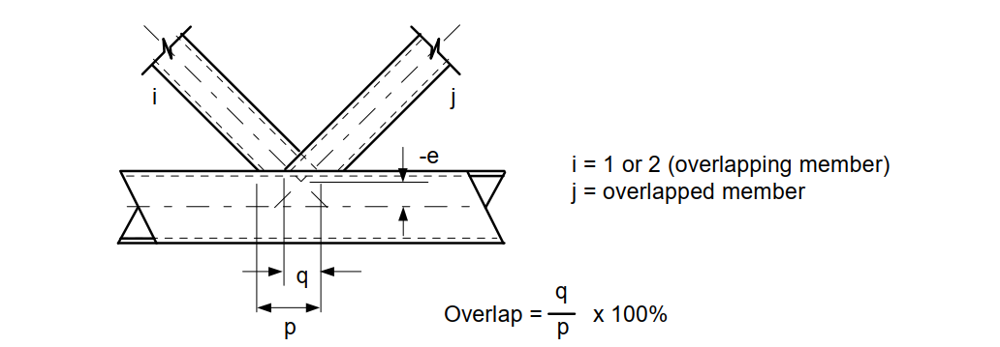
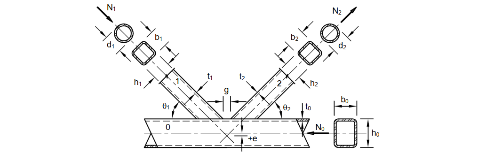
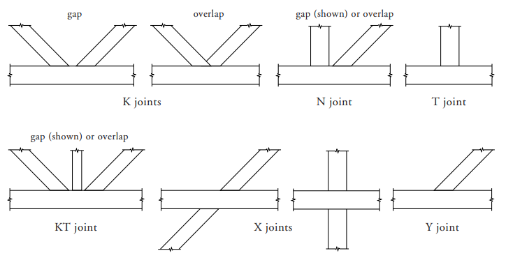

# Cauruļprofilu kopņu projektēšanas principi

Kopņu projektēšanā no taisnstūra (RHS) vai apaļiem (CHS) cauruļprofiliem mezglu nestspēju galvenokārt nosaka šķērsgriezumu ģeometriskās attiecības un mezglu izveides veids. Pārbaudes veic saskaņā ar **LVS EN 1993-1-8 7. nodaļu**.

---

## Ģeometrisko parametru ierobežojumi cauruļprofilu mezgliem

Lai nodrošinātu kvalitatīvu metināto šuvju izveidi un vienmērīgu spriegumu pāreju:
- **Minimālais pieslēguma leņķis:** Leņķis \\(\theta\\) starp režģa elementu (atgāzni) un joslu nedrīkst būt mazāks par **\\(30^\circ\\)**. Pretējā gadījumā ir grūti izveidot šuvi un tās saknes daļa nav kvalitatīvi aizmetināma.
- **Atstarpe K-veida mezglos ar atstarpi (gap joints):**
  Lai būtu pietiekami daudz vietas šuvju uzklāšanai un novērstu spriegumu koncentrāciju joslas sieniņā, tīrajai atstarpei \\(g\\) starp abiem atgāžņiem uz joslas virsmas jābūt vismaz:
  \\[g \ge t_1 + t_2\\]
  kur \\(t_1\\) un \\(t_2\\) ir savienojamo režģa elementu sieniņu biezumi.
- **Pārsegums K-veida mezglos ar pārklāšanos (overlap joints):**
  Pārklāšanās apjomam jābūt pietiekamam bīdes spēku pārnesei no viena režģa elementa uz otru. Minimālais pārklāšanās apjoms ir **\\(25\%\\)**.
  - Ja elementi ir ar dažādiem platumiem, šaurākajam elementam ir jāpārklāj platākais.
  - Ja elementi ir ar vienādu platumu, bet dažādu biezumu un/vai tērauda marku, elementam ar mazāko stiprības kapacitāti (\\(t_i \cdot f_{yi}\\)) ir jāpārklāj stiprākais elements.

**Pārlaiduma un atstarpes mezglu ģeometrija:**

---

## Mezglu ekscentricitāte (\\(e\\))

Ekscentricitāte \\(e\\) ir vertikālais attālums no režģa elementu asu krustpunkta līdz joslas asij. 

Saskaņā ar standartu, ieteicamās ekscentricitātes robežas ir:
\\[-0,55 \cdot h_0 \le e \le 0,25 \cdot h_0\\]
kur \\(h_0\\) ir joslas šķērsgriezuma augstums.

- **Pozitīva ekscentricitāte (\\(e > 0\\)):** Asu krustpunkts ir nobīdīts uz kopnes ārpusi.
- **Negatīva ekscentricitāte (\\(e < 0\\)):** Asu krustpunkts ir nobīdīts uz kopnes iekšpusi (diagnoļu krustpunkts atrodas "zem" joslas ass).

*Piezīme: Ja ekscentricitāte atrodas pieļaujamajās robežās, sekundāros lieces momentus mezglā (kas rodas no šīs ekscentricitātes) joslu un režģa stieņu aprēķinos var neievērtēt. Ja ekscentricitāte pārsniedz robežvērtības, lieces momenti ir pilnībā jāņem vērā aprēķinos.*

### Ekscentricitātes \\(e\\) un atstarpes \\(g\\) saistības formula:

\\[g = \left( e + \frac{h_0}{2} \right) \cdot (\cot\theta_1 + \cot\theta_2) - \frac{h_1}{2\sin\theta_1} - \frac{h_2}{2\sin\theta_2}\\]

*Ja joslai izmanto pastiprinājuma plāksni (flange plate) ar biezumu \\(t_p\\), tad augstumu aizstāj: \\(\frac{h_0}{2} \to \frac{h_0}{2} + t_p\\).*

**Cauruļprofilu kopņu mezglu apzīmējumi:**

---

## Režģa elementu izvēle un aprēķina garumi

Lai kopnes būtu ekonomiskas un viegli izgatavojamas:
- **Šķērsgriezumu proporcijas:** Režģa elementus (atgāžņus un statņus) ieteicams izvēlēties ar lielāku ārējo izmēru un plānāku sieniņu. Vēlams, lai režģa elementu platums būtu robežās no **\\(0,70\\) līdz \\(0,80\\)** no joslas platuma, kas vienkāršo metināšanas šuvju izveidi sānmalās.
- **Aprēķina garumi (\\(L_{\text{cr}}\\)) klupšanai:**
  Konservatīvā aprēķinā režģa stieņu aprēķina garumu pieņem vienādu ar to ģeometrisko garumu starp mezglu centriem (\\(L_{\text{cr}} = 1,0 \cdot L\\)). 
  Tomēr, ja režģa stieņi ir pa visu perimetru piemetināti pie stingrām joslām, aprēķina garumu drīkst samazināt, reizinot ar koeficientu **\\(0,75\\)** (t.i., \\(L_{\text{cr}} = 0,75 \cdot L\\)).

**Biežāk izmantotie metinātie kvadrātcauruļu savienojumu veidi:**

