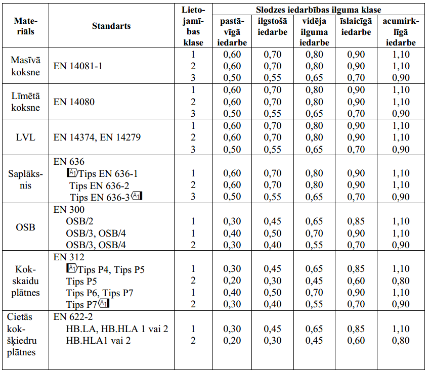

## Materiālu parciālie koeficienti γM

| Pamata kombinācija: | Pamata kombinācija: |
| --- | --- |
| Masīva koksne | 1.30 |
| Līmēta koksne | 1.25 |
| LVL, saplāksnis, OSB | 1.20 |
| Kokskaidu plātnes | 1.30 |
| Cietās kokšķiedru plātnes | 1.30 |
| Vidēji cietās kokšķiedru plātnes | 1.30 |
| MDF tipa kokšķiedru plātnes | 1.30 |
| Mīkstās kokšķiedru plātnes | 1.30 |
| Savienojumi | 1.30 |
| Perforēto metāla plākšņu savienotājlīdzekļi | 1.25 |
| Ārkārtējās kombinācijās: | Ārkārtējās kombinācijās: |
| Visām pārbaudēm | 1.00 |

## Koeficienta kmod vērtības

## PIEMĒRI SLODZES IEDARBĪBAS ILGUMA KLASES NOTEIKŠANAI

<table>
<colgroup>
  <col style="width:14%"><col style="width:18%"><col style="width:8%">
  <col style="width:12%"><col style="width:12%"><col style="width:12%"><col style="width:12%"><col style="width:12%">
</colgroup>
<thead>
<tr>
  <th>Materiāls</th><th>Standarts</th><th>Lieto-jamības klase</th>
  <th>Pastāvīgā iedarbe</th><th>Ilgstošā iedarbe</th><th>Vidēja ilguma iedarbe</th><th>Īslaicīgā iedarbe</th><th>Acumirklīgā iedarbe</th>
</tr>
</thead>
<tbody>
<tr><td rowspan="3">Masīvā koksne</td><td rowspan="3">EN 14081-1</td><td>1</td><td>0,60</td><td>0,70</td><td>0,80</td><td>0,90</td><td>1,10</td></tr>
<tr><td>2</td><td>0,60</td><td>0,70</td><td>0,80</td><td>0,90</td><td>1,10</td></tr>
<tr><td>3</td><td>0,50</td><td>0,55</td><td>0,65</td><td>0,70</td><td>0,90</td></tr>
<tr><td rowspan="3">Līmētā koksne</td><td rowspan="3">EN 14080</td><td>1</td><td>0,60</td><td>0,70</td><td>0,80</td><td>0,90</td><td>1,10</td></tr>
<tr><td>2</td><td>0,60</td><td>0,70</td><td>0,80</td><td>0,90</td><td>1,10</td></tr>
<tr><td>3</td><td>0,50</td><td>0,55</td><td>0,65</td><td>0,70</td><td>0,90</td></tr>
<tr><td rowspan="3">LVL</td><td rowspan="3">EN 14374, EN 14279</td><td>1</td><td>0,60</td><td>0,70</td><td>0,80</td><td>0,90</td><td>1,10</td></tr>
<tr><td>2</td><td>0,60</td><td>0,70</td><td>0,80</td><td>0,90</td><td>1,10</td></tr>
<tr><td>3</td><td>0,50</td><td>0,55</td><td>0,65</td><td>0,70</td><td>0,90</td></tr>
<tr><td rowspan="3">Saplāksnis</td><td>EN 636 Tips EN 636-1 Tips EN 636-2 Tips EN 636-3</td><td>1 2 3</td><td>0,60 0,60 0,50</td><td>0,70 0,70 0,55</td><td>0,80 0,80 0,65</td><td>0,90 0,90 0,70</td><td>1,10 1,10 0,90</td></tr>
<tr><td rowspan="3">OSB</td><td>EN 300 OSB/2 OSB/3, OSB/4 OSB/3, OSB/4</td><td>1 1 2</td><td>0,30 0,40 0,30</td><td>0,45 0,50 0,40</td><td>0,65 0,70 0,55</td><td>0,85 0,90 0,70</td><td>1,10 1,10 0,90</td></tr>
<tr><td rowspan="4">Kokskaidu plātnes</td><td>EN 312 Tips P4, Tips P5 Tips P5 Tips P6, Tips P7 Tips P7</td><td>1 2 1 2</td><td>0,30 0,20 0,40 0,30</td><td>0,45 0,30 0,50 0,40</td><td>0,65 0,45 0,70 0,55</td><td>0,85 0,60 0,90 0,70</td><td>1,10 0,80 1,10 0,90</td></tr>
<tr><td rowspan="2">Cietās kokšķiedru plātnes</td><td>EN 622-2 HB.LA, HB.HLA 1 vai 2 HB.HLA1 vai 2</td><td>1 2</td><td>0,30 0,20</td><td>0,45 0,30</td><td>0,65 0,45</td><td>0,85 0,60</td><td>1,10 0,80</td></tr>
</tbody>
</table>

Noteikts LV nacionālajā pielikumā (LVS EN 19951-1:2005/NA:2012)

LIETOJAMĪBAS KLASES

<table>
<colgroup><col style="width:30%"><col style="width:70%"></colgroup>
<thead><tr><th>Slodzes iedarbības ilguma klase</th><th>Piemērojamie slodžu veidi</th></tr></thead>
<tbody>
<tr><td>Pastāvīgā</td><td>Pašsvars, grunts spiediens, starpsienas</td></tr>
<tr><td>Ilgstošā</td><td>Materiāli noliktavās, tehnoloģiskās iekārtas, ūdens rezervuāri</td></tr>
<tr><td>Vidēja ilguma</td><td>Lietderīgā slodze uz pārsegumu, sniega slodze, mitruma izmaiņu slodzes</td></tr>
<tr><td>Īslaicīgā</td><td>Vēja slodze, slodzes uz kāpnēm, horizontālās slodzes uz margām, apkopes darbību izraisītās slodzes, transportlīdzekļu slodzes un montāžu slodzes</td></tr>
<tr><td>Acumirklīgā</td><td>Vēja brāzmas, avārijas (ārkārtas) slodzes un gadījuma slodzes</td></tr>
</tbody>
</table>

**3. lietojamības klases** pieskaitāmas ārējo laika apstākļu ietekmē pakļautas koka pārklātas konstrukcijas un ūdens iedarbībai pakļautas koka konstrukcijas. Nosakot koka konstrukcijas saglabāšanu, 3. izmantošanas klase, atkarībā no tā, cik lielā mērā konstrukcijas ir pakļautas mitruma ietekmei, papildus tiek sadalītas divās dažādās apakšgrupās (skat. EN 335-1:2005).

Papildus koksnes lizdveivara mitrumam, izmantošanas klases noteikšanā jāpievērš uzmanība arī mitruma izmaiņām. Mitruma izmaiņu ietekme uz koka konstrukciju var būt lielāka nekā pat augsta līmeņa pastāvīga mitruma ietekme. 1. izmantošanas klasē īpašu uzmanību jāpievērš koksnes plaisāšanas riskam.
