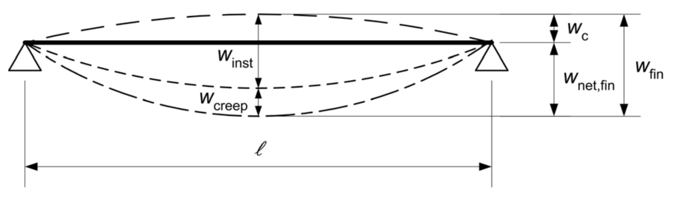

## Siju izlieču robežlielumi

Vertikālo pārvietojumu robežvērtības pieņemtas pēc LVS EN 1995-1-1 pirmās paaudzes nacionālā pielikuma punkta 2.3 7.2 tabulas Deformāciju robežlielumi (Limiting values for deflections).

**Piemēri izlieču robežlielumiem**

<table>
<colgroup>
<col style="width:46%">
<col style="width:18%">
<col style="width:18%">
<col style="width:18%">
</colgroup>
<thead>
<tr><th>Nosaukums</th><th>Winst</th><th>Wnet,fin</th><th>Wfin</th></tr>
</thead>
<tbody>
<tr><td>Sijas uz diviem balstiem</td><td>L / 400</td><td>L / 300</td><td>L / 200</td></tr>
<tr><td>Konsolsijas</td><td>L / 200</td><td>L / 150</td><td>L / 100</td></tr>
<tr><td>Spāres un citi līdzīgi mazāk nozīmīgi elementi</td><td>L / 250</td><td>L / 200</td><td>L / 150</td></tr>
</tbody>
</table>

**Izlieces komponentes**

Wc – konstruktīvā priekšizliece nenoslogotā konstruktīvā elementā

Winst – sijas elastīgā izliece

Wcreep – sijas izlieces komponente no šļūdes

Wfin – sijas galīgā izliece

Wnet,fin – sijas galīgās izlieces neto lielums
