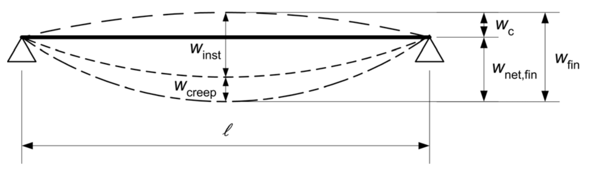

# Siju izlieču robežvērtības (SLS)

Koka konstrukciju deformācijas lietojamības robežstāvoklī (SLS) pārbauda, salīdzinot aprēķinātās izlieces ar robežvērtībām saskaņā ar LVS EN 1995-1-1.

---

## Izlieču robežvērtības ($w_{\text{limit}}$)

Saskaņā ar LVS EN 1995-1-1/NA ieteicamās robežvērtības siju un plātņu vertikālajām izliecēm:

| Konstrukcijas elements / Shēma | Momentānā izliece $w_{\text{inst}}$ | Neto galīgā izliece $w_{\text{net,fin}}$ | Kopējā galīgā izliece $w_{\text{fin}}$ |
| :--- | :---: | :---: | :---: |
| Sijas uz diviem balstiem (pārsegumi) | $L / 400$ | $L / 300$ | $L / 200$ |
| Konsolsijas (pārkares) | $L / 200$ | $L / 150$ | $L / 100$ |
| Spāres, kopturi un jumta elementi (bez trauslas apdares) | $L / 250$ | $L / 200$ | $L / 150$ |

*Apzīmējumi: $L$ — sijas laidums (konsoles gadījumā $L$ ir konsoles brīvais garums).*

---

## Izlieces komponentes un aprēķina shēma

Koka konstrukciju izliece sastāv no elastīgās (momentānās) izlieces un šļūdes izlieces (mitruma un ilglaicīgas slodzes ietekmē).

### Deformācijas komponentu definīcijas:
- **$w_c$** — konstruktīvā priekšizliece (precamber) nenoslogotā stāvoklī;
- **$w_{\text{inst}}$** — momentānā (elastīgā) izliece tūlīt pēc slodzes pielikšanas;
- **$w_{\text{creep}}$** — šļūdes (deformāciju pieauguma) izlieces daļa laika gaitā;
- **$w_{\text{fin}}$** — galīgā (kopējā) izliece, ņemot vērā šļūdi: $w_{\text{fin}} = w_{\text{inst}} + w_{\text{creep}}$;
- **$w_{\text{net,fin}}$** — neto galīgā izliece, kas paliek pēc priekšizlieces $w_c$ atskaitīšanas:
  $$w_{\text{net,fin}} = w_{\text{fin}} - w_c$$

---

## Izlieču aprēķina formulas (ilglaicīgo efektu ievērtēšana)

Izlieces komponentes nosaka, izmantojot šļūdes koeficientu $k_{\text{def}}$ (skat. [Slodžu ilgumi un modifikācijas koeficienti](02-koeficienti.md)):

### 1. Momentānā izliece:
$$w_{\text{inst}} = w_{\text{inst},g} + w_{\text{inst},q,1} + \sum w_{\text{inst},q,i}$$

### 2. Galīgā izliece:
- **Pastāvīgajām slodzēm $G$:**
  $$w_{\text{fin},g} = w_{\text{inst},g} \cdot (1 + k_{\text{def}})$$
- **Vadošajai mainīgajai slodzei $Q_1$:**
  $$w_{\text{fin},q,1} = w_{\text{inst},q,1} \cdot (1 + \psi_2 \cdot k_{\text{def}})$$
- **Pavadītājām mainīgajām slodzēm $Q_i$:**
  $$w_{\text{fin},q,i} = w_{\text{inst},q,i} \cdot (\psi_{0,i} + \psi_{2,i} \cdot k_{\text{def}})$$

Kopējā galīgā izliece $w_{\text{fin}}$ ir visu galīgo izlieču summa:
$$w_{\text{fin}} = w_{\text{fin},g} + w_{\text{fin},q,1} + \sum w_{\text{fin},q,i}$$

*Kur $\psi_0$ un $\psi_2$ ir slodžu kombināciju koeficienti saskaņā ar LVS EN 1990 (piemēram, lietderīgajai slodzei dzīvojamās ēkās $\psi_2 = 0,3$).*
