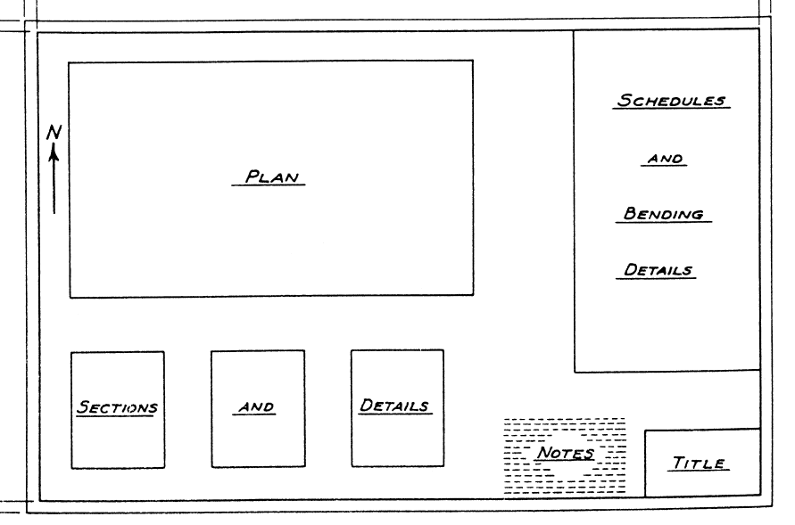
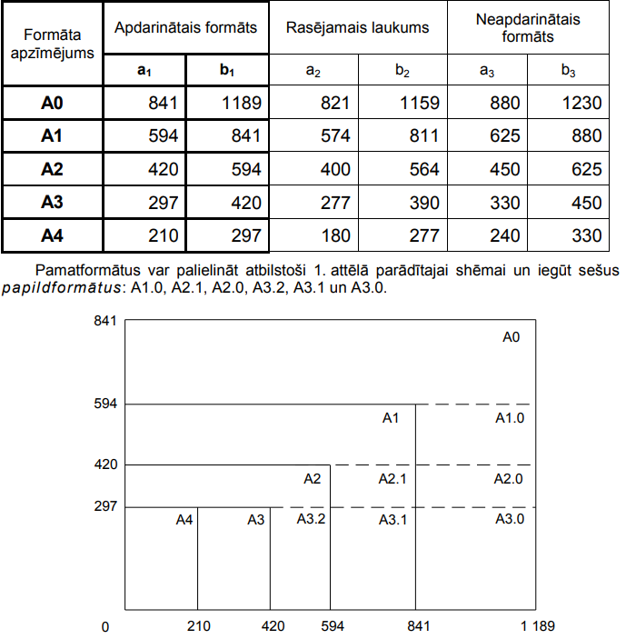
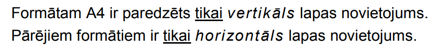

# Rasējuma lapu izkārtojums un formāti

Rasējumu lapas noformē un loka saskaņā ar standartu **LVS EN ISO 5457** (tehniskā produkta dokumentācija — rasējumu lapu izmēri un izkārtojums).

---

## Optimālais rasējuma lapas izkārtojums

Parasti rasējuma laukumu sadala šādās zonās:
- **Kreisajā un centrālajā daļā:** Rasējuma grafiskā daļa (plāni, griezumi, fasādes);
- **Apakšējā daļā:** Mezgli, detaļas un papildu griezumi;
- **Labajā malā (virs rakstlaukuma):** Elementu specifikācijas (tabulas) un teksta piezīmes (norādes par materiāliem, slodzēm, izbūvi).

> [!TIP]
> Specifikāciju un piezīmju bloku platumu ieteicams veidot tieši **$185\text{ mm}$** platumā (atbilstoši standarta rakstlaukuma platumam). Salokot lapu A4 formātā, specifikācijas un piezīmes būs uzreiz redzamas uz pirmās salocītās lapas virsmas, tās pilnībā neatlokot. Tas novērš arī svarīgas informācijas kropļošanu locījumu vietās.

---

## Standarta rasējumu lapu izmēri (ISO 216)

Rasējumu izstrādē izmanto šādus standarta A-sērijas lapu formātus:

| Formāts | Izmēri (platums × augstums, mm) | Piezīmes |
| :---: | :---: | :--- |
| **A0** | $1189 \times 841$ | Lielformāta plāniem un kopsalikumiem. |
| **A1** | $841 \times 594$ | Standarta izmērs būvkonstrukciju plāniem. |
| **A2** | $594 \times 420$ | Izdevīgs mezglu lapām un mazākiem plāniem. |
| **A3** | $420 \times 297$ | Ļoti ērts montāžas un mezglu shēmām (viegli pārnēsājams būvlaukumā). |
| **A4** | $297 \times 210$ | Tikai specifikācijām, titullapām vai vienkāršām detaļām. |

### Lapu salocīšanas shēmas uzglabāšanai (LVS EN ISO 5457):

Lapas ir jāsaloka tā, lai rakstlaukums ar projekta nosaukumu un numuru vienmēr atrastos priekšpusē (augšpusē):

| Lapu locīšana mapēm ar caurumiem | Lapu locīšana brīvai uzglabāšanai |
| :---: | :---: |
|  |  |
