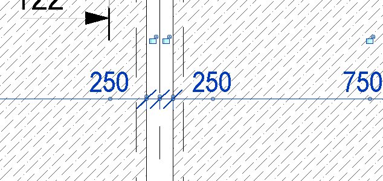
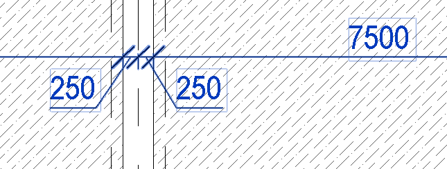
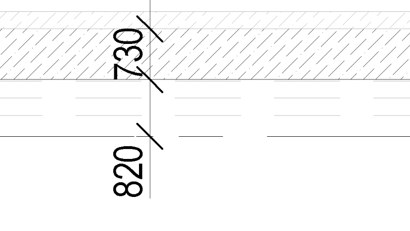
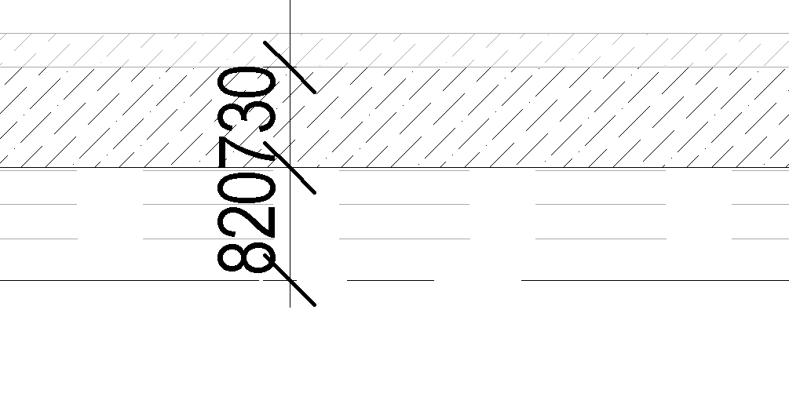

## Izmēru līnijas

Izmēru līnijas ir grafisks elements, kas strukturālajos rasējumos norāda konstrukciju un to elementu gabarītus, atstatumu starp asīm un būvdaļu novietojumu. Precīzas izmēru līnijas ir priekšnoteikums, lai rasējums kalpotu kā darba dokuments — bez mērogošanas vai pieņēmumiem izpildes brīdī. Tās izvietojamas ārpus konstrukcijas kontūras, nepārklājoties ar attēlotajiem elementiem, un annotiācija vienmēr jāorientē ērti nolasāmā virzienā.

Ja iespējams, izmēri izvietojami vienā līmenī, lai samazinātu krustojošu līniju apjomu un nodrošinātu saprotamāku nolasīšanu tieši pielikšanas virzienā.

Izmērus kuri izvietojas ļoti tuvu vienam rekomendējams atvirzīt, lai tie vizuāli neveidotu vienu skaitli.

