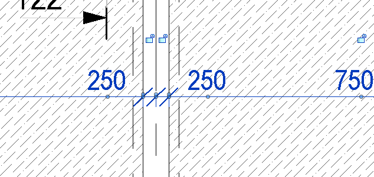
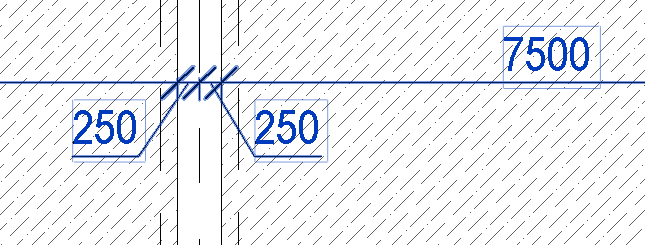
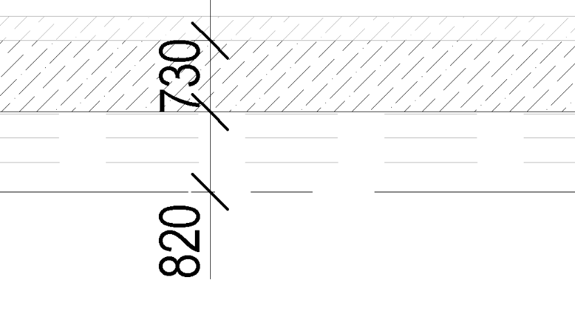
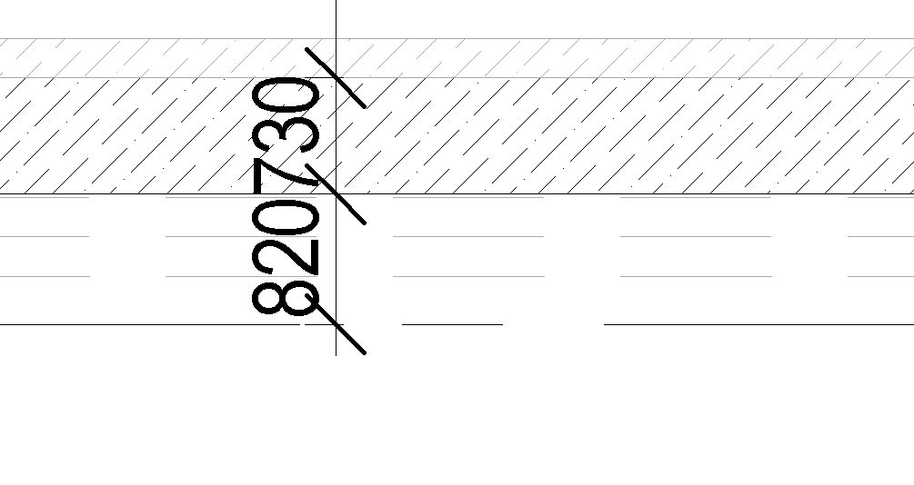

# Izmēru līnijas un izmēru norādīšana

Izmēru norādīšana rasējumos ir galvenais informācijas avots būvelementu izgatavošanai un montāžai. Tā jāveic saskaņā ar standartu **LVS EN ISO 129-1** (tehniskie rasējumi — izmēru un pielaižu norādīšana).

---

## Izmēru līniju izvietošanas principi

Izmēru līnijām ir skaidri jānorāda elementu gabarīti, atstatumi starp asīm un izbūves piesaistes, nepieļaujot to divdomīgu interpretāciju:
- **Novietojums:** Izmēru līnijas izvieto ārpus konstrukcijas galvenās kontūras. Tās nedrīkst pārklāties ar stiegrojumu, šraffējumu (lūzuma līnijām) vai citiem grafiskajiem elementiem.
- **Attālumi:** Pirmā izmēru līnija jāvelk vismaz **\\(10\text{ mm}\\)** attālumā no elementa kontūras. Paralēlās izmēru līnijas izvieto vismaz **\\(7 \dots 8\text{ mm}\\)** attālumā vienu no otras.
- **Saskaņotība:** Izmērus izvieto vienotās ķēdēs. Ja iespējams, izmēru līnijas visā rasējuma garumā izlīdzina vienā līmenī, lai samazinātu krustojošos līniju skaitu.

| Pareizs izmēru līniju izvietojums (ārpus kontūras) | Nepareizs (krustojošas un kontūru sedzošas līnijas) |
| :---: | :---: |
|  |  |

---

## Izmēru skaitļu nolasāmība un virziens

- **Novietojums virs līnijas:** Izmēru skaitļi jāraksta aptuveni izmēru līnijas vidū virs tās (skaitlis nedrīkst saskarties ar līniju vai tikt pārsvītrots ar to).
- **Nolasīšanas virziens:** Horizontālie izmēri ir nolasāmi no lapas apakšas. Vertikālie izmēri jāizvieto tā, lai tie būtu nolasāmi, skatoties no lapas labās malas (t.i., skaitļi rakstīti virzienā no apakšas uz augšu, kreisajā pusē no izmēru līnijas).

### Tuvu izvietotu izmēru skaitļu sakārtošana:
Ja izmēri ir mazi un skaitļi atrodas ļoti tuvu viens otram, tos ieteicams izbīdīt uz iznesuma līnijām vai izvietot pamīšus (dažādos augstumos), lai novērstu skaitļu saplūšanu.

| Pareizs risinājums ar iznesumiem | Nepareizs risinājums (skaitļi pārklājas) |
| :---: | :---: |
|  |  |
