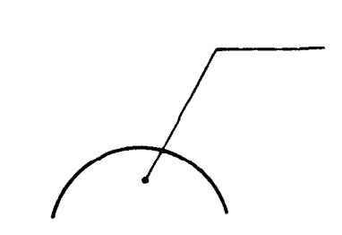
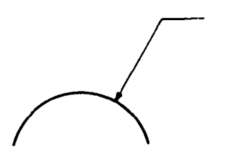
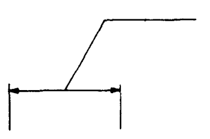
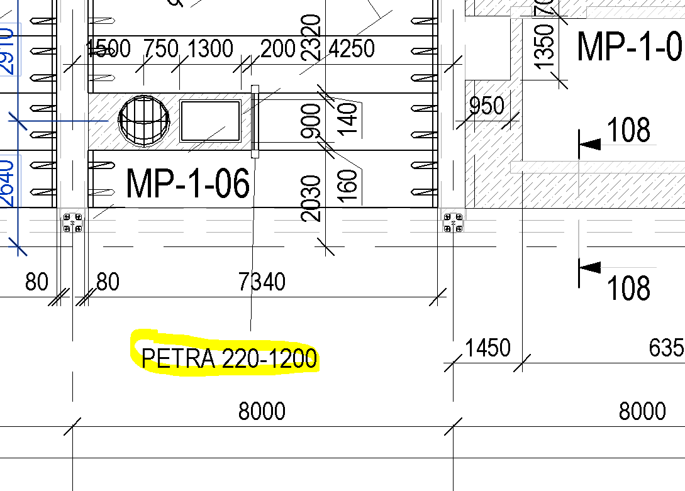
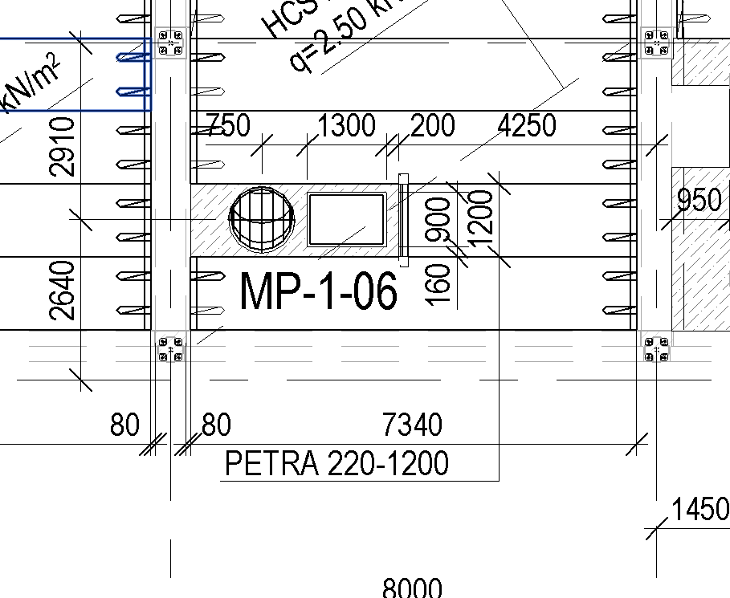
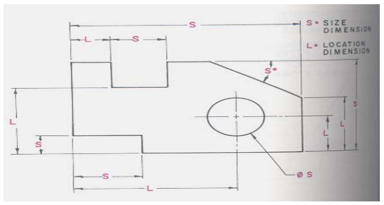

## ELEMENTU MARĶĒJUMS, INFORMATĪVĀS NORĀDES

Marķējumu veido horizontāla iznesuma līnijas daļa, tās taisns turpinājums vai slīpa un vertikāla daļa norādot uz konkrēto elementu (angliski izmanto terminu leader line). Ja līnija pieiet pie elementa, tad parasti liekam bultu, ja tā beidzas jau uz elementa – tad var likt bumbuli. Bez gala elementa līniju izmanto, ja tā norāda uz izmēru. Slikta prakse ir likt norāžu līnijas ar dažu grādu nobīdi no horizontālās vai vertikālās ass.

Norāžu līnijas nevajadzētu krustot (ja tas ir iespējams).

## ELEMENTU MARĶĒJUMA INDEKSI

Piemērs elementu indeksiem atbilstoši konstrukciju tipiem un materiāliem

| MARKA | ATŠIFRĒJUMS | PIEZĪMES |
| --- | --- | --- |
| RCW | Monolīta dzelzsbetona siena |  |
| SW | Trīsslāņu panelis |  |
| P | Pālis |  |
| SP | Vienslāņa panelis |  |
| HCS | Dobumotie pārseguma paneļi |  |
| MPS | Saliekamā dzelzsbetona masīvā iepriekšsaspriegtā pārseguma plātne | Massive prestressed slab |
| RCS | Monolīta pārseguma plātne | Reinforced concrete slab |
| PP | Parapeta panelis |  |
| RCC | Monolītā dzelzsbetona kolonna | Reinforced concrete column |
| PCC | Saliekamā dzelzsbetona kolonna | Precast concrete column |
| FS | Pamatu plātne | Foundation slab |
| PBS | Saliekamā dzelzsbetona balkons | Precast balcony slab |
| RCBS | Monolītā dzelzsbetona balkons | Reinforced concrete balcony slab |
| RCB | Monolītā dzelzsbetona sija | Reinforced concrete beam |
| PCB | Saliekamā dzelzsbetona sija | Precast concrete beam |
| ID | Dzelzsbetona ieliekamā detaļa | Talo kods saliekamaniem dzelzsbetona elementiem: 1238, monolītajiem elementiem: 1239 |
| SF | Saliekamā dzelzsbetona kāpņu laids | Stair flight |
| SL | Saliekamā dzelzsbetona kāpņu laukums | Stair landing |
| SS | Tērauda loksne | Steel sheet |
| SB | Tērauda sija | Steel beam |
| SC | Tērauda kolonna | Steel column |
| SE | Stiprināšanas elements | Bultskrūves, vītņstieņi u.c. |
| TD | Termodetaļa |  |
| PMS | Saliekamā dzelzsbetona pārseguma elements | Precast massive slab |
| RCPC | Režģogs | Reinforced concrete pile cap |
| RCSF | Lentveida režģogs | Reinforced cocrete spread footing |
| RCF | Pamats | Reinforced cocrete footing |
| RCR | Rampas konstrukcija | Reinforced concrete ramp |
| RCR | Monolītā josla | Lokāli apgabali starp HCS, vai to malām, lokāli apgabali |
