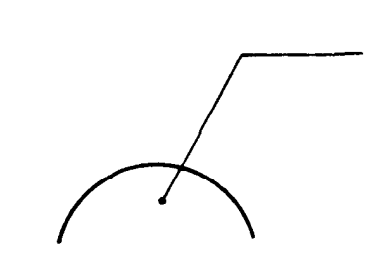
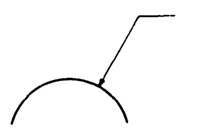
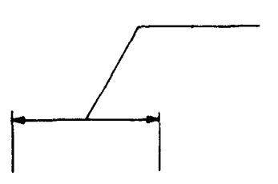

# Elementu marķējums un norādes rasējumos

Norāžu līnijas (leader lines) un elementu marķējumi rasējumos nodrošina ātru elementu tipu un materiālu identificēšanu. Tie jāveido saskaņā ar standartu **LVS EN ISO 128-22** (tehniskie rasējumi — norāžu un atsauces līnijas).

---

## Norāžu līniju (Leader Lines) noformēšana

Norāžu līnijas izmanto, lai piesaistītu anotācijas, elementu markas vai izmēru specifikācijas konkrētai vietai rasējumā:
- **Gala apzīmējumi (nobeigumi):**
  - **Bultiņa:** Izmanto, ja norādes līnija beidzas tieši **uz elementa kontūras** (ārējās robežlīnijas);
  - **Punkts (bumbulis):** Izmanto, ja norādes līnija beidzas **elementa iekšpusē** (uz tā laukuma vai šķērsgriezumā);
  - **Bez nobeiguma (tīra līnija):** Izmanto, ja norādes līnija beidzas uz izmēru līnijas vai koordinācijas ass.
- **Virziens un stils:** Norāžu līniju slīpajām daļām vēlams būt leņķī pret asīm (visbiežāk $30^\circ$, $45^\circ$ vai $60^\circ$). Slikta prakse ir zīmēt norāžu līnijas ar nelielu nobīdi ($1^\circ \dots 5^\circ$) no horizontāles vai vertikāles, kas vizuāli izskatās pēc rasēšanas kļūdas.
- **Krustošanās:** Norāžu līnijas nedrīkst krustoties savā starpā vai krustot izmēru līnijas.

| Norāde uz kontūru (bultiņa) | Norāde elementa iekšienē (punkts) | Norāde uz asi (bez gala apzīmējuma) |
| :---: | :---: | :---: |
|  |  |  |

| Pareizs paralēlu norāžu izkārtojums | Nepareizs (norādes krustojas un ir nesakārtotas) |
| :---: | :---: |
|     |  |

---

## Standarta elementu marķējuma indeksi (Markas)

Projekta rasējumos un specifikāciju tabulās ieteicams izmantot vienotus elementu indeksus, kas norāda elementa materiālu (tērauds, monolītais vai saliekamais dzelzsbetons) un funkciju:

| Markas kods | Elementa nosaukums | Apraksts / Piezīmes |
| :---: | :--- | :--- |
| **RCW** | Monolītā dzelzsbetona siena | Reinforced Concrete Wall |
| **SW** | Trīsslāņu panelis (ārsiena) | Sandwich Wall (saliekamais dz/b) |
| **SP** | Vienslāņa dzelzsbetona panelis | Single Panel |
| **HCS** | Dobumotais pārseguma panelis | Hollow Core Slab (saliekamais dz/b) |
| **MPS** | Masīvā iepriekšsaspriegtā plātne | Massive Prestressed Slab (saliekamais dz/b) |
| **PMS** | Saliekamā dz/b masīvā plātne | Precast Massive Slab (nereducēta) |
| **RCS** | Monolītā pārseguma plātne | Reinforced Concrete Slab |
| **FS** | Pamatu plātne | Foundation Slab (monolītā) |
| **RCC** | Monolītā dzelzsbetona kolonna | Reinforced Concrete Column |
| **PCC** | Saliekamā dzelzsbetona kolonna | Precast Concrete Column |
| **RCB** | Monolītā dzelzsbetona sija | Reinforced Concrete Beam |
| **PCB** | Saliekamā dzelzsbetona sija | Precast Concrete Beam |
| **RCF** | Monolītais pamats (pēda) | Reinforced Concrete Footing (glāžveida/stabu) |
| **RCSF** | Lentveida pamats | Reinforced Concrete Spread Footing |
| **RCPC** | Pāļu režģogs (cepure) | Reinforced Concrete Pile Cap |
| **P** | Pālis | Pile (dzelzsbetona urbtais/dzītais) |
| **PP** | Parapeta panelis | Parapet Panel (saliekamais dz/b) |
| **PBS** | Saliekamā dzelzsbetona balkons | Precast Balcony Slab |
| **RCBS** | Monolītā dzelzsbetona balkons | Reinforced Concrete Balcony Slab |
| **SF** | Saliekamā dzelzsbetona kāpņu laids | Stair Flight |
| **SL** | Saliekamā dzelzsbetona kāpņu laukums | Stair Landing |
| **ID** | Dzelzsbetona ieliekamā detaļa | Talo kods saliekamajiem elementiem: 1238, monolītajiem: 1239 |
| **SB** | Tērauda sija | Steel Beam |
| **SC** | Tērauda kolonna | Steel Column |
| **SS** | Tērauda loksne (plāksne) | Steel Sheet |
| **SE** | Stiprināšanas elements | Steel Element (bultskrūves, vītņstieņi, enkuri) |
| **TD** | Termodetaļa | Thermal Break Element (piem., Schöck Isokorb) |
| **RCR** | Monolītā josla (apmales) | Ring Beam / lokāli monolītie iecirkņi starp plātnēm |
